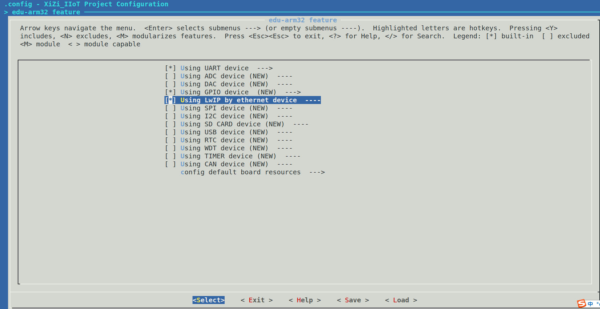
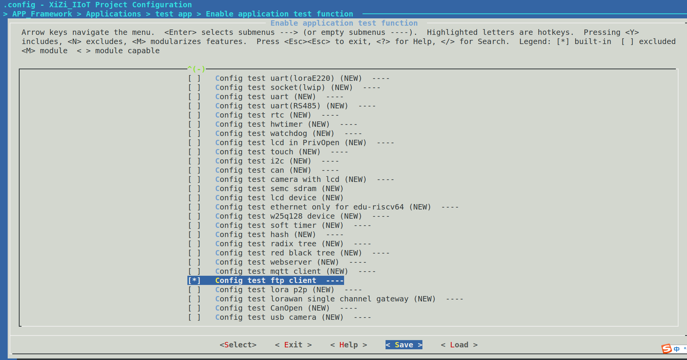
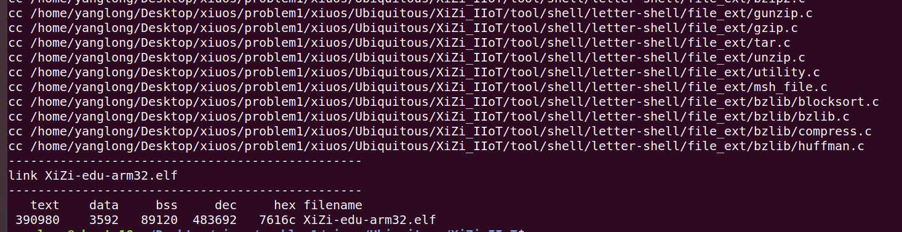
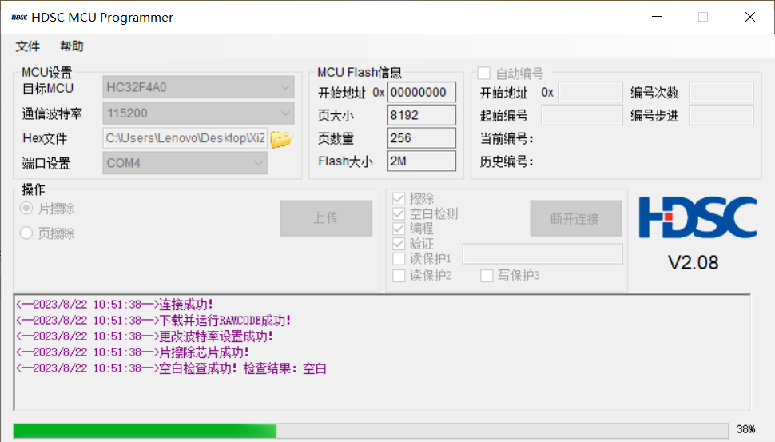
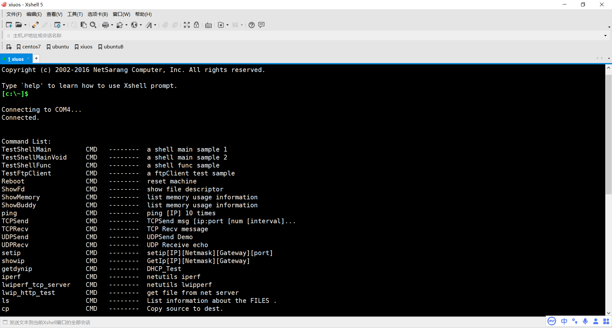
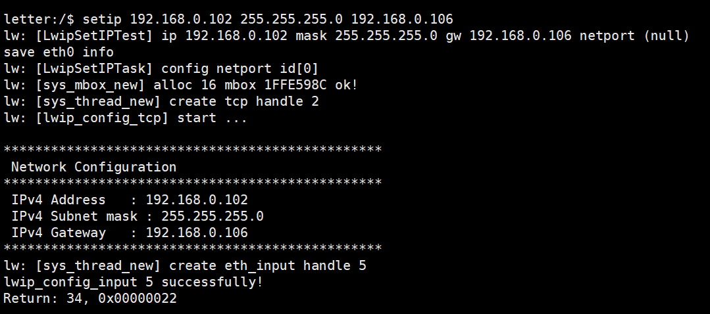
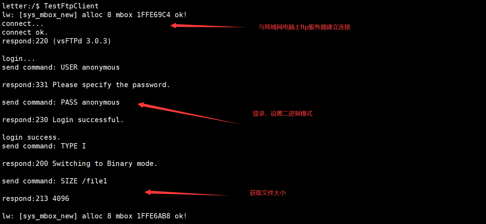
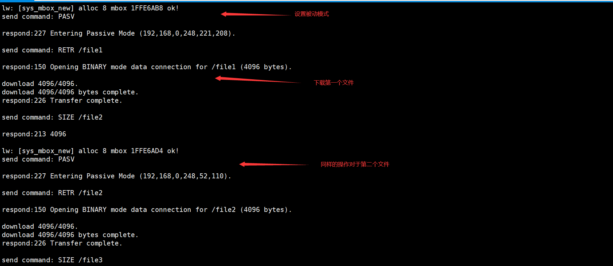
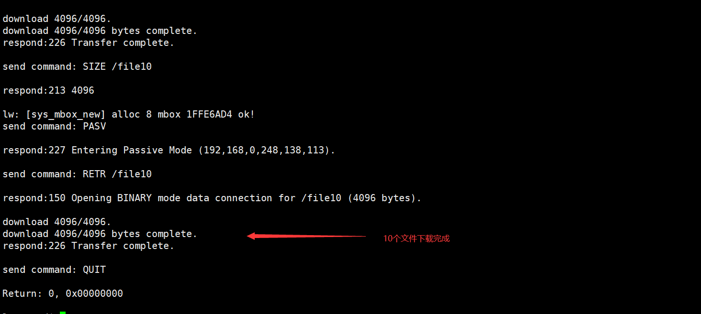

# 初赛一级赛题3：基于矽璓已实现的Lwip，在ARM上实现FTP协议的Client功能

## 1. 简介
本项目是基于矽璓已实现的Lwip，在ARM上实现FTP协议的Client功能
test_ftpclient.h声明了下载10个文件的测试函数
test_ftpclient.c实现了下载10个文件的测试函数
ftp_client文件夹定义了ftp_client的相关类库其中my_socket.h,my_socket.c定义了socket抽象层，并基于
Lwip实现了该抽象层，ftp_client.h,ftp_client.c实现了ftp登录，获取文件大小，下载文件等功能

## 2. 数据结构设计说明
- ftp_client.c 的设计
分别定义了发送命令和接收数据的socket和相应的缓冲区并且实现了登录、发送命令、接收响应数据、查找文件大小、进入被动模式、下载文件、关闭ftp客户端等操作
```c
static int  m_socket_cmd; // 发送命令的socket文件描述符
static int  m_socket_data; // 接收ftp服务器文件的socket文件描述符
static char m_send_buffer[1024]; // 发送缓冲区
static char m_recv_buffer[1024];  // 接收缓冲区
```
## 3. 测试程序说明
- test_ftpclient.c用于测试下载10个文件
连接电脑上的ftp服务器下载10个4KB文件,通过终端日志打印确定文件是否下载成功，以及追踪通信流程和下载进度
```c
void TestFtpClient(int argc, char* argv[])
{
    FtpInitCmd();
    int ret = FtpLogin("192.168.0.248", 21, "anonymous", "anonymous");
    int size;
    char *buf;
    for(int i = 1;i <= 10;i++){
        char fileName[20] = "/file"; 
        char temp[5] = "";
        sprintf(temp,"%d",i);
        strcat(fileName,temp);
        size = FtpFileSize(fileName);
        buf = malloc(size);
        FtpInitData();  // data socket 每次下载都要重新创建，下载完都要关闭
        ret = FtpDownload(fileName, buf, size);
        free(buf);
    }
    FtpQuit();
    return;
}
```

## 4. 运行结果（##需结合运行测试截图按步骤说明##）
1. 配置开启BSP_USING_LWIP、USER_TEST_FTPCLIENT


2. 编译

3. 烧写

4. xshell连接串口终端

6. 配置ip

7. 运行TestFtpClient，开始下载文件


