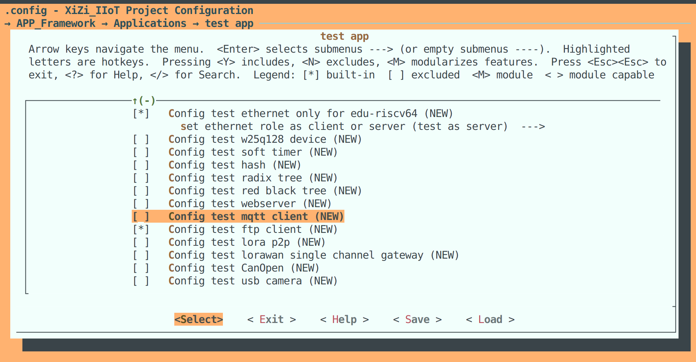
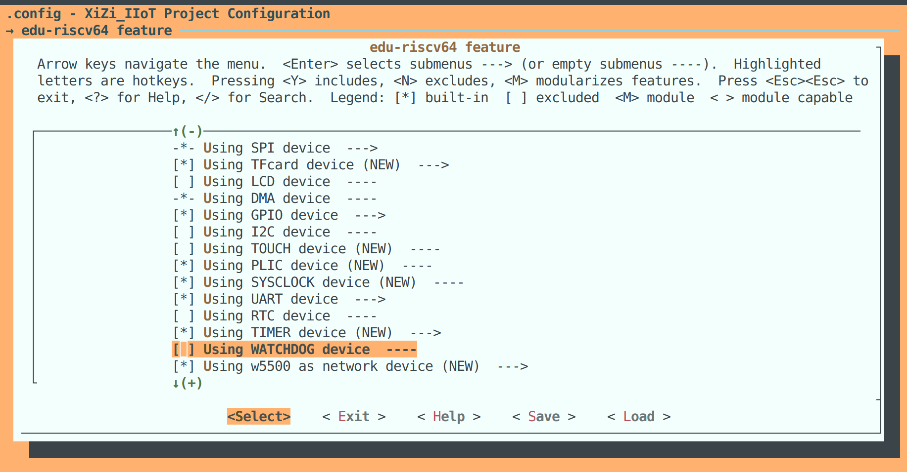
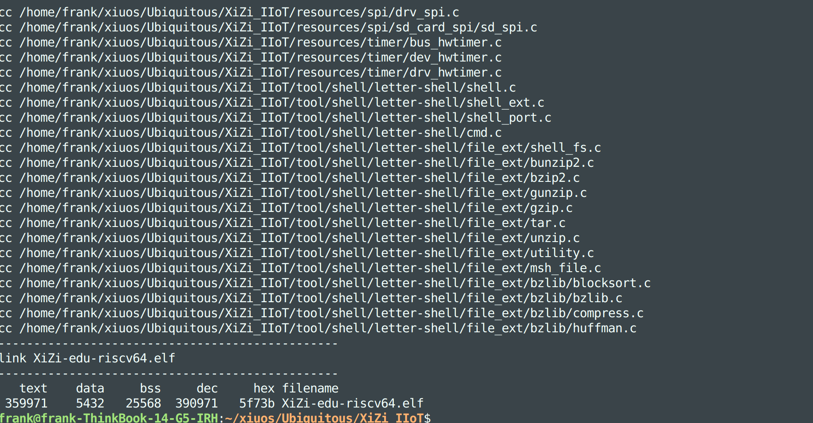
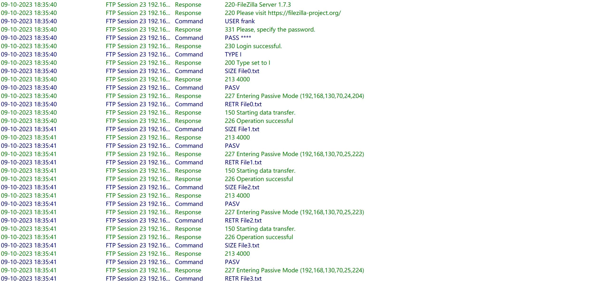
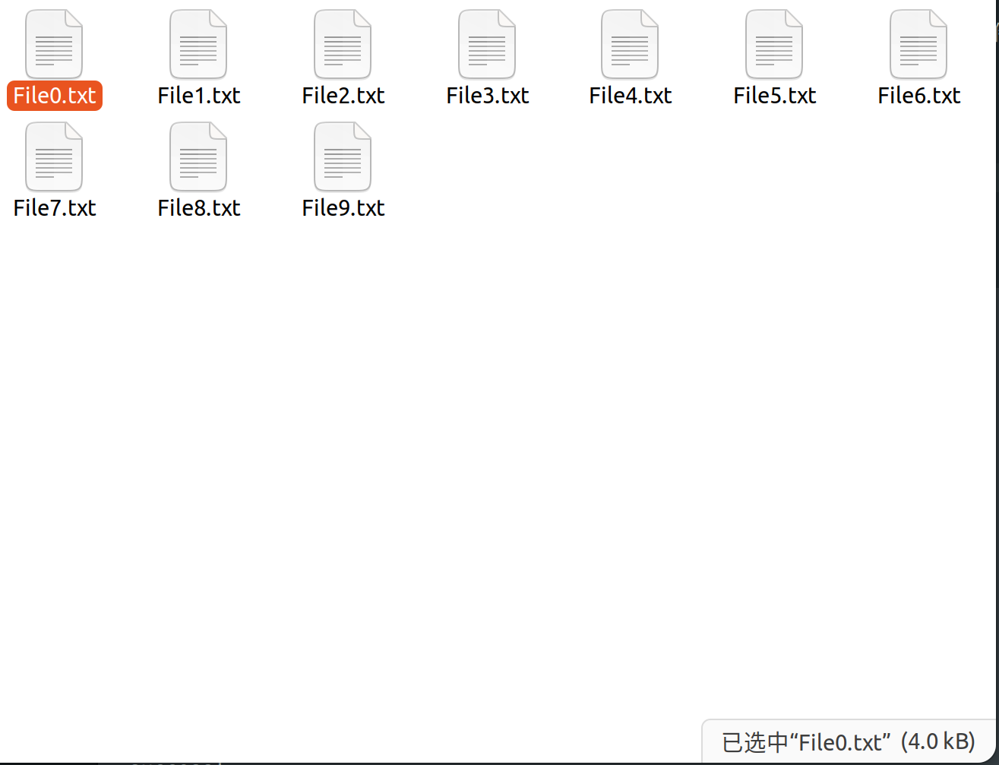
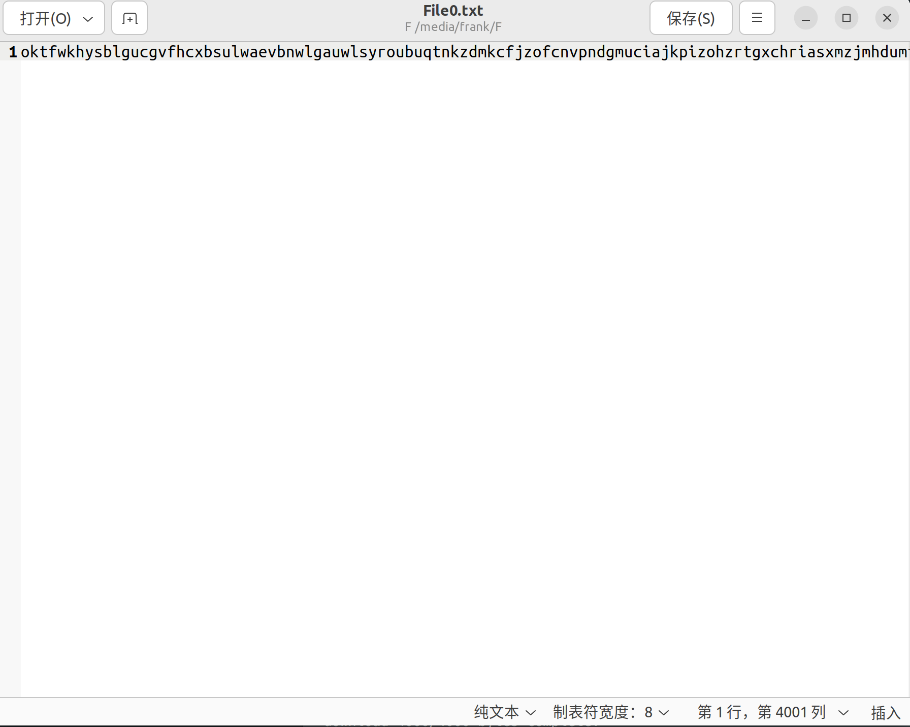
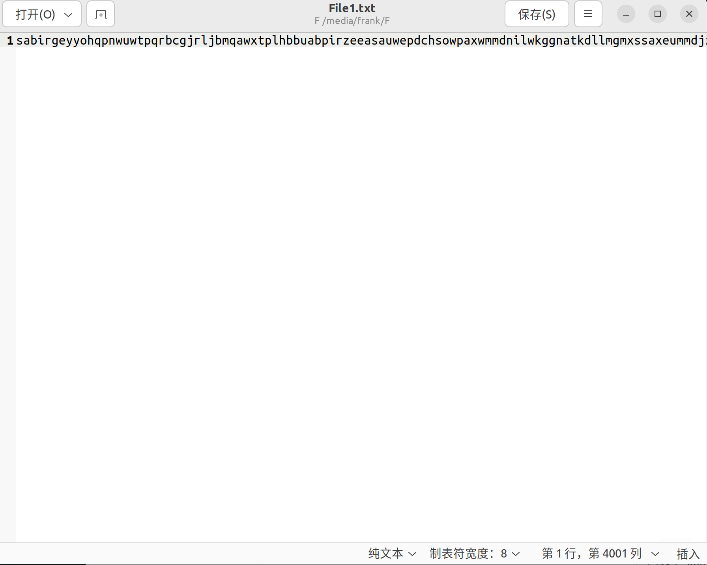
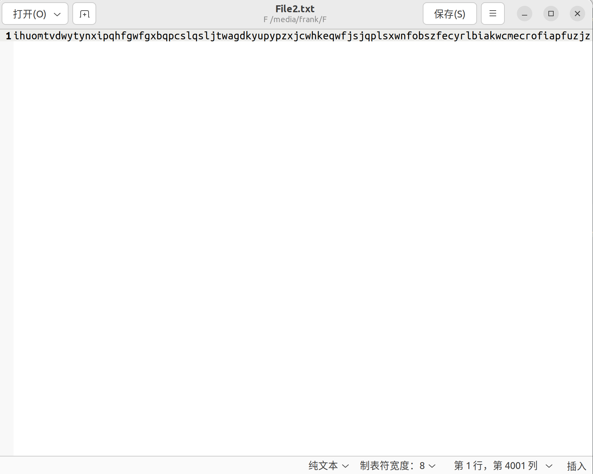

# 基于矽璓已实现的W5500网卡驱动，在Riscv上实现FTP协议的Client功能 #

## 1. 简介
利用w5500网络编程的api实现了ftp客户端的功能，具体功能包括向ftp服务器发送指定命令，根据用户名登陆ftp服务器，获取文件大小，下载指定文件并保存至sd卡内，并提供了测试函数模拟从ftp服务器上下载10个4KB文件的过程

## 2. 数据结构设计说明
全局变量：
char sendBuffer[]:输出缓冲区  
char recvBuffer[]:输入缓冲区

包括以下函数功能，分别为：  
`SendCommand`：发送指定的指令  
`EnterPasv`：进入被动模式  
`Login`：根据用户名登陆ftp服务器  
`GetFileSize`：获取指定文件的大小  
`Download`：下载指定文件
  

## 3. 测试程序说明
测试了创建套接字，与服务器建立连接并根据传入的用户名和密码发送登陆指令。登陆成功后下载服务器上指定的10个4KB大小的txt文件，然后调用开发板的相关api在系统根目录中创建对应的文件，写入从服务器接收到的数据。

## 4. 运行结果（##需结合运行测试截图按步骤说明##）

打开menuconfig之后，将test_ftp开启(y)，将Using TFcard device 和 Using W5500 as network device 开启(y)保存后退出

编译XiZi-edu-riscv64.elf成功

启动kflash烧录bin文件，按reset键重置成功进入系统并显示SD卡已挂载

执行TestTfp命令，可以看到成功登陆ftp服务器，并开始下载10个大小为4KB的文件。

服务器日志信息

读取sd卡中的文件可以看到10个大小为4KB的文件被成功下载

