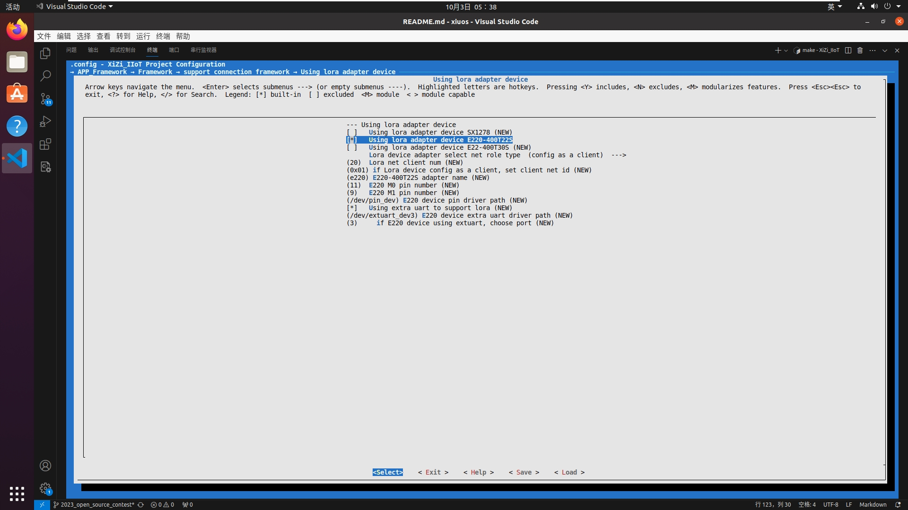
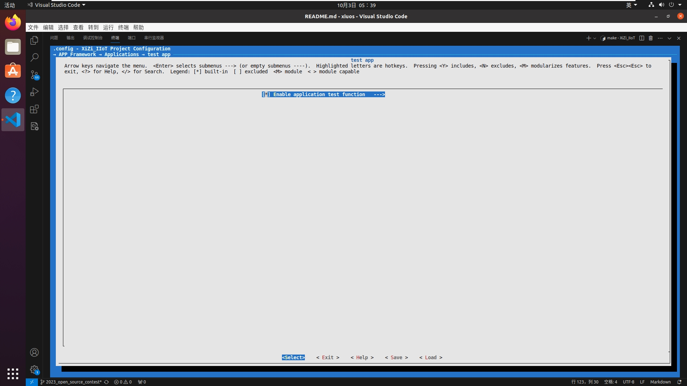
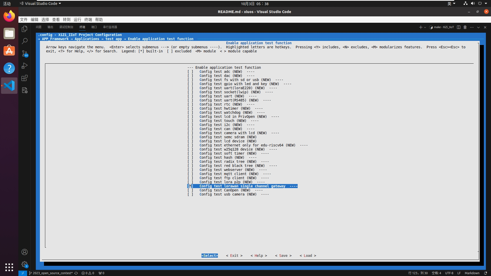
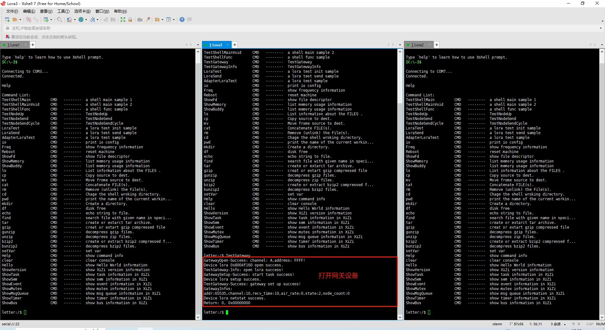
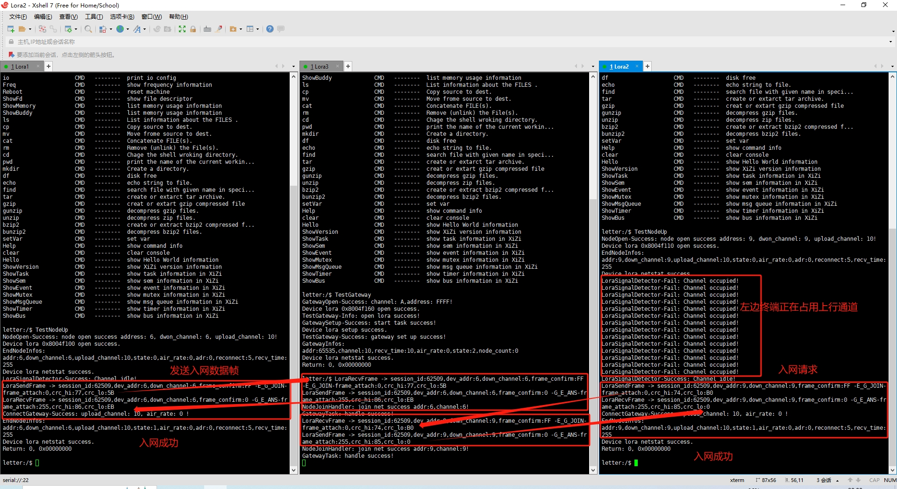
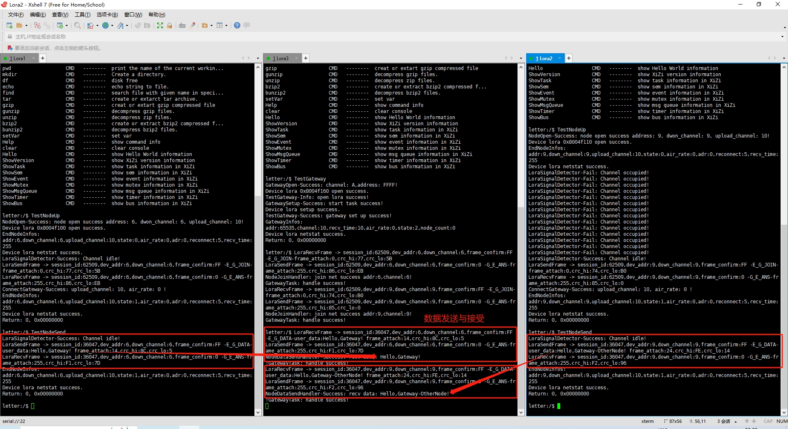
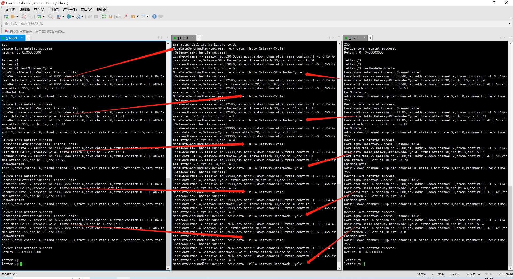

# 基于初赛二级赛题1，实现多个LoRa节点和LoRa网关通信私有协议
## 1. 简介
基于 E220-400T22S Lora模块设计实现通信私有协议，主要包含以下几个方面：<br>
- 协议实现完全遵循LoRa Adapter代码规范，可以直接使用原有的Adapter相关函数基于本协议构建Lora网络。
- 重新设计实现E220底层函数，增加了IOCTL函数实现，支持在运行时对地址、信道、通信模式、空中速率等参数的动态配置。
- E220模块只支持单通道通信，本协议基于定向传输模式实现了多下行信道通信。
- 支持数据帧完整性校验、支持数据帧丢失或者跳帧检测。
- 支持节点断网自动重联，在数据发送失败时可以进行重联或者搜索其他网关。
- 支持节点对网关的搜索，可以主动寻找在线网关入网。
- 支持信道冲突检测，检测上行通道是否占用。
## 2. 数据结构说明
### E220模块相关数据结构
```c
enum LoraMode                        // E220工作模式，支持四种，配置模式与休眠模式一致
{
    MODE_TRANSFER_MODE = 0,          // M0 : M1 = 0 : 0 可发可收
    MODE_WOR_SEND,                   // M0 : M1 = 1 : 0 可发可收
    MODE_WOR_RECV,                   // M0 : M1 = 0 : 1 可收不发
    MODE_CONFIG_SLEEP                // M0 : M1 = 1 : 1 不收不发
};

enum LoraState                       // 硬件状态
{
    STATE_CLOSED,                    // 硬件关闭
    STATE_OPENED,                    // 已正常开启
    STATE_BROKEN                     // 硬件损坏
};

enum LoraTransMode                   // 模块传输模式
{
    TRANS_MODE_HYALINE = 0X0,        // 透明传输
    TRANS_MODE_ORIENTED = 0X40,      // 定点传输
};

enum LoraAirRate                     // 空中速率，通信双方必须设置一致的空中速率方可进行通信
{
    AIR_RATE_2D4K = 0X0,             // 2.4K
    AIR_RATE_4D8K = 0X3,             // 4.8K
    AIR_RATE_9D6K = 0X4,             // 9.6K
    AIR_RATE_19D2K = 0X5,            // 19.2K
    AIR_RATE_38D4K = 0X6,            // 38.4K
    AIR_RATE_62D5K = 0X7             // 62.5K
};

enum LoraConfig                      // 支持IOCTL函数进行配置的配置项枚举,某些项只支持9600波特率配置
{
    CONFIG_SERIAL_TIME_OUT = 0X0,    // 串口超时时间
    CONFIG_LORA_MODE = 0X1,          // 配置Lora模式
    CONFIG_TRANS_MODE = 0X2,         // 配置Lora传输模式(9600)
    CONFIG_AIR_RATE = 0X3,           // 配置空中速率(9600)
    CONFIG_BAUD_RATE = 0X4,          // 配置波特率
    CONFIG_ADDRESS = 0X5,            // 配置设备地址(9600)
    CONFIG_CHANNEL = 0X6,            // 配置设备信道(9600)
    CONFIG_SHOW = 0X7                // 打印配置信息
};
```
### 数据帧相关数据结构
```c
enum FrameType      // 数据帧类型枚举
{
    E_G_JOIN = 0,   // 客户端入网请求，需回复
    E_G_QUIT,       // 客户端退网请求，不需回复
    E_G_DATA,       // 客户端上传数据，需回复
    G_E_ANS,        // 网关响应客户端请求
};

struct LoraFrame                // 数据帧消息类型
{
    uint16 begin_mark;          // 开始标志 0x3C3C
    uint16 session_id;          // 会话ID，客户端每次数据上传会随机设置，若是回复ID不一致则表示数据丢失
    uint16 dev_addr;            // 设备地址，特指终端地址，网关地址固定为 0XFFFF
    uint8 down_channel;         // 下行通道，即终端所在的信道
    uint8 frame_type;           // 数据帧的类型
    uint8 frame_confirm;        // 该数据帧是否需要确认回复
    uint8 frame_attach;         // 用于携带简单的数据，例如用户数据长度
    uint8 *user_data;           // 需要额外携带的大量数据
    uint8 crc_hi;               // 校验位高字节
    uint8 crc_lo;               // 校验位低字节
    uint16 end_mark;            // 结束标志 0X5A5A
};
```
### Lora节点相关数据结构
```c
enum EndNodeState                     //节点状态
{
    NODE_STATE_DISCONNECT = 0,        // 硬件开启，但是没有联网，后台程序可能开启
    NODE_STATE_CONNECT,               // 硬件开启，已经联网，后台程序可能开启
    NODE_STATE_BROKEN,                // 硬件损坏，无后台程序
    NODE_STATE_CLOSED                 // 硬件关闭，无后台程序
};

struct EndNodeParam                   // 节点参数结构
{
    uint16 dev_addr;                  // 设备地址信息
    uint8 down_channel;               // 下行通道，终端可以接收信息的信道
    uint8 upload_channel;             // 上行通道，终端可以给网关发送信息的信道
    uint16 session_id;                // 会话ID，用于判定数据帧是否存在丢失

    enum EndNodeState node_state;     // 客户端状态
    enum LoraAirRate air_rate;        // 终端的空中速率
    uint8 adr_enable;                 // 终端是否开启自动寻找上行网关
    uint8 reconnect_enable;           // 终端断网自动重联
    uint8 recv_time;                  // 接受下行消息的时间窗口长度，单位为秒
};
```
### Lora网关相关数据结构
```c
struct EndNodeInfo                    // 网关存储的客户端信息
{
    uint16 node_addr;                 // 客户端地址
    uint8 node_down_channel;          // 客户端下行通道
    uint16 session_id;                // 上一个命令的会话ID
};

enum GatewayState                   // 网关的状态枚举
{
    GATEWAY_CLOSED,                 // Lora还没有打开
    GATEWAY_OPENED,                 // 已打开，但是未开始工作
    GATEWAY_WORKING,                // 正常打开且已经开始正常工作
    GATEWAY_BROKEN                  // 模块损坏
};

struct GatewayParam                                             // 网关参数
{
    uint16 dev_addr;                                            // 设备ID
    uint8 channel;                                              // 网络编号

    int recv_time;                                              // 串口超时时间
    enum LoraAirRate air_rate;                                  // 网关空中速率
    uint8 frame_retry;                                          // 重传次数
    enum GatewayState gateway_state;                            // 网关状态
    struct EndNodeInfo *node_infos[LORA_GATEWAY_MAX_NODE];      // 客户端信息
    uint16 node_count;                                          // 已链接客户端数量
};
```
## 3. 测试程序说明
- 编译烧录两个不同地址、信道的客户端和一个网关。
- 分别打开客户端和网关并联网。
- 两个客户端分别向网关发送数据。
## 4. 运行结果
### （1）编译模块：
- 配置MENUCONFIG

> 开启连接框架支持，同时开启Lora Adapter支持


> 选择E220模块


> 开启测试函数


> 测试单通道网关

- 修改MakeFile：xiuos/APP_Framework/Applications/app_test/Makefile第141行修改为
```c
        SRC_FILES += test_lora_net_final/lora_driver/e220.c
        SRC_FILES += test_lora_net_final/lora_mac/lora_mac.c
        SRC_FILES += test_lora_net_final/test_lora_net_final.c
```
- 修改框架初始函数：
> 1. 文件：xiuos/APP_Framework/Framework/framework_init.c 第27行修改为<br> extern int UsrAdapterLoraInit(void);
> 2. 文件：xiuos/APP_Framework/Framework/framework_init.c 第170行的AdapterLoraInit修改为UsrAdapterLoraInit
### （2）打开网关

> 网关打开，地址OXFFFF，信道OXA，空中速率2.4K

### （3）客户端连接网关

> 两边客户端同时发送入网请求，可以看见信道检测效果

### （4）客户端发送数据

> 客户端向网关发送数据


> 两边客户端同时发送数据

使用自带的天线，2.4K空中速率，载荷64字节，在无大型遮盖物的情况下传输距离近1500米