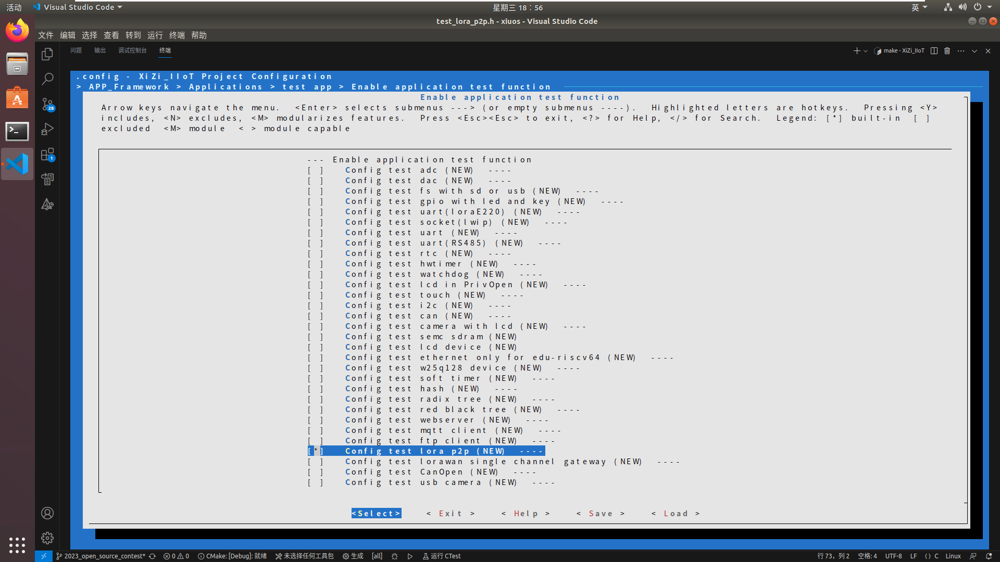
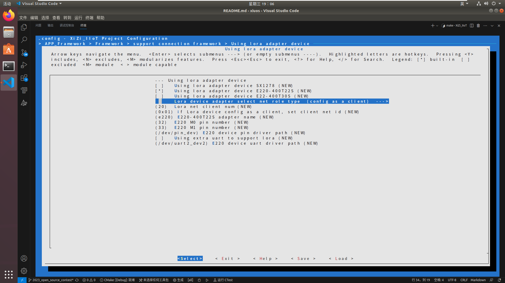
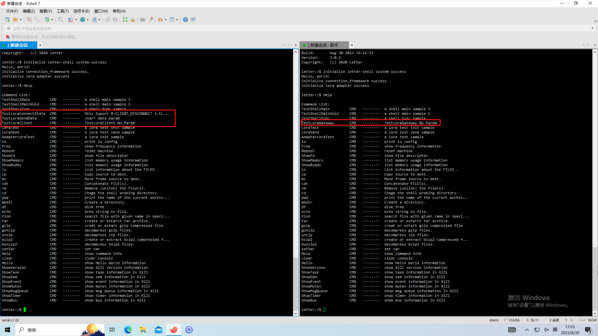
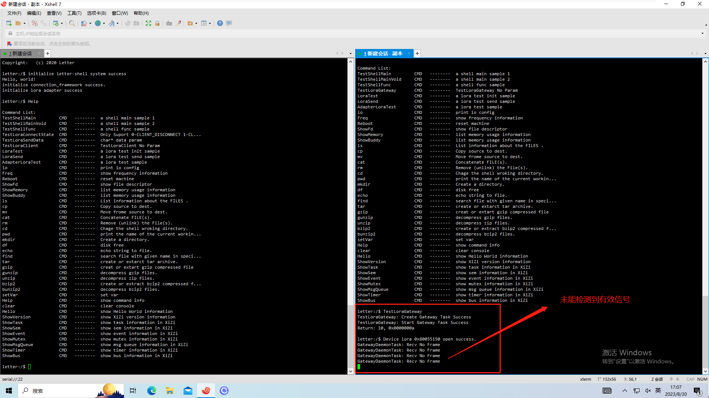
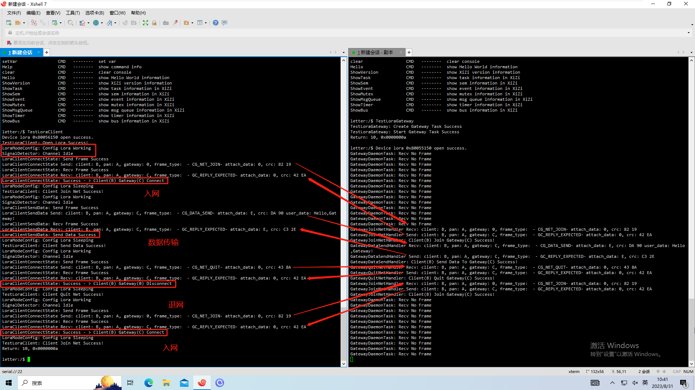
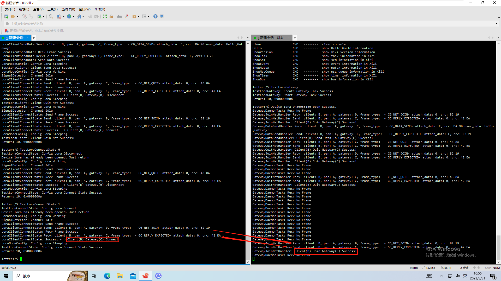
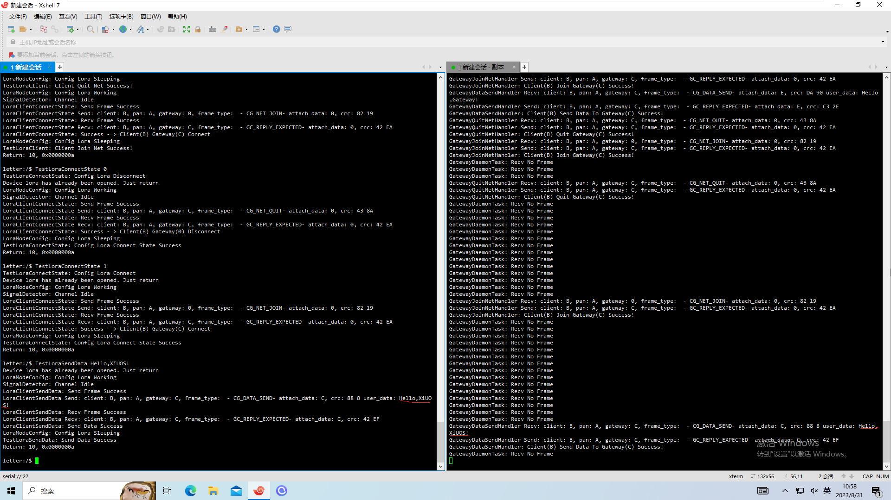

# 基于RISC-V终端，实现LoRa节点和LoRa网关通信私有协议

## 一、简介
在RISC-V终端上实现LoRa节点和LoRa网关私有协议通信功能,客户端可以通过SHELL终端连接\断开网关,并可以向网关发送数据.

## 二、数据结构设计说明
### 1、Lora工作模式枚举
```c
enum LoraMode
{
    LORA_SLEEP = 0, // 切换至休眠模式
    LORA_WORK = 1 // 切换至工作模式
};
```
在客户端需要传输数据时，Lora会工作在普通模式进行数据传输，在客户端数据传输完毕后，Lora会切换到休眠模式以屏蔽数据。

### 2、客户端/网关状态信息
```c
enum ClientState
{
    CLIENT_DISCONNECT = 0, // 开启但断网
    CLIENT_CONNECT, // 开启且联网
    CLIENT_BROKEN, // 硬件损坏
    CLIENT_CLOSED // 硬件关闭
};
enum GatewayState
{
    GATEWAY_ORIGINAL= 0, // 关闭且未开始工作
    GATEWAY_WORKING, // 开启且已经开始工作
    GATEWAY_BROKEN // 模块损坏
};
```
### 3、客户端/网关参数信息
```c
struct ClientParam 
{
    uint8_t client_id;
    uint8_t panid;
    uint8_t gateway_id;
    enum ClientState client_state;
    pthread_mutex_t client_mutex; // 互斥量
};
struct GatewayParam 
{
    uint8_t gateway_id;
    uint8_t panid;
    uint8_t client_infos[GATEWAY_MAX_CLIENT_NUM];
    uint8_t client_num;
    enum GatewayState gateway_state;
    pthread_mutex_t gateway_mutex; // 互斥量
};
```
### 4、数据帧类型枚举
```c
enum FrameType
{
    /*C --->  G*/
    CG_NET_JOIN = 0, // 入网请求
    CG_NET_QUIT, // 退网请求
    CG_DATA_SEND, // 数据传输请求
    /*G --->  C*/
    GC_REPLY_EXPECTED, // 上行请求执行成功
    GC_REPLY_UNEXPECTED, // 上行请求执行失败
};
```
### 5、数据帧结构设计
```c
struct DataFrameFormat
{
    uint8_t begin_mark_1; // 0XFF
    uint8_t begin_mark_2; // 0XAA
    uint8_t client_id;  // 0 - 127
    uint8_t panid;  // 0 - 127
    uint8_t gateway_id;   // 0 - 127
    uint8_t frame_type;   // 0 - 127
    uint8_t attach_data;   // 0 - 127 可以是数据长度，该值的意义视数据帧类型而定
    uint8_t* user_data;  // 在有数据携带时才会发送该指针所指缓冲区数据
    uint8_t crc_hi;   // 这个字节没有0XFF
    uint8_t crc_lo; // 这个字节会出现 0XFF，但是他的下一个字节不可能是00，必然是0XFF
    uint8_t end_mark_1; // 0XFF
    uint8_t end_mark_2; // 0X00
};
```
## 三、包含以下功能
### 1、客户端联网/退网/数据传输操作
> (1)、获取使用权后将其配置为传输模式。<br>
> (2)、构建数据帧并设置好数据帧类型。<br>
> (3)、监听信道直到信道空闲。<br>
> (4)、发送数据帧（若是数据传输需要带上数据一起传输），若失败回到第三步。<br>
> (5)、接收数据帧并对数据帧进行数据过滤，若失败回到第三步。<br>
> (6)、解析数据帧并得到结果<br>
### 2、网关后台任务操作
> (1)、获取使用权后开启数据接收。<br>
> (2)、根据数据帧结构，监听信道，过滤掉杂乱的信号，在接收到一个完整的数据帧并完整性校验通过后返回继续第三步，否则循环执行第二步。<br>
> (3)、根据得到的数据帧类型将其交付给对应的处理器处理，处理完毕后返回第二步。<br>

## 四、测试程序说明
在进行测试时，最好先启动网关并开启网关程序，当然后启动网关也一样。
### 1、客户端测试程序
> (1)、`TestLoraConnectState`命令可以进行网络连接或者断开，`0-CLIENT_DISCONNECT 1-CLIENT_CONNECT`。
> (2)、`TestLoraSendData`命令可以发送数据（联网状态下），请使用字符串（`void TestLoraSendData(char* data)`）。
> (3)、`TestLoraClient`命令可以整体测试，先进行联网，再发送数据，再断开连接，最后再联网。
### 2、网关测试程序
> (1)、`TestLoraGateway`命令可以启动网关程序。

## 五、运行结果（##需结合运行测试截图按步骤说明##）
### 1、修改必要的框架和驱动代码

#### 修改文件： `xiuos/APP_Framework/Framework/framework_init.c`
1. 在第`28`行添加代码: `extern int UsrAdapterLoraInit(void);`;
2. 将第`170`行代码的`AdapterLoraInit`修改为`UsrAdapterLoraInit`，更换Lora的初始化函数;

#### 修改文件：`xiuos/APP_Framework/Framework/connection/lora/e220/e220.c`
1. 将第`429`行代码修改为`cfg.serial_timeout = 5000;`,更改客户端超时时间;
2. 为第`478`行的`E220Ioctl`添加函数体：
```c     
static int E220Ioctl(struct Adapter *adapter, int cmd, void *args)
{
    switch (cmd)
    {
    case 0:                                      // LORA_SLEEP
        E220LoraModeConfig(CONFIGURE_MODE_MODE); // 切换至休眠模式
        break;
    case 1:                                      // LORA_WORK
        E220LoraModeConfig(DATA_TRANSFER_MODE); // 切换至传输模式
        break;
    default:
        break;
    }

    return 0;
}
```
### 2、修改Makefile

#### 修改文件： `xiuos/APP_Framework/Applications/app_test/Makefile` 第 `137` 行为 `SRC_FILES += test_lora_p2p/test_lora_p2p.c`
### 3、menuconfig配置
1. `APP_Framework > Applications > test app` 开启 `Enable application test function` ,然后进入其中，开启 `Config test lora p2p (NEW)` ;

2. `APP_Framework > Framework` 开启 `support connection framework (NEW)` ,然后进入其中，开启 `Using lora adapter device (NEW)` ，然后进入其中， 客户端将其配置如下图所示，网关将其配置为下下图所示;


3. 将客户端和网关分别编译、烧录到不同的板子并启动后用串口进行连接;

4. 启动网关程序；

5. 整体测试客户端；

6. 测试断网

7. 测试联网

8. 测试数据发送
