# 基于RISC-V终端，实现LoRa节点和LoRa网关通信私有协议

## 1.简介
在RISC-V终端上实现LoRa节点和LoRa网关私有协议通信功能,客户端可以通过SHELL终端连接\断开网关,并可以向网关发送数据.

## 2.数据结构设计说明

```c
enum ClientState
{
    CLIENT_DISCONNECT = 0,
    CLIENT_CONNECT,
};
struct LoraClientParam 
{
    uint8_t client_id;
    uint8_t panid;
    uint8_t gateway_id;
    enum ClientState client_state;
    int client_mtx;
};
```
Lora客户端基础数据结构,`ClientState`为客户端状态,仅有断开和连接两种状态,`LoraClientParam`为客户端参数数据结构,`client_mtx`是Lora硬件互斥量.
```c
struct LoraGatewayParam 
{
    uint8_t gateway_id;
    uint8_t panid;
    uint8_t client_id[GATEWAY_MAX_CLIENT_NUM];
    int client_num;
    int gateway_mtx;
};
```
Lora网关参数数据结构,`gateway_mtx`是Lora硬件互斥量.
```c
struct LoraHeaderFormat
{
    uint8_t client_id; //1
    uint8_t panid;//1
    uint8_t gateway_id; //1
    uint8_t lora_data_type; //1
    uint8_t data; //1
    uint8_t crc_lo;
    uint8_t crc_hi; //2
};
enum LoraDataType
{
    /*****C --->  G*/
    CLIENT_JOIN_NET_REQUEST = 0,
    CLIENT_QUIT_NET_REQUEST,
    CLIENT_SEND_TEST_DATA_TO_GATEWAY_REQUEST,
    /*****G --->  C*/
    GATEWAY_REPLY_CLIENT_RESULT_EXPECTED,
    GATEWAY_REPLY_CLIENT_RESULT_UN_EXPECTED,
};
```
`LoraHeaderFormat`是主要的数据结构,包含基本参数,数据类型,附带数据,校验信息.`LoraDataType`标识数据报头的类型

```c
static int (*gateway_handlers[])(struct Adapter*,struct LoraHeaderFormat*) = 
{
    [CLIENT_JOIN_NET_REQUEST] = ClientJoinNetHandler,
    [CLIENT_QUIT_NET_REQUEST] = ClientQuitNetHandler,
    [CLIENT_SEND_TEST_DATA_TO_GATEWAY_REQUEST] = ClientSendTestDataHandler,
};
```
`gateway_handlers`是网关人物处理相关事物的映射表,网关会根据不同的信息类型调用不同的处理函数.

## 3.测试程序说明

1. 第一步: 启动网关任务
    > 网关任务启动后会一直监听信道,在接收到数据后,首先对数据进行过滤,判断是否是发送给当前网关的数据,启动网关的命令: `StartGatewayTask`
2. 第二步: 初始化客户端,
   > `ClientInit`命令可以初始化相关参数并打开Lora设备.
3. 第三步:客户端连接网关
   > `ClientConnect`命令可以向客户端配置的网络发送入网请求,当该入网请求被该网络中的网关接受处理后即可完成入网.
4. 第四步:客户端发送数据
   > `ClientSend` 命令在客户端入网后可以向网关发送数据.
5. 第五步:客户端断开连接
   > `ClientDisConnect`命令可以向客户端配置的网络发送退网请求,当该退网请求被指定网关接受处理后即可完成退网.

## 4. 运行结果（##需结合运行测试截图按步骤说明##）

1. 修改Lora的初始化和注册函数,将原来的注册函数更换为自定义的初始化函数:<br>
在文件 `APP_Framework/Framework/framework_init.c` 第 28 行添加 外部函数声明 <br>`extern int UsrAdapterLoraInit(void);`,<br>
将第170行的`AdapterLoraInit`改为`UsrAdapterLoraInit`.
2. 修改对应的Makefile文件将测试代码加入编译.
3. 在工作区终端进入指定目录并输入命令`make BOARD=edu-riscv64 menuconfig`进入配置模式:<br>
> (1) 依次进入: `APP_Framework -> Framework `开启 `support connection framework` 并进入;<br>
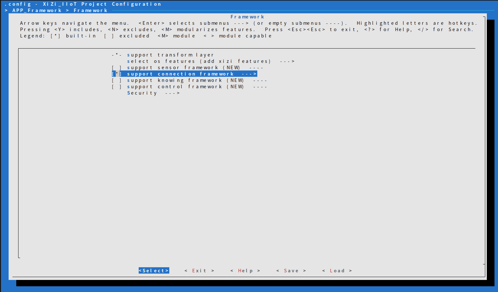<br>
> (2) 开启 `Using lora adapter device` 并进入<br>
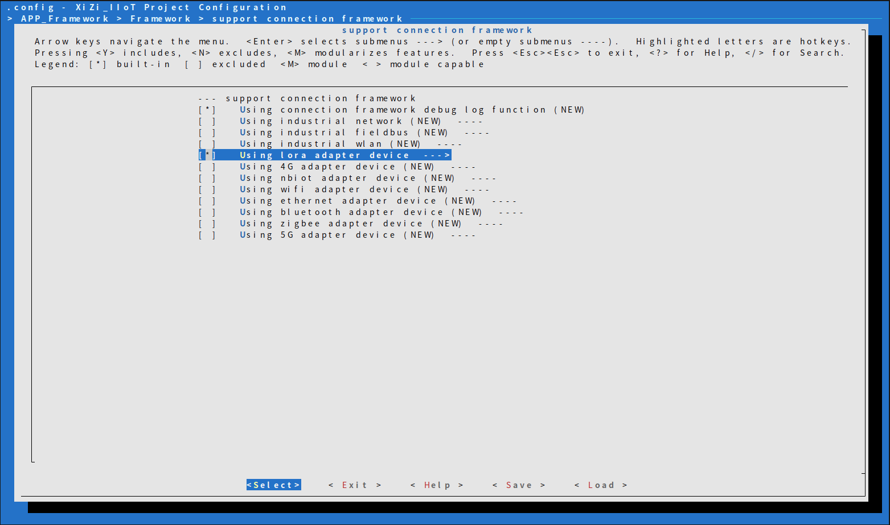<br>
> (3) 选择 `Lora device adapter select net role type`,将角色配置为网关角色,其他配置如下图所示<br>
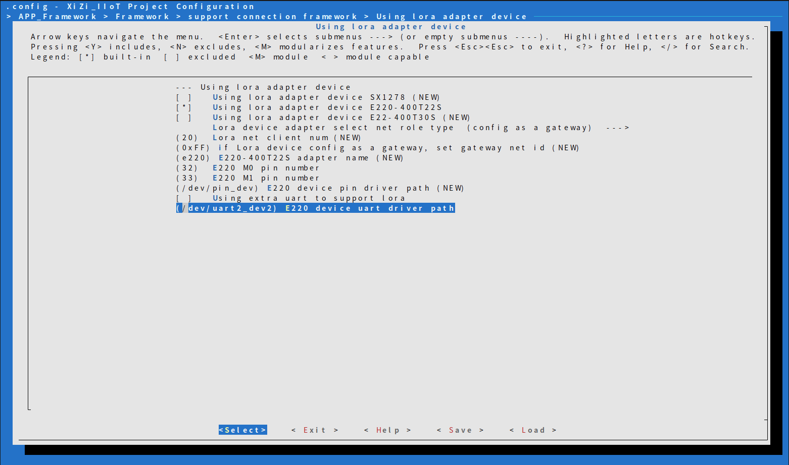<br>
> (4) 依次进入: `APP_Framework > Applications > test app` 开启 `Enable application test function` 并进入, 开启`Config test lora p2p`选项.<br>
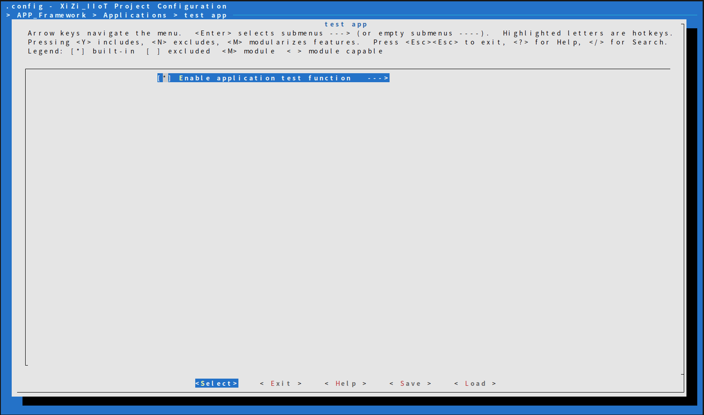<br>
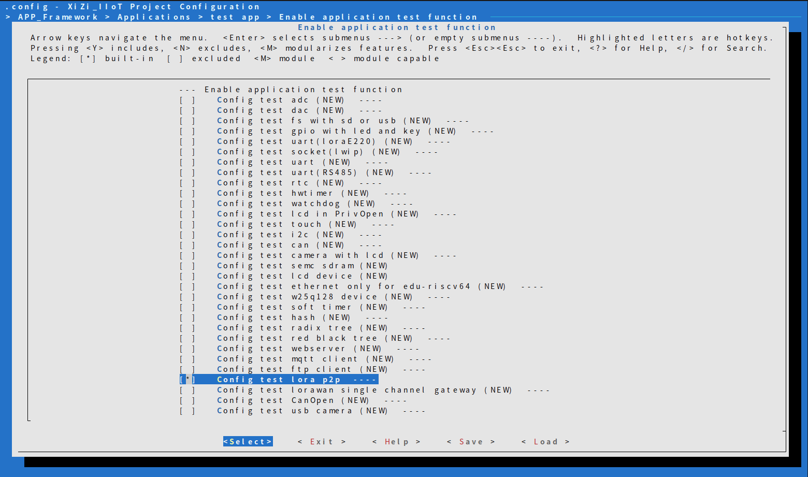<br>
> (5) 保存配置.
1. 使用命令`make BOARD=edu-riscv64`获得网关服务的运行文件,烧录进一个硬件作为网关
2. 使用同样的方法配置编译一个客户端可执行文件并烧录(配置的第三步将其配置为客户端角色)
3. 连接两个硬件并开始测试.
4. 开启网关服务
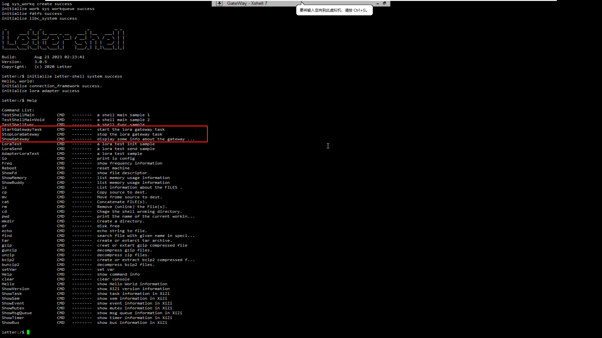<br>
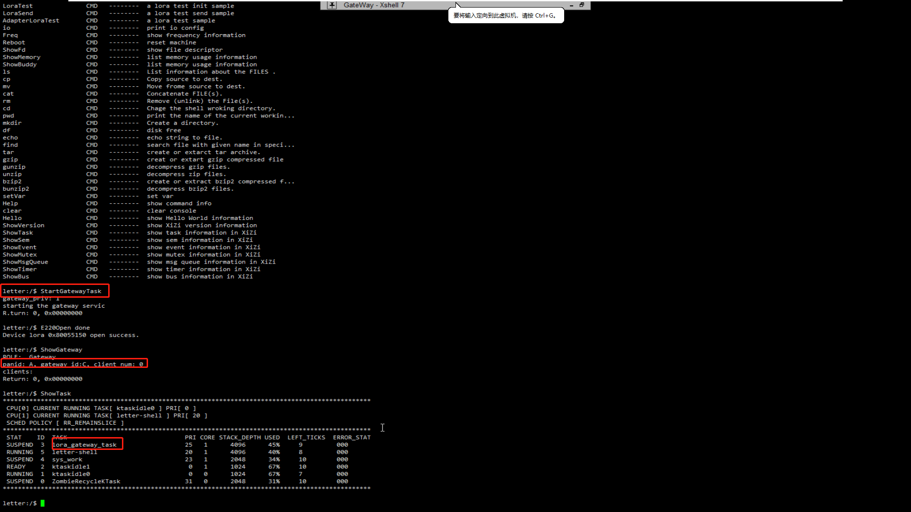<br>
1. 初始化客户端
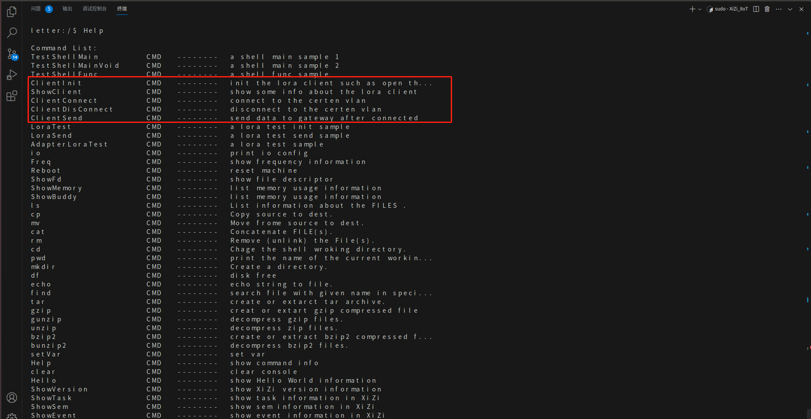<br>
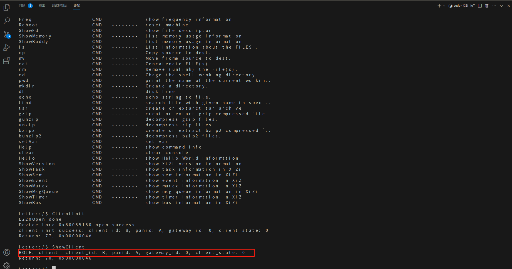<br>
1.  客户端连接网关
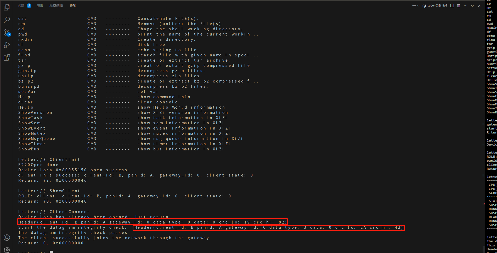<br>
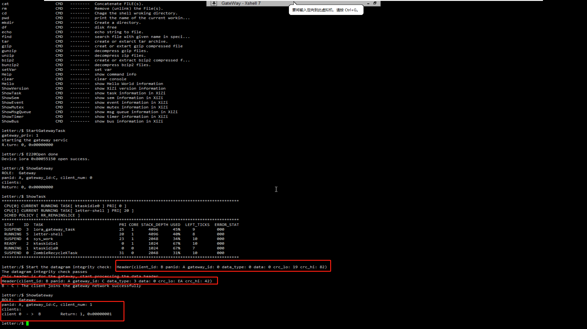<br>
1.   客户端发送数据到网关
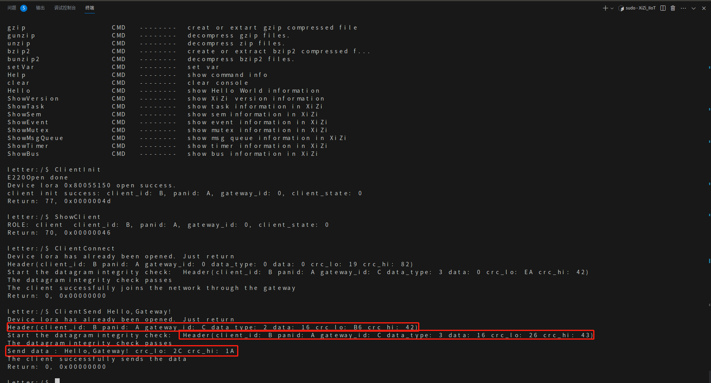<br>
<br>
1.   客户端断开网关
<br>
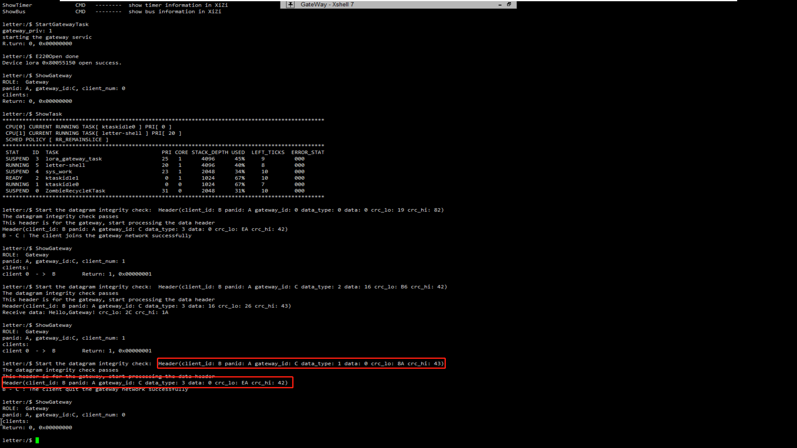<br>
