# ##modbus-tcp##

## 1. 简介

在xiuos平台实现modbusTCP协议，包括协议报文组装、解析和数据传输，支持主从通信。

## 2. 数据结构设计说明

### 2.1 数据结构定义 	

首先，需要定义设备存储区的结构体，包括两种存储类型，16位的寄存器和线圈。

```c
//定义存储区结构体
typedef struct MbMemory
{
    coils8_t*rcoil_mem;
    reg_t*rreg_mem;
    coils8_t*rwcoil_mem;
    reg_t*rwreg_mem;
}MBmemoryType;
```

​	然后便是关于ModbusTCP协议相关的结构体定义，包括MBAP和PDU，后续数据区视情况而定，长短不固定。

```c
//协议的固定部分为12个字节，当功能码为写多个数据时，后续还有不定长的数据部分
typedef struct mbap
{
    //MbapType
    u16_t tid;
    u16_t pid;
    u16_t len;
    u8_t uid;

    /* data */
}MbapType;

typedef struct pdu
{
    u8_t func;    

    u16_t addr;

    u8_t operand1;
    u8_t operand2;
    /* data */
}PduType;
```

### 2.1 从设备请求解析和响应部分

​	主要定义请求的解析器结构，以及每种功能码对应的解析函数，和发送响应的函数。

```c
//定义解析器结构体
typedef struct mbparser
{
    int (*func_set[20])(MBmemoryType*,int,MbapType*,PduType*,u8_t**resp);
}MbParserType;

//功能码解析函数
int FuncReadRwCoilX01(MBmemoryType*mem,int fd,MbapType*mbap,PduType*pdu,u8_t**resp);
int FuncReadRCoilX02(MBmemoryType*mem,int fd,MbapType*mbap,PduType*pdu,u8_t**resp);
int FuncReadRwRegX03(MBmemoryType*mem,int fd,MbapType*mbap,PduType*pdu,u8_t**resp);
int FuncReadRRegX04(MBmemoryType*mem,int fd,MbapType*mbap,PduType*pdu,u8_t**resp);
int FuncWriteRwCoilX05(MBmemoryType*mem,int fd,MbapType*mbap,PduType*pdu,u8_t**resp);
int FuncWriteRwRegX06(MBmemoryType*mem,int fd,MbapType*mbap,PduType*pdu,u8_t**resp);
int FuncWriteRwMcoilsX0f(MBmemoryType*mem,int fd,MbapType*mbap,PduType*pdu,u8_t**resp);
int FuncWriteRwMregsX10(MBmemoryType*mem,int fd,MbapType*mbap,PduType*pdu,u8_t**resp);
int FuncReportSlaveIDX11(MBmemoryType*mem,int fd,MbapType*mbap,PduType*pdu,u8_t**resp);


/**
 * @description: 制作响应报文
 * @param  {MbapType*mbap,PduType*pdu,u8_t**resp,u16_t buf_len}
 * @return {}
 * @Author: pgh_dd 1041315949@qq.com
 * @LastEditors: pgh_dd 1041315949@qq.com
 */
void MakeResponse(MbapType*,PduType*,u8_t**,u16_t);

/**
 * @Description: 发送响应报文
 * @param {int} fd 套接字对应文件描述符
 * @param {u16_t} n 报文大小
 * @return {int} 
 * @Date: 2023-07-25 17:24:55
 * @Author: pgh_dd 1041315949@qq.com
 */
int SendResponse(int fd,u8_t**buf,u16_t n);


```

### 2.2 主设备的请求包装和发送部分

```c
/**
 * @Description: 读取键盘输入，并生成请求报文
 * @param {u8_t} flag
 * @return {int}
 * @Date: 2023-07-25 17:25:26
 * @Author: pgh_dd 1041315949@qq.com
 * @LastEditors: pgh_dd 1041315949@qq.com
 */
int GenerateModbusRequest(MbapType*,PduType*,u8_t flag,u8_t**request);

/**
 * @Description: 发送请求报文
 * @param {int fd,u8_t**request,int n}
 * @return {}
 * @Date: 2023-07-25 17:26:10
 * @Author: pgh_dd 1041315949@qq.com
 * @LastEditors: pgh_dd 1041315949@qq.com
 */
void SendModbus(int fd,u8_t**request,int n);

/**
 * @Description: 读取请求报文
 * @param {int fd,MbapType*mbap,PduType*pdu}
 * @return {void}
 * @Date: 2023-07-25 17:26:49
 * @Author: pgh_dd 1041315949@qq.com
 * @LastEditors: pgh_dd 1041315949@qq.com
 */
void GetRequest(int fd,MbapType*,PduType*);
```


## 3. 测试程序说明

​	modbusTCP协议基于TCP协议，因此其主从通信实际上是基于TCP的S/C通信，因此分为服务端和客户端。

​	服务端部分（从设备）程序实际上是一个被动接受请求报文的TCP服务器程序，除了一些基础参数的定义外，主要包括一个无限循环的服务程序，包括报文的接收，以及对存储区的操作，和生成发送响应。

```c
static void *ModbusTcpServer(void *arg)
{
    //设置IP和子网掩码网关
    u8_t uid=1;//定义从设备id和存储区
    
    MBmemory mbm;//定义存储区
    if(mb_memory_init(&mbm)==-1)//初始化存储区，包括对四个存储区进行内存分配
    {
        return 0;
    };

    MBparser mb_parser;//初始化功能码解析器
    MBparser_init(&mb_parser,MBTCP);//初始化解析器，将功能码对应函数注册

    int fd=create_socket(PORT);//创建监听套接字
    if(fd==-1)return 0;

    if (listen(fd, 10) != 0 ) {
        lw_error("Unable to listen\n");
        close(fd);
        return 0;
    }

    while(1)
    {
        //建立连接，因为每次接受的连接可能不是同一个设备发来的，因此需要把建立连接部分放在循环体内。
        struct sockaddr_in tcp_addr;
        socklen_t addr_len;

        printf("wait accept\n");
        int clientfd = accept(fd, (struct sockaddr *)&tcp_addr, (socklen_t*)&addr_len);

        if(clientfd==-1)
        {
            lw_error("Unable to listen\n");
            return 0;
        }

        while(1)
        {
            MBAP mbap;
            PDU pdu;
            read_mbtcp_MBAP(clientfd,&mbap);//读取数据前7字节为mbap初始化
            
            if(mbap.uid!=uid){//检验是否为此从机
                close(clientfd);
                break;
            }
            

            read_mbtcp_PDU(clientfd,&pdu);//读取pdu和一些定长部分

            printf("OP:%x\n",pdu.func);
            printf("ADDR:%x\n",pdu.addr);
            
            u8_t** response_buf;//定义操作返回的指针
            u8_t buf_len=mb_parser.func_set[pdu.func](&mbm,clientfd,&mbap,&pdu,response_buf);//请求的解析和对存储区的操作
            
            send_response(clientfd,response_buf,buf_len);//发送响应
            // return NULL;
            //执行操作

        }
        close(clientfd);
    }
    close(fd);
    mb_memory_free(&mbm);//释放存储区
}

```

​	客户端部分（主设备）是一个主动发送请求的TCP客户端程序，主要包括一个接受键盘输入的循环体，可以接受用户输入的指令，然后包装成Modbus请求报文，并发送给ModbusTCP服务器，然后接受响应报文。

```c
static void *ModbusTcpClient(void *arg)
{
    u16_t counter=0;
    int fd = -1;
    int ret;

	// lw_print("2023-05-27 Peng Guanhua\n");
    lw_print("%s start\n", __func__);

    fd = socket(AF_INET, SOCK_STREAM, 0);//定义服务器套接字
    if (fd < 0) {
        lw_print("Socket error\n");
        return NULL;
    }

    char tcp_ip_str[128]="192.168.31.148";//服务器ip和端口号
    u16_t tcp_socket_port=6000;
    
	/*建立套接字连接*/
    printf("%s\n",tcp_ip_str);
    struct sockaddr_in tcp_sock;
    tcp_sock.sin_family = AF_INET;
    tcp_sock.sin_port = htons(tcp_socket_port);
    tcp_sock.sin_addr.s_addr = inet_addr(tcp_ip_str);
    printf("%s\n",tcp_ip_str);

    memset(&(tcp_sock.sin_zero), 0, sizeof(tcp_sock.sin_zero));
	
    ret = connect(fd, (struct sockaddr *)&tcp_sock, sizeof(struct sockaddr));

    if (ret < 0) {
        lw_print("Unable to connect %s:%d = %d\n", tcp_ip_str, tcp_socket_port, ret);
        close(fd);
        return NULL;
    }

    lw_print("TCP connect %s:%d success, start.\n", tcp_ip_str, tcp_socket_port);


    	
    while (1) {

        MBAP mbap={counter,0,0,0};
        PDU pdu;
        u8_t*request;
        
        int mesg_len=generate_modbus_request(&mbap,&pdu,MBTCP,&request);//此函数中接收键盘输入，并生成请求报文。
        send_modbus(fd,&request,mesg_len);//发送请求报文。
        get_response(fd,&mbap,&pdu);//接收响应报文，并显示
        counter++;
    }

    close(fd);
    return NULL;
}
```


## 4. 运行结果

### 4.1 从设备通信测试

从设备测试，在终端上将TCP服务端程序打开，如图1，等待主设备的连接。

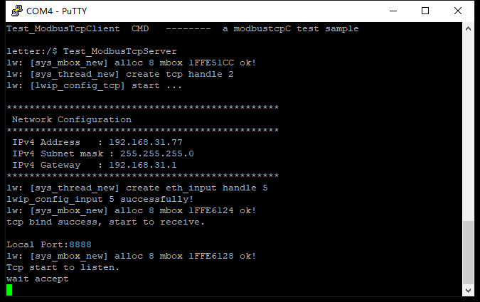

​	主设备采用Modbus Poll应用程序，建立TCP连接，如图2所示。

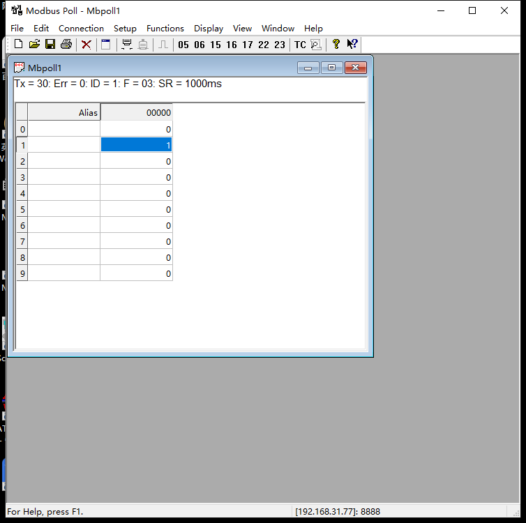

​	此时modbus poll程序便会不断的向从设备发送请求，如图3。

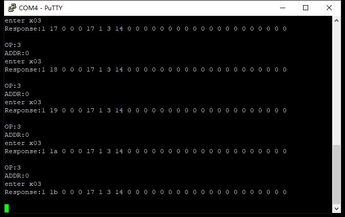

​	可以看到解析出的功能码、地址以及对应的响应报文，然后我们在modbus poll上修改一下存储区数据。如图4所示。

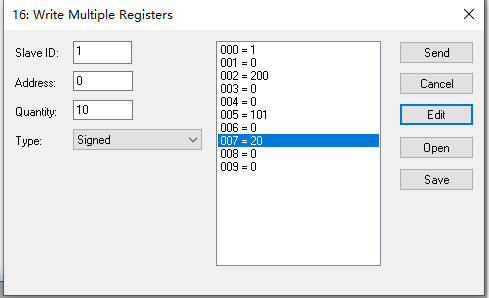

因为修改的是寄存器存储区的值，因此对应0x10功能码，然后看看从设备的反映。如图5所示。

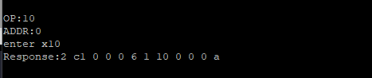

可见成功收到功能码，并返回了响应的报文。

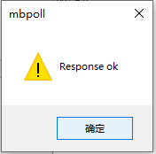

modbus poll显示响应成功，存储区已成功修改期望的值。

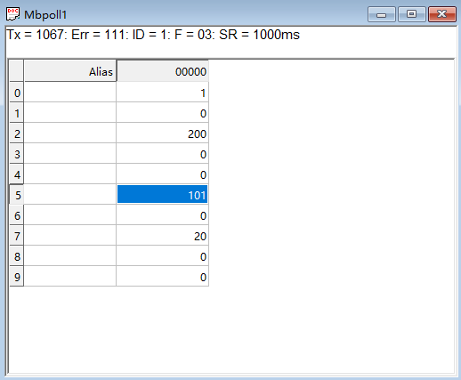

可见存储区已成功修改。

线圈部分的查询修改同理，不再赘述。

### 4.2主设备通信测试

​	首先打开modbus slave应用程序，用以作为从设备，然后将存储区数据修改，用以测试，并打开TCP端口，等待主设备的连接，如图8所示。

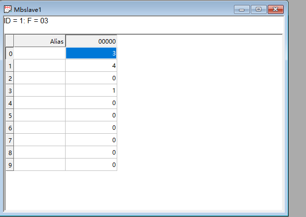

​	同样在终端打开从设备程序，从设备的ip，port在源码中已定义好，所以打开时已经连接上，如图9所示。


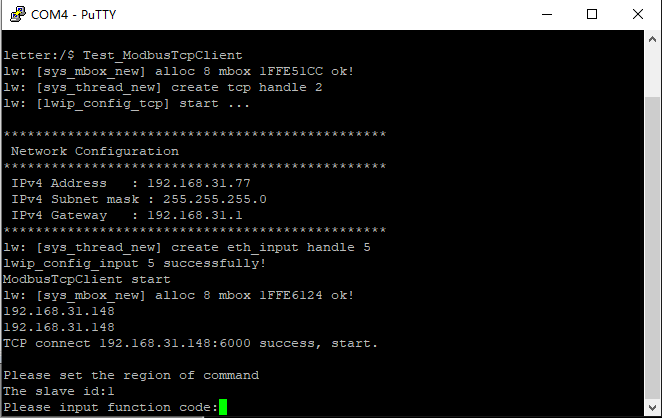

​	开始输入从设备id，功能码，以及其他信息用以生成请求报文。

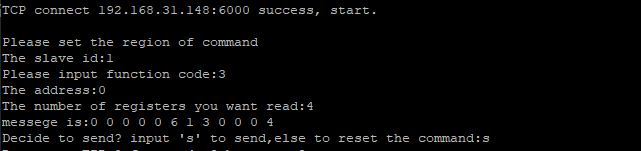

​	如图10所示，输入功能码3，对应读取寄存器功能，地址从0开始，数量4，然后便会生成请求报文，然后发送，结果如图11所示。

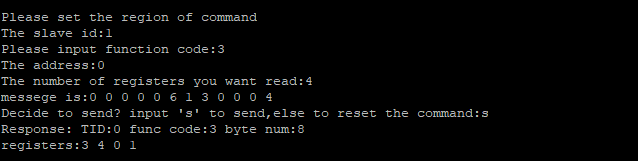

​	可见，已成功查询到寄存器的值。

​	然后测试写入功能，输入功能码15(0xf)，对应写入多个线圈功能，如图12，modbus slave对应的响应结果如图13所示。

​	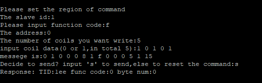

​	写入线圈的值为5个，分别为1 0 1 0 1。发送成功后，modbus salve中显示如图13所示。

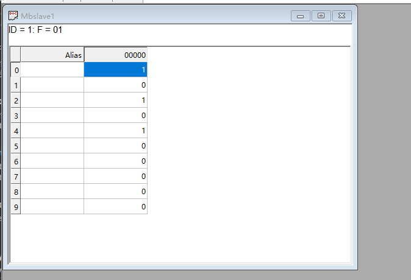

​	可见，已成功修改。

​	其他功能码测试过程类似，不再赘述。