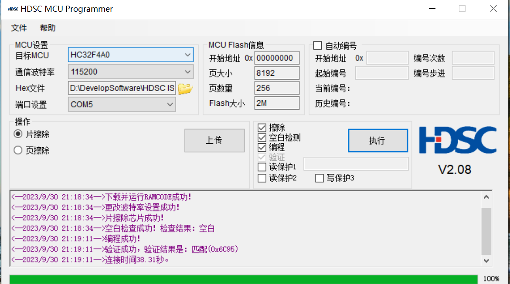
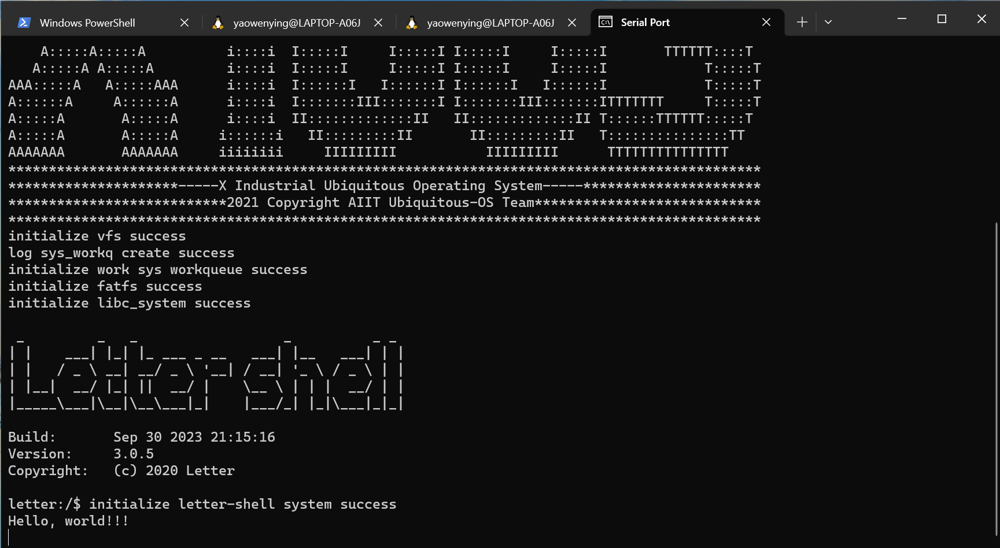
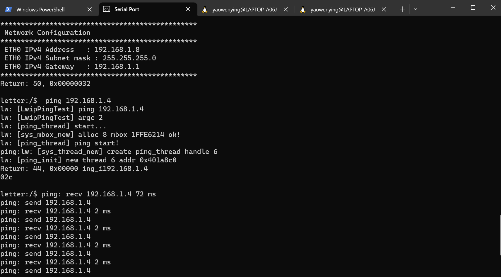
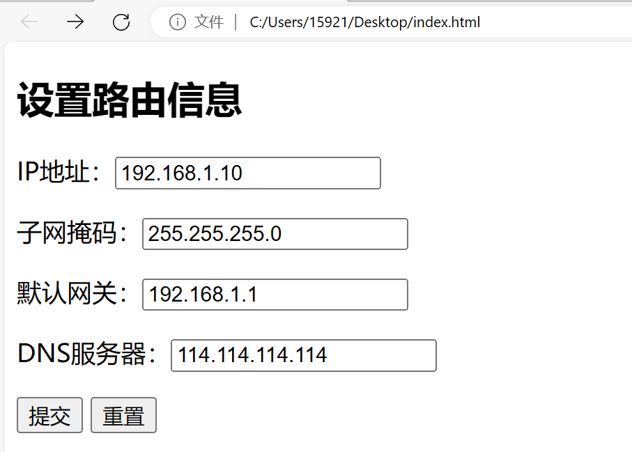
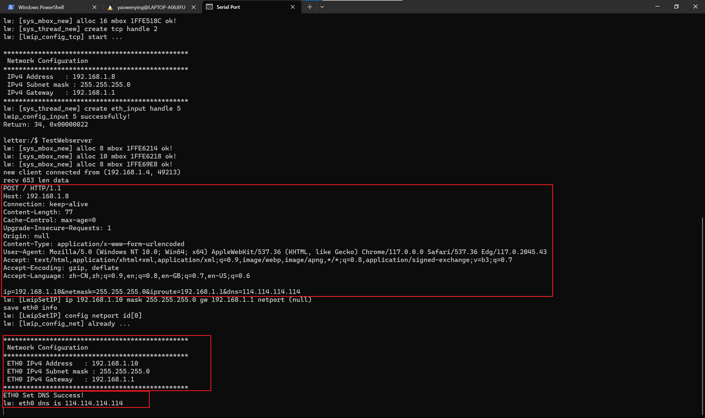

# 基于矽璓已实现的Lwip，在ARM上实现基本的Web服务##

## 1. 简介
基于矽璓已实现的Lwip，在ARM上实现基本的Web服务，其功能支持IP、GateWay、DNS、子网掩码等网络参数的设置。
主要功能为：web服务等待Http请求的到来，解析Http报文后，设置本机的网络参数信息，在终端打印设置后的网络参数信息，并返回浏览器客户端成功响应。

## 2. 数据结构设计说明
Server的网络结构参数为：
```
struct ServerNet 
{
    char local_ip[20];
    char local_mask[20];
    char local_gw[20];
    char local_dns[20];
}ServerNet;
```

主要实现了以下几个函数：
```
TcpThread:  建立socket监听，循环等待网络通信事件的到来；
HandleHttpRequest：处理并解析Http报文，得到网络参数信息；
AddrUpdate： 根据到来的参数，更新本机网络参数；
LwipShowIP：显示网络参数信息，包括IP、GateWay、DNS、子网掩码；
LwipSetIP： 设置网络参数信息，包括IP、GateWay、DNS、子网掩码；
ShowDns: 显示dns网址； 
SetDns： 设置dns网址；
```
除此之外，还包括两个工具函数：
```
SubstractServerNet： 截取http报文的请求体，格式为：ip=192.168.1.9&netmask=255.255.255.0&iproute=192.168.1.1&dns=114.114.114.114
substring： 截取字符串

```

## 3. 测试程序说明
1. 通过数据线将开发板连接电脑，并通过网线连接使开发板接入家庭局域网。
2. 将TestWebserver注册为shell 命令，编译前通过menuconfig打开lwip和TestWebserver功能。
3. 将编译成功的XiZi-edu-arm32.bin文件烧录到arm板子。烧录bin文件前，需要将开发板boot引脚拉高(盖上跳帽)，上电后再按下reset按键，之后可以点击烧写工具的执行按钮，等待烧写完成。
4. 将boot引脚拉低（摘下跳帽），按下reset按键，使用串口工具显示xiuos的命令行界面。
5. 将开发板的本机ip通过setip命令设置为与电脑端在同一个局域网之下，利用ping命令检测成功通信。
6. 运行TestWebserver命令验证功能。

## 4. 运行结果（##需结合运行测试截图按步骤说明##）
  

烧录程序，boot引脚拉高，按下reset按键。

  

点击执行烧录，程序烧录成功。

  

打开串口调试工具，xiuos程序成功在开发板上运行。

  

利用setip命令，修改开发板ip,使得开发板和电脑在同一个局域网内，并使用ping命令测试。

  

在服务端运行TestWebserver命令，打开index.html，设置网络参数信息，点击提交，发送http请求。

 

web服务收到http请求后并打印post请求报文，以及修改后的开发板的网络参数信息，包括IP、子网掩码、GateWay和DNS。
