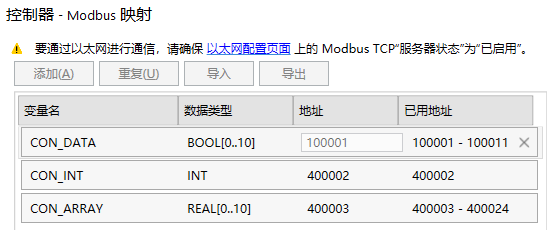

# AB_850通信测试

[TOC]

## 通信接线及参数设置

* 网口

  *Mosbus TCP协议，IP：192.168.250.56，Port：502

## 存储区

- 存储区D区

## JSON配方设计

* AB_850类型PLC需要配置控制器映射

  
  
* 共测试Word和real共2种类型数据,real型数据有2个Word组成，以下为JSON文件解释。

  - ```json
    {
        "device_id": 1,                     //设备ID默认是1，此参数无效
        "device_name": "AB_850",            //设备名称，自定义
        "communication_type": 0,            //通讯协议类型 0是以太网，1是串口 
        "socket_config": {                  //以太网配置
            "plc_ip": "192.168.250.56",     //PLC的IP地址
            "local_ip": "192.168.250.233",   //矽达通IP地址设定
            "gateway": "192.168.250.1",     //矽达通的网关地址设定
            "netmask": "255.255.255.0",     //矽达通子网掩码设定
            "port":502                      //端口号设定
            },
        "protocol_type": 2,                 //通讯协议，2代表modbus-tcp协议
        "read_period": 100,                 //交互周期ms
        "read_item_list": [
            {
                "value_name": "CON_DATA[0]",  //变量名称，自定义
                "value_type": 1,      //变量类型，BOOL = 1,INT8 = 2,INT16,INT32,UINT8,UINT16,UINT32,DOUBLE,FLOAT = 9
                "function_code": 1,   //功能码。1是读线圈
            	"start_address": 0,   //起始地址
                "data_length": 1      //默认是1，代表读取1个数据类型长度
            },
            {
                "value_name": "CON_DATA[1]",  //变量名称，自定义
                "value_type": 1,      //变量类型，BOOL = 1,INT8 = 2,INT16,INT32,UINT8,UINT16,UINT32,DOUBLE,FLOAT = 9
                "function_code": 1,   //功能码。1是读
            	"start_address": 1,   //起始地址偏移1位106*8+1=849
                "data_length": 1      //默认是1，代表读取1个数据类型长度
            },
            {
                "value_name": "CON_INT",  //变量名称，自定义
                "value_type": 3,      //变量类型，BOOL = 1,INT8 = 2,INT16,INT32,UINT8,UINT16,UINT32,DOUBLE,FLOAT = 9
                "function_code": 3,   //功能码。3是读
            	"start_address": 2,   //起始地址偏移2位
                "data_length": 1      //默认是1，代表读取1个数据类型长度
            },
            {
                "value_name": "CON_ARRAY[0]_1",  //变量名称，自定义
                "value_type": 3,      //变量类型，BOOL = 1,INT8 = 2,INT16,INT32,UINT8,UINT16,UINT32,DOUBLE,FLOAT = 9
                "function_code": 3,   //功能码。3是读
            	"start_address": 3,   //起始地址偏移3位
                "data_length": 1      //默认是1，代表读取1个数据类型长度
            },
            {
                "value_name": "CON_ARRAY[0]_2",  //变量名称，自定义,CON_ARRAY[0]_1和CON_ARRAY[0]_2组成real型数据
                "value_type": 3,      //变量类型，BOOL = 1,INT8 = 2,INT16,INT32,UINT8,UINT16,UINT32,DOUBLE,FLOAT = 9
                "function_code": 3,   //功能码。3是读
            	"start_address": 4,   //起始地址偏移4位
                "data_length": 1      //默认是1，代表读取1个数据类型长度
            }
        ]
    }
    ```

## 通信测试

 (1) 新增1个通信demo，命名为ab_micro850.c；

 (2) 复制modbus_tcp样例代码程序到ab_micro850.c文件中；

 (3) void **ControlAB850Test**(void) 更改函数名；

 (4) PRIV_SHELL_CMD_FUNCTION(**ControlAB850Test**, AB Plc micro850 Demo**, PRIV_SHELL_CMD_MAIN_ATTR);更改测试指令；

 (5) 剪裁配置完成后，用过烧写器下载至矽数通中，重启后完成测试。


 
