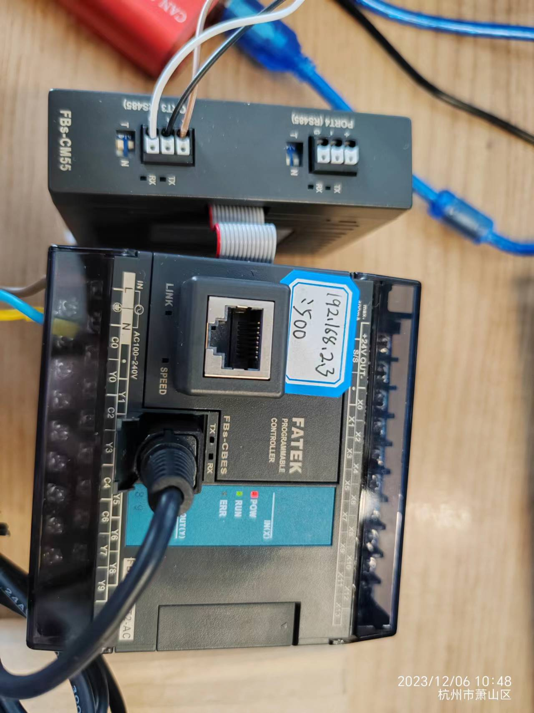

# 永宏通信测试

[TOC]

## 永宏FBs-24MCT2-AC通信测试

### 通信接线及参数设置

* 网口和串口
  * FBS-24MCT2自带圆口232，用于程序的下载。
  * 可本体拓展FBs-CBES用于Modbus TCP，永宏私有协议永宏协议等通信。板卡默认IP：192.168.2.3.端口号500，永宏协议
  * 通过本体拓展FBs-CM22通信模板，可用于Modbus RTU及永宏协议通信。串口接线：+接485A；-接485B。
  * 串口模块MODBUS RTU通信参数配置：通信速率：9600；数据位：8bit；停止位：1bit；校验：偶校验
  * 串口模块永宏协议通信参数配置：通信速率：9600；数据位：8bit；停止位：1bit；校验：偶校验
  * 终端与PLC通信测试，PC编程软件与PLC不能处于联机状态。
  

### 存储区

- 存储区 X，Y，R，D区等。

### 通信测试

-  共测试BOOL，INT16等类型数据。

-  测试Y区，R区及D区数据。

- 测试截图：

  测试PLC环境搭建：

  

  解析完成的配方为:

  

  测试结果：

  