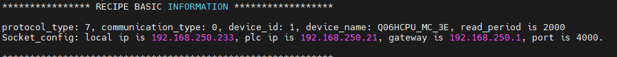
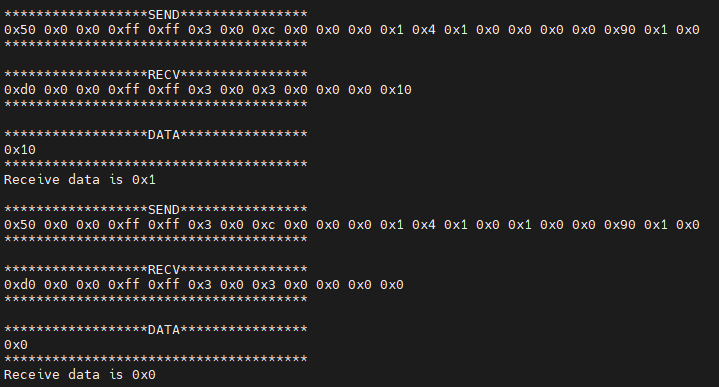
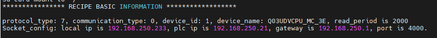
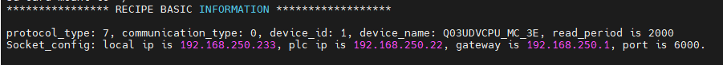
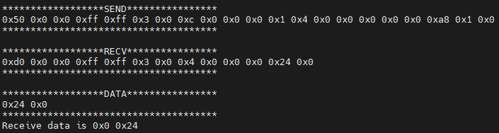

# 三菱通信测试

[TOC]

## 三菱FX2N通信测试

### 通信接线及参数设置

* 串口
  * FX2N自带8针圆口422，用于程序的下载。全系列不支持网口，且需购买串口拓展模块FX2N-485-BD用于通信测试。
  * 接线：RDA和SDA短接，引出A；RDB与SDB短接，引出B。
  * 串口模块支持MC-1C协议，通信速率：9600；数据位：7bit；停止位：1bit；校验：偶校验

### 存储区

- 存储区 I，Q，M，D区。

### 通信测试

-  共测试BOOL，INT16，FLOAT共三种类型数据。

-  测试M区及D区数据。

## 三菱Q06H通信测试

### 通信接线及参数设置

* 接口
  * 首次连接时，可通过CPU自带的串口（打印机方口线）进行程序的下载。
  * 本次测试通过Q06H拓展的模块QJ71E71_100模块的网口模块进行MC—3E通信测试。
  * PLC网口模块IP：192.168.250.21 端口号：4000

### 存储区

- 存储区 I，Q，M，D区。

### 通信测试

-  共测试BOOL，INT16，FLOAT共三种类型数据。

- 测试M区及D区数据。

- 测试截图：

  解析完成的配方为

  
  
  测试结果：
  
  

## 三菱Q03UDV通信测试

### 通信接线及参数设置

* 接口
  * 本次测试通过Q03UDV拓展的模块QJ71E71_100模块的网口模块进行MC—3E通信测试。网口模块IP：192.168.250.21 端口号：4000
  * 本次测试还可通过Q03UDV自身网口进行MC—3E通信测试。网口模块IP：192.168.250.22 端口号：6000

### 存储区

- 存储区 I，Q，M，D区。

### 通信测试

-  共测试BOOL，INT16，FLOAT共三种类型数据。

- 测试M区及D区数据。

- 测试截图：

  扩展模块解析完成的配方为

  

  CPU自带网口解析完成的配方为

  
  
  测试结果：
  
  
