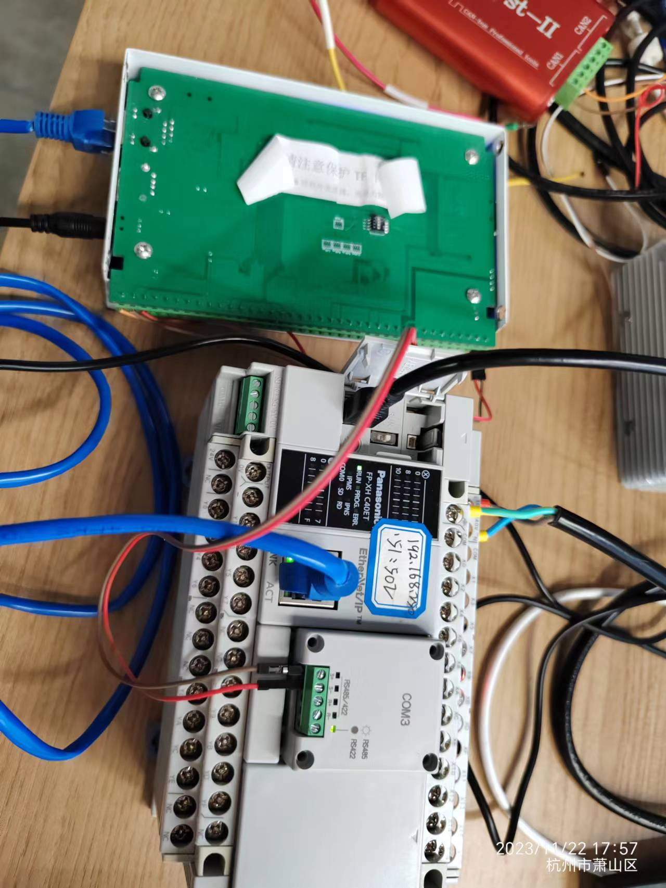
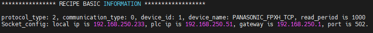
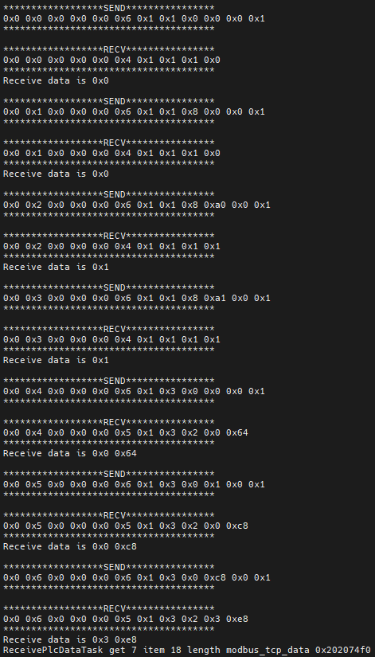

# 松下通信测试

[TOC]

## 松下FPXHC40ET通信测试

### 通信接线及参数设置

* 网口和串口
  * FPXHC40ET自带miniUSB，用于程序的下载。本体自带的串口为RS232。
  * 本体自带的网口可用于Modbus TCP，Ethernet/IP等通信。目前用于Modbus TCP通信测试，网口IP：192.168.250.51 Port：502
  * 通过本体拓展FPXH-COM3通信模板，可用于Modbus RTU通信。串口接线：S+接485A；S-接485B。
  * 串口模块通信参数配置：通信速率：115200；数据位：8bit；停止位：1bit；校验：偶校验

### 存储区

- 存储区 X，Y，R，D，L区等。

### 通信测试

-  共测试BOOL，INT16等类型数据。

-  测试Y区，R区及DT区数据。

- 测试截图：

  测试PLC环境搭建：

  

  解析完成的配方为:

  

  测试结果：

  