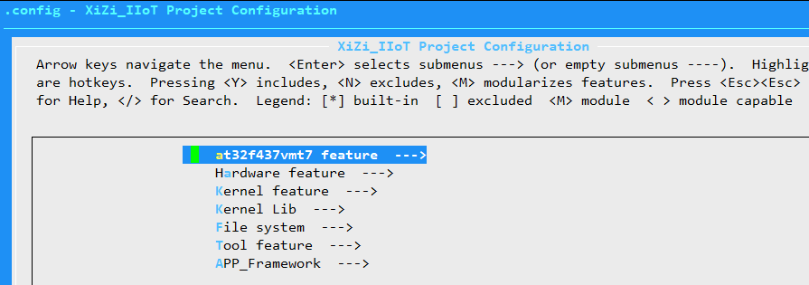
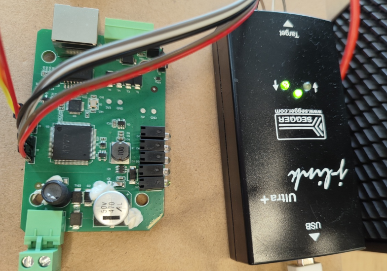
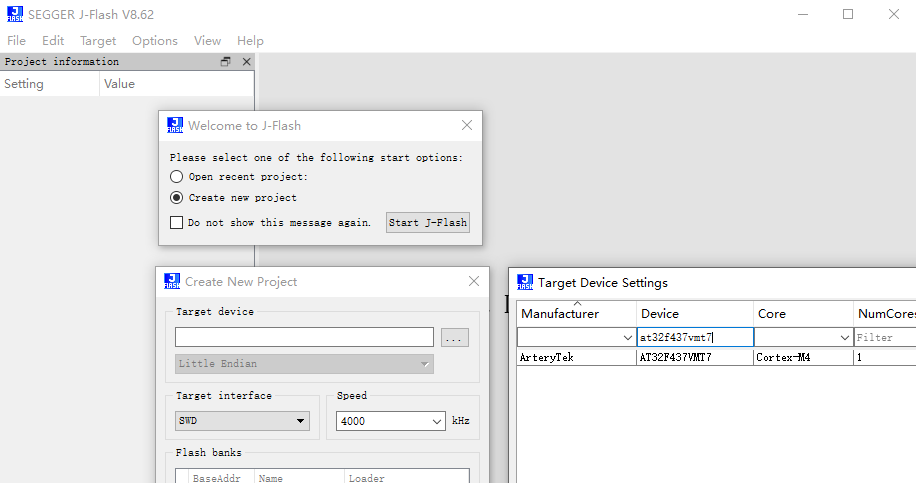
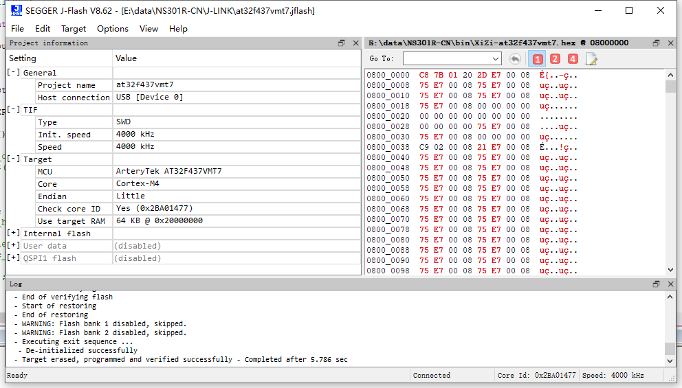
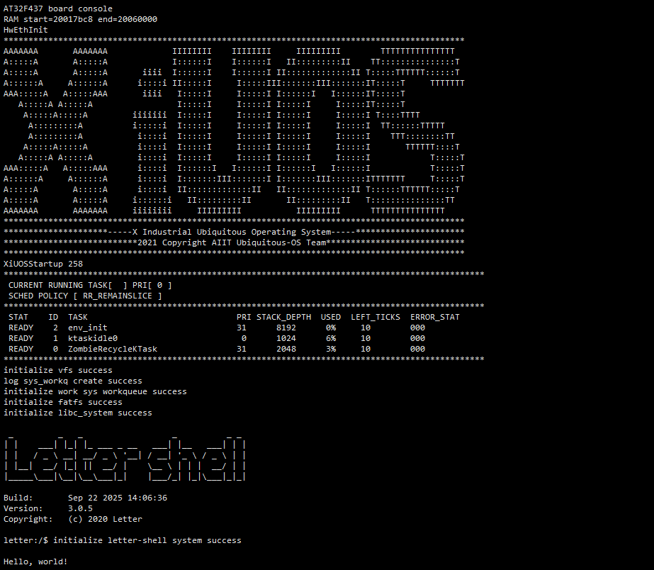
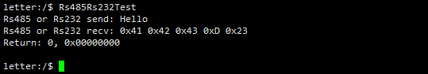
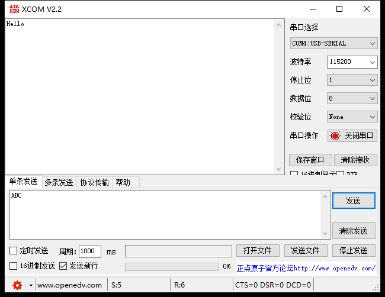
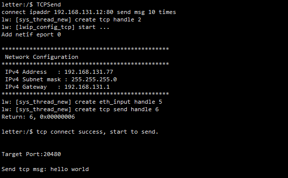
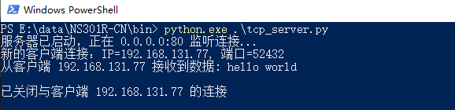

# AT32F437VMT7 README

## 1. 简介

| 硬件 | 描述 |
| -- | -- |
|芯片型号| AT32F437VMT7 |
|CPU|arm cortex-m4|
|主频| 288MHz |
|片内SRAM| 384KB |
|片上FLASH| 4032KB |
| 外设 | SWD烧录接口、Debug调试接口、RS485、RS232、Ethernet。 |

移星科技NS301R-CN工业级串口服务器支持1路RS232/485转百兆网口功能，2024年出货量已突破10万台。该设备核心处理器采用AT32F437VMT7芯片。


## 2. 编译说明

### 编译环境：Ubuntu20.04

### 编译工具链：arm-none-eabi-gcc

编译步骤：

>1.需要安装arm-none-eabi编译工具, 安装到Ubuntu的默认路径/usr/bin/arm-none-eabi-，使用如下命令行下载

```bash
sudo apt-get install gcc-arm-none-eabi
```
>2.在代码根目录下执行以下命令，生成配置文件

```bash
cd ./Ubiquitous/XiZi
make BOARD=at32f437vmt7 distclean
make BOARD=at32f437vmt7 menuconfig
```
>3.在menuconfig界面配置需要关闭和开启的功能，按回车键进入下级菜单，按Y键选中需要开启的功能，按N键选中需要关闭的功能，配置结束后保存并退出



>4.继续执行以下命令，进行编译。如果编译正确无误，会产生文件build/XiZi-at32f437vmt7.hex。
```bash
make BOARD=at32f437vmt7
```
>5.如果编译正确无误，会产生文件build/XiZi-at32f437vmt7.hex。

>6.最后可以执行以下命令，清除配置文件和编译生成的文件
```bash
make BOARD=at32f437vmt7 distclean
```


## 3. 烧写说明

将NS301R-CN开发板（芯片AT32F437VMT7）SWD与J-LINK连接，J-LINK转接到USB接口。

NS301R-CN的SWD是J2排针，接口排列：

```bash
GND,NRST,SWCLK,SWDIO,VDD
```

SWD与J-LINK连接图片如下：

<div align= "center"> 

  </div>


然后，使用J-Flash工具进行烧写。

J-Flash工具创建工程，选择AT32F437VMT7，选择SWD，默认4000khz，如图：

<div align= "center"> 

  </div>


在J-Flash工具中，点击File，选择打开需要烧录的文件XiZi-at32f437vmt7.hex，点击Target，然后点击产品Programming烧写。烧录成功有打印提示，如图：

<div align= "center"> 

  </div>


## 4. 设备运行

NS301R-CN开发板Debug调试串口连接到USB转UART转换器。

NS301R-CN的Debug串口是J3排针，接口排列：

```bash
TX,RX,GND
```

设备使用12V电源供电。

如果编译 & 烧写无误，将会在串口终端上看到信息打印输出。




## 5. 外设测试

### 5.1 RS485/RS232测试

NS301R-CN开发板对外接口有RS485和RS232接口。

RS485信号通过XJ13487EESA转换后接的是UART2，RS232信号通过TPT3232E转换后接的也是UART2。因此，RS485和RS232都是通过UART2实现。

NS301R-CN的RS485接口连接到USB转RS485/232转换器的485接口（测RS232时连接232接口），转换器连接电脑。NS301R-CN发送数据，电脑端接收数据。

在电脑上，打开XCOM V2.2.exe工具，选择USB转RS485/232转换器对应的串口，选择波特率115200，然后打开串口。

在连接NS301R-CN的shell窗口，输入命令：Rs485Rs232Test

串口打印：

<div align= "center"> 

  </div>


电脑XCOM显示接收到数据：

<div align= "center"> 

  </div>

然后，XCOM发送ABC，串口显示接收数据。


### 5.2 Ethernet测试

NS301R-CN开发板的以太网接口连接到网络，测试tcp发送数据。NS301R-CN是tcp client端，电脑是tcp server端。

配置设备本地IP（文件resources/ethernet/LwIP/arch/sys_arch.c），配置服务端IP（文件resources/ethernet/cmd_lwip/lwip_tcp_demo.c），重新编译烧录。

在电脑上，用python编写tcp server端程序，用于确认连接成功，以及打印接收到的数据。

在电脑上，cmd运行tcp server端程序；然后，NS301R-CN对应的shell上，执行命令：TCPSend。

tcp client端打印：

<div align= "center"> 

  </div>

tcp server端打印：

<div align= "center"> 

  </div>
