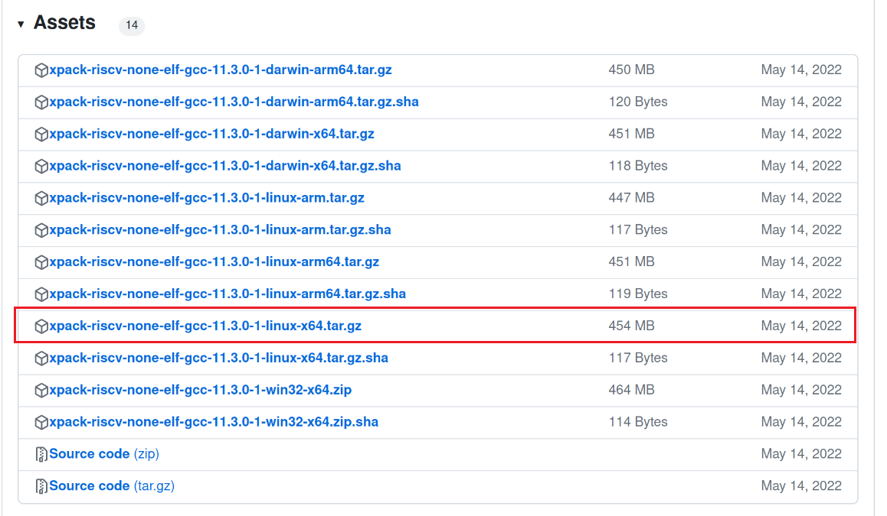
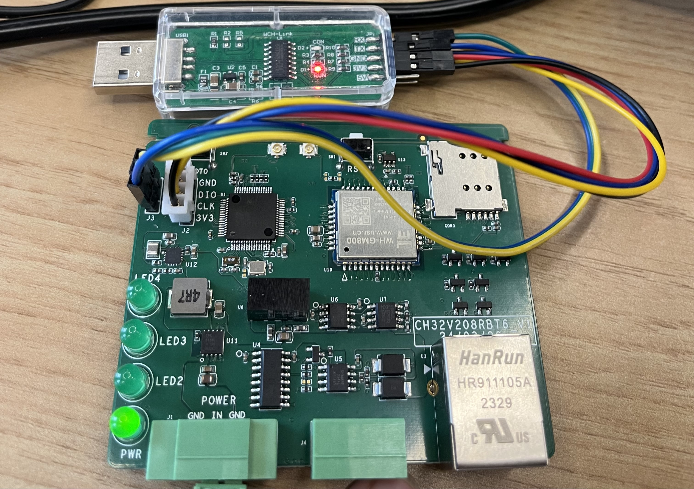
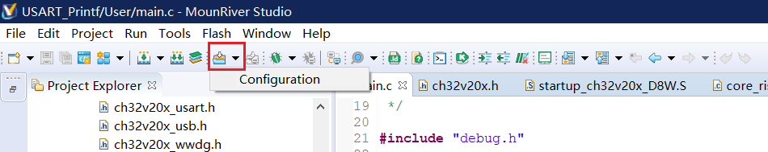
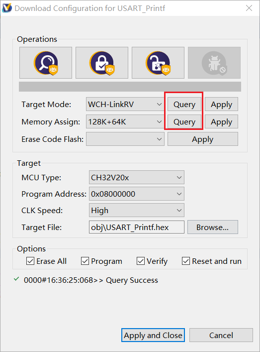
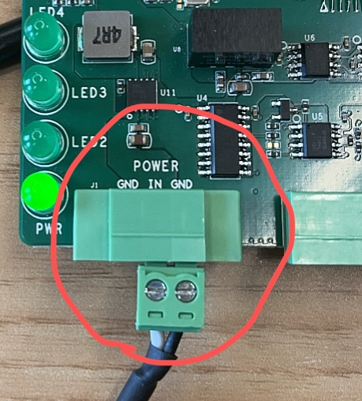
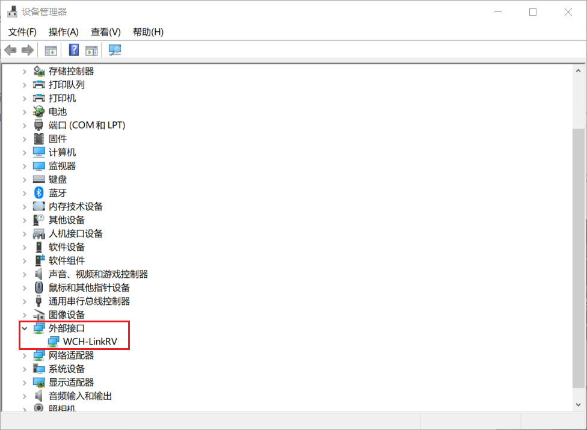
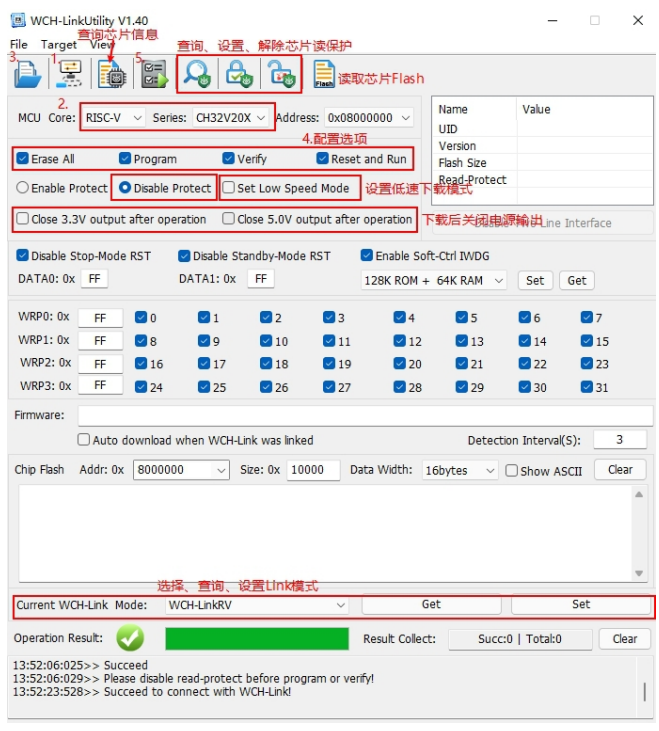
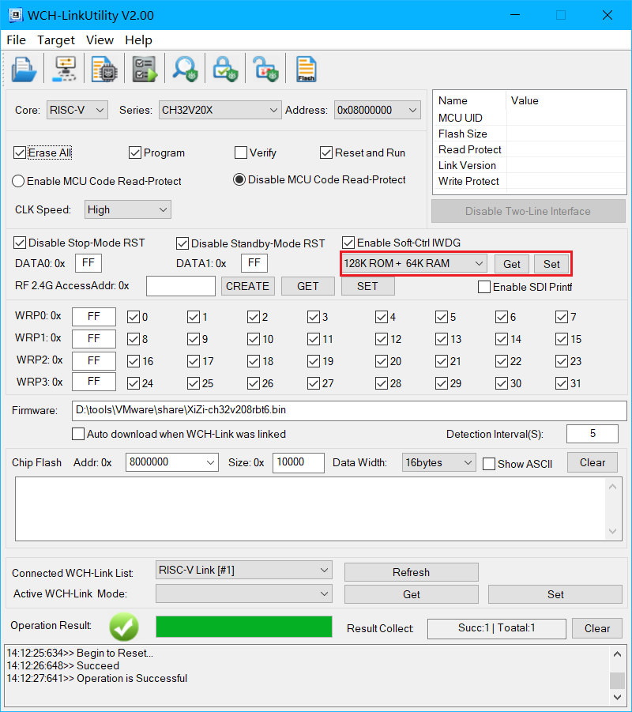
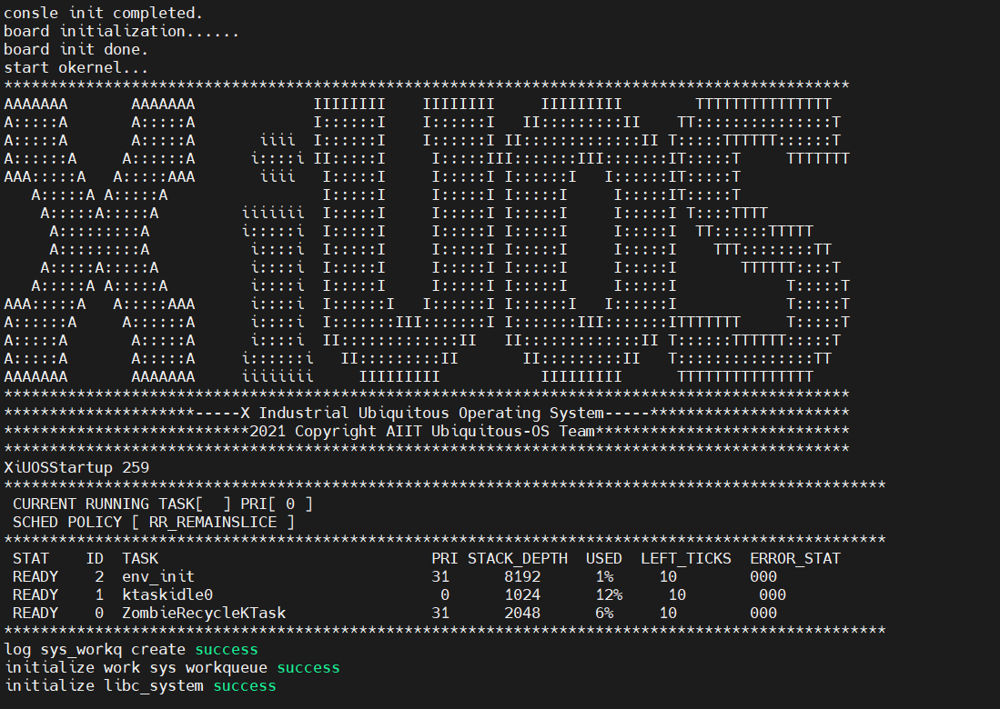

# 1. 简介

| 硬件      | 描述                                                         |
| --------- | ------------------------------------------------------------ |
| 芯片型号  | CH32V208RBT6                                                 |
| CPU       | 单核RISC-V4C                                                 |
| 主频      | 144MHz                                                       |
| 片内SRAM  | 可配：32KB、48KB、64KB                                       |
| 片内FLASH | 可配：160KB、144KB、128KB                                    |
| 外设      | 2Mbps低功耗蓝牙BLE通讯模块、10M以太网MAC+PHY模块、USB2.0全速设备+主机/设备接口、CAN控制器等 |

# 2. 克隆代码

将XiUOS的源代码克隆下来：

```bash
git clone https://gitlink.org.cn/xuos/xiuos.git
```

# 3. 下载编译工具链

编译环境：Ubuntu 20.04.6 LTS

编译工具链：riscv-none-elf-gcc（xpack-riscv-none-elf-gcc-11.3.0-1）

编译工具链可到Github进行下载：https://github.com/xpack-dev-tools/riscv-none-elf-gcc-xpack/releases



下载完成后将其移动到`/opt`目录下，并进行解压：

```bash
sudo tar -xvzf xpack-riscv-none-elf-gcc-11.3.0-1-linux-x64.tar.gz
```

# 4. 编译

## 方式1（推荐）

可以在`Ubiquitous/XiZi_IIoT`目录下创建文件`script.sh`，内容如下：

```sh
#! /bin/env sh
export CROSS_COMPILE=/opt/xpack-riscv-none-elf-gcc-11.3.0-1/bin/riscv-none-elf-
make BOARD=ch32v208rbt6 clean # 将之前的编译生成文件清空
make BOARD=ch32v208rbt6 menuconfig
make BOARD=ch32v208rbt6
```

创建之后，在命令行移动到`XiZi-IIOT`目录下，键入`./script`运行该脚本。

经过KConfig配置、编译后，即可在`Ubiquitous/XiZi_IIoT/build`目录中生成`XiZi-ch32v208rbt6.bin`文件，将该文件拷贝至Windows侧待下一步进行烧录。

> [!CAUTION]
>
> 如果`make BOARD=ch32v208rbt6 menuconfig`显示【无法找到`kconfig-mconf`】，需要先安装`ncurses-devel`和`kconfig-mconf`，如下：
>
```bash
sudo apt install libncurses5-dev kconfig-frontends
```

## 方式2

1. 设置`CROSS_COMPILE`环境变量，以下为将编译工具链解压到`/opt`目录下时的命令：

   ```bash
   export CROSS_COMPILE=/opt/xpack-riscv-none-elf-gcc-11.3.0-1/bin/riscv-none-elf-
   ```

2. 在`Ubiquitous/XiZi_IIoT`目录下执行命令：

   ```bash
   make BOARD=ch32v208rbt6 distclean # 将之前的编译生成文件清空
   make BOARD=ch32v208rbt6 menuconfig # 进行编译设置
   ```

   如果`make BOARD=ch32v208rbt6 menuconfig`显示【无法找到`kconfig-mconf`】，需要先安装`ncurses-devel`和`kconfig-mconf`，如下：

   ```bash
   sudo apt install libncurses5-dev kconfig-frontends
   ```

3. 在`menuconfig`配置界面选择要增加的功能。按回车键进入下级菜单，按Y键选中需要开启的功能，按N键选中需要关闭的功能，配置结束后选择Exit保存并退出，完成后会生成`.config`文件。

4. 进行编译：

   ```bash
   make BOARD=ch32v208rbt6
   ```

5. 编译完成后会在`Ubiquitous/XiZi_IIoT/build`目录中生成`XiZi-ch32v208rbt6.bin`文件，将该文件拷贝至Windows侧待下一步进行烧录。

# 5. 端口连接

`ch32v208rbt6`需要使用`WCH-LINK`模块进行串口连接，各个端口的连接如下：

| 接口组别       | ch32v208rbt6 | WCH-LINK |
| -------------- | ------------ | -------- |
| J2（编程接口） | GND          | GND      |
| J2（编程接口） | DIO          | SWDIO    |
| J2（编程接口） | CLK          | SWCLK    |
| J2（编程接口） | 3V3          | 3V3      |
| J3（通信接口） | GND          | GND      |
| J3（通信接口） | TX           | RX       |
| J3（通信接口） | RX           | TX       |

连接后如下：



# 6. WCH-LINK模块固件更新（可选）

如WCH-LINK模块蓝灯闪烁，代表其固件缺失，需要进行固件烧录或者更新。

可以使用[MounRiver Studio](http://www.mounriver.com/download)在线更新。更新步骤如下：

1. 将WCH-LINK连接至电脑。

2. 打开MounRiver Studio，点击`download`图标右边的向下箭头，点击`configuration`，如下所示：



3. 显示窗口后，点击任意`query`按钮即可进行固件更新，如下：



4. 待WCH-LINK模块红灯亮起，表示固件更新完成。

# 7. 烧录

1. 下载`WCH-LinkUtility`工具：https://www.wch.cn/downloads/WCH-LinkUtility_ZIP.html

2. ch32v208rbt6连接电源线（如果电源线只有两根，保证`IN`和其中一个`GND`接地即可），如下：



3. 将WCH-LINK连接至电脑，设备管理器显示`WCH-LinkRV`表示连接成功，如下：

   

4. 打开烧录软件WCH-LinkUtility，如下：

   

   1）连接 WCH-Link。

   2）选择芯片信息，`MCU Core`选择`RISC-V`，`Series`选择`CH32V20X`。

   3）添加固件，即[2. 编译](# 2. 编译)中编译好的`XiZi-ch32v208rbt6.bin`文件。

   4）设置配置选项，若芯片为读保护需解除芯片读保护。

   5）执行。
   
   ## 7.1 指定ROM和RAM大小
   
   > 参考资料：
   >
   > [1]https://www.cnblogs.com/gscw/p/17286307.html
   
   > [!caution]
   >
   > WCH-LinkUtility中需要指定ROM和RAM大小，如果大小与源文件`link.ld`中的ROM和RAM大小不一致，可能会导致XiZi启动失败。
   
   在WCH_LinkUtility中，在以下位置指定ROM和RAM大小：
   
   
   
   其中，set按钮用于设置CH32V208的ROM和RAM大小，get按钮用于获取CH32V208的当前ROM和RAM大小。
   
   在`Ubiquitous/XiZi_IIoT/board/ch32v208rbt6/link.ld`中，在以下代码位置配置ROM和RAM大小：
   
   ```c
   /* CH32V20x_D8 - CH32V203RB
      CH32V20x_D8W - CH32V208x
      FLASH + RAM supports the following configuration
      FLASH-128K + RAM-64K
      FLASH-144K + RAM-48K
      FLASH-160K + RAM-32K
   */
   	FLASH (rx) : ORIGIN = 0x00000000, LENGTH = 448K
   	RAM (xrw) : ORIGIN = 0x20000000, LENGTH = 64K
   ```
   
   以下是测试成功的RAM和ROM大小配置，如果编译时显示RAM或者ROM不足，则需要调整RAM或者ROM。推荐使用下面的慢速FLASH配置。
   
   1. 仅使用快速FLASH
   
      | link.ld                   | WCH-LinkUtility    |
      | ------------------------- | ------------------ |
      | 128K（FLASH）+ 64K（RAM） | 128K ROM + 64K RAM |
      | 144K（FLASH）+ 48K（RAM） | 144K ROM + 48K RAM |
      | 160K（FLASH）+ 32K（RAM） | 160K ROM + 32K RAM |
   
   2. 使用慢速FLASH
   
      | link.ld                   | WCH-LinkUtility    |
      | ------------------------- | ------------------ |
      | 448K（FLASH）+ 64K（RAM） | 128K ROM + 64K RAM |

# 8. 启动

烧录完成后，并且将WCH-LINK连接至电脑串口。

按下ch32v208rbt6板上的`RST`按钮，即可看到操作系统启动的信息，如下：

