# 1. 模块说明

- ADC模块和CAN模块共用引脚PA2，因此两个模块不能同时启用，否则会发生未知错误。
- LTE模块即4G模块。
- LTE模块和RS485模块底层都通过UART串口进行通信，但为了代码逻辑清晰，因此把LTE和RS485单独形成一个模块。

# 2. KConfig配置

下面列出与CH32V208相关的KConfig配置，由于ch32v208的RAM空间较小（最高64KB），因此下列涉及栈空间大小的配置都需要反复调整优化。以下配置可以在448KB（ROM）+64KB（RAM）下运行：

## 2.1 ch32v208rbt6 feature

ch32v208rbt6驱动相关配置，分为UART（串口）、Ethernet（以太网）、ADC（模数转换）、BLE（低功耗蓝牙）、CAN、RS485、LTE（4G）七个模块。

### 2.1.1 Using UART device

路径：`ch32v208rbt6 feature`-`Using UART device`-`Enable UART1`

| 字段                   | 说明         |
| ---------------------- | ------------ |
| serial bus name        | UART总线名称 |
| serial bus driver name | UART驱动名称 |
| serial bus device name | UART设备名称 |

> [!CAUTION]
>
> 在Xizi文件系统中，如果把设备当作文件处理，那么这里的名称需要遵循规范：
>
> - 假设总线名称为`bus`（bus为自定义内容）
> - 驱动名称为`bus_xxx`（xxx为自定义内容）
> - 设备名称为`bus_xxx`（xxx为自定义内容）

个人配置如下：

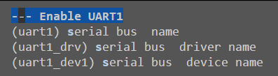

### 2.1.2 Using Ethernet

暂无配置字段。

### 2.1.3 Using ADC

暂无配置字段。

### 2.1.4 Using BLE

路径：`ch32v208rbt6 feature`-`Using BLE`，勾选 `Using BLE config`后显示蓝牙相关字段。

| 字段                            | 说明            |
| ------------------------------- | --------------- |
| device ble name                 | 设备蓝牙名称    |
| Device Info System ID Element 0 | 设备系统ID字节0 |
| Device Info System ID Element 1 | 设备系统ID字节1 |
| Device Info System ID Element 2 | 设备系统ID字节2 |
| Device Info System ID Element 3 | 设备系统ID字节3 |
| Device Info System ID Element 4 | 设备系统ID字节4 |
| Device Info System ID Element 5 | 设备系统ID字节5 |
| Device Info System ID Element 6 | 设备系统ID字节6 |
| Device Info System ID Element 7 | 设备系统ID字节7 |
| dev info model number           | 设备模块号      |
| dev info serial number          | 设备序列号      |
| dev info firmware revision      | 设备固件版本    |
| dev info hardware revision      | 设备硬件版本    |
| dev info software revision      | 设备软件版本    |
| dev info manufacturer name      | 设备制造商名称  |

以上字段中，`device ble name`是提供蓝牙主设备扫描后，ch32v208作为蓝牙从设备显示的蓝牙名称。其余字段都是作为蓝牙特征值提供给蓝牙主设备进行读取。详细的对应特征值ID见[附录3 蓝牙特征值 设备信息](#设备信息) 。

个人配置如下（此处配置对系统无任何影响）：

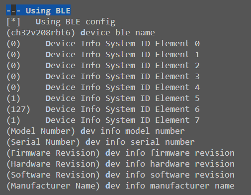

### 2.1.5 Using CAN device

路径：`ch32v208rbt6 feature`-`Using CAN device`

| 字段                  | 说明         |
| --------------------- | ------------ |
| can bus name          | CAN总线名称  |
| can bus driver name   | CAN驱动名称  |
| can bus device 1 name | CAN设备1名称 |

命名规范详见[2.2.1 Using UART device](#2.1.1 Using UART device)

个人配置如下：

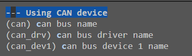

### 2.1.6 Using RS485

路径：`ch32v208rbt6 feature`-`Using RS485`

| 字段                    | 说明           |
| ----------------------- | -------------- |
| rs485 bus name          | RS485总线名称  |
| rs485 bus driver name   | RS485驱动名称  |
| rs485 bus device 1 name | RS485设备1名称 |

命名规范详见[2.2.1 Using UART device](#2.1.1 Using UART device)

个人配置如下：


### 2.1.7 Using LTE

路径`ch32v208rbt6`-`Using LTE`

| 字段                  | 说明         |
| --------------------- | ------------ |
| lte bus name          | LTE总线名称  |
| lte bus driver name   | LTE驱动名称  |
| lte bus device 1 name | LTE设备1名称 |

命名规范详见[2.2.1 Using UART device](#2.1.1 Using UART device)

个人配置如下：

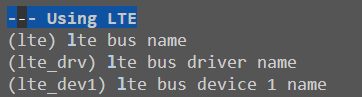

## 2.2 kernel feature

### 2.2.1 Task feature

路径：`kernel feature`-`Task feature`

| 字段                                  | 说明                                                         |
| ------------------------------------- | ------------------------------------------------------------ |
| start system application              | 开启系统应用（实际是系统启动后调用`APP_Framework/Applications/main.c`中的main函数） |
| The stack size of idle task           | idle线程的栈空间大小                                         |
| The stack size of zombie_recycle task | zombie_recycle线程的栈空间大小                               |

个人的设置如下：

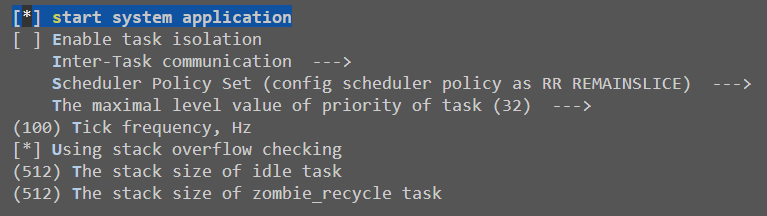

### 2.2.2 Command shell

路径：`kernel feature`-`Command shell`-`Enable letter-shell function`-`Set shell config param`

| 字段                         | 说明                  |
| ---------------------------- | --------------------- |
| Set the stack size for shell | shell线程的栈空间大小 |

个人设置如下：

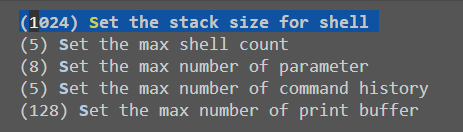

### 2.2.3 Kernel components init

路径：`Kernel feature`-`Kernel components init`-`Use components automatically initialization`

| 字段                         | 说明                     |
| ---------------------------- | ------------------------ |
| Set env init task stack size | env init线程的栈空间大小 |

个人设置如下：


## 2.3 File System

路径：`File System`-`Using device virtual file system`

| 字段                        | 说明                        |
| --------------------------- | --------------------------- |
| Using dev object for FS_VFS | 在虚拟文件系统中使用dev对象 |

配置该项主要是将设备dev也当作文件来处理，并且在应用层可以使用`PrivOpen`、`PrivRead`等函数来操控设备。

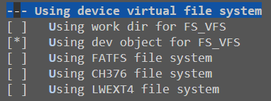

## 2.4 APP_Framework

### 2.4.1 Framework

这部分配置的功能，主要是可以在应用层使用Adapter框架来操控设备，比如`AdapterDeviceConnect`、`AdapterDeviceOpen`等函数。

#### 2.4.1.1 Using 4G adapter device

路径：`APP_Framework`-`Framework`-`support connection framework`-`Using 4G adapter device`，勾选`Using 4G adapter device GM800TF`。

| 字段                 | 说明              |
| -------------------- | ----------------- |
| GM800TF adapter name | GM800TF适配器名称 |
| GM800TF device path  | GM800TF设备路径   |

需要注意`GM800TF device path`为`/dev/LTE设备名称`，其中`/dev/`需要固定不变，`LTE`设备名称需要和[2.1.7 Using LTE](#2.1.7 Using LTE)中的LTE设备名称保持一致。如[2.1.7 Using LTE](#2.1.7 Using LTE)中的LTE设备名称为`lte_dev1`，GM800TF device path就需要设置为`/dev/lte_dev1`。

个人配置如下：

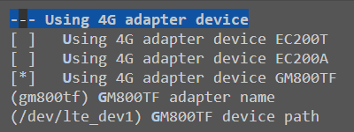

#### 2.4.1.2 Using ethernet adapter device

路径：`APP_Framework`-`Framework`-`support connection framework`-`Using ethernet adapter device`，勾选`Using ethernet adapter device WCHNET`。

| 字段                         | 说明        |
| ---------------------------- | ----------- |
| WCHNET ETHERNET adapter name | GM800TF名称 |

个人配置如下：

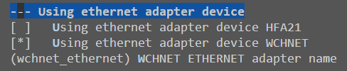

### 2.4.2 Applications

#### 2.4.2.1 config stack size and priority of main task

路径：`APP_Framework`-`Applications`-`config stack size and priority of main task`

| 字段                     | 说明               |
| ------------------------ | ------------------ |
| Set main task stack size | main线程栈空间大小 |

个人配置如下：


#### 2.4.2.2 connection app

路径：`APP_Framework`-`Applications`-`connection app`，勾选`Using connection apps`。

这部分配置的功能是可以编译链接`APP_Framework/Applications/connection_app/4g_app/ch32v208_adl400.c`。

个人配置如下：


# 3. 线程说明

除了XiZi自带的系统线程外，与ch32v208有关的线程有：receiveDataFromADL400Task、sendDataToServerTask、at_agent、wchbleMainTask、wchnetMainTask、parseBleRequestTask。

由于ch32v208的RAM空间有限，因此这些线程的栈空间也需要反复调整优化。

## 3.1 receiveDataFromADL400Task

路径：`APP_Framework/Applications/connection_app/4g_app/ch32v208_adl400.c`

功能：该线程主要用于定时采集电表ADL400数据，并将采集到的数据放到循环队列中。

栈空间：2048KB（可调整优化）

优先级：16（可调整优化）

## 3.2 sendDataToServerTask

路径：`APP_Framework/Applications/connection_app/4g_app/ch32v208_adl400.c`

功能：该线程主要用于将电表ADL400采集到的数据发送到服务器中，可通过4G模块或者以太网模块。

栈空间：2200KB（可调整优化）

优先级：16（可调整优化）

## 3.3 at_agent

路径：`APP_Framework/Framework/connection/adapter_agent.c`

功能：该线程主要负责ch32v208的4G模块读写数据。

栈空间：1800KB（可调整优化）

优先级：16（可调整优化）

## 3.4 wchbleMainTask

路径：`Ubiquitous/XiZi_IIoT/board/ch32v208rbt6/third_party_driver/ble/test/peripheral_main.c`

功能：负责蓝牙模块底层交互，以及缓存微信小程序发来的蓝牙包数据，一旦收到的蓝牙包可以拼接成完整的报文，便启动一个parseBleRequestTask线程用于解析报文。

栈空间：2048KB（可调整优化）

优先级：16（可调整优化）

## 3.5 wchnetMainTask

路径：
`/home/huoyujia/workspace/xiuos/APP_Framework/Framework/connection/ethernet/wchnet_ethernet/wchnet_ethernet.c`

功能：负责以太网模块底层交互，以及处理以太网中断。

栈空间：1100KB（可调整优化）

优先级：16

## 3.6 parseBleRequestTask

路径：`Ubiquitous/XiZi_IIoT/board/ch32v208rbt6/third_party_driver/ModuleConfig.c`

功能：解析蓝牙请求，蓝牙回复响应报文。

栈空间：2048KB（可调整优化）

优先级：16

# 4. ROM保存配置

## 4.1 存放配置的FLASH空间

在FLASH中专门预留了1KB的空间来存放用于模块初始化的配置参数。配置参数的FLASH开始地址为`PAGE_WRITE_START_ADDR`，结束地址为`PAGE_WRITE_END_ADDR`，所在的文件路径`Ubiquitous/XiZi_IIoT/board/ch32v208rbt6/third_party_driver/include/ModuleConfig.h`。如下所示：

```c
#define PAGE_WRITE_START_ADDR ((uint32_t)0x08077800) /* 开始地址 (479K - 1K) */
#define PAGE_WRITE_END_ADDR ((uint32_t)0x08077C00)   /* 结束地址 479K */
#define FLASH_PAGE_SIZE 1024 /* FLASH页大小 */
```

## 4.2 配置内容

目前支持的配置有4G、以太网、RS485，配置内容如下：

```c
typedef struct MODULE_CFG {
    unsigned char moduleName[21];                    // module name
    unsigned char type;                              // The module is in default mode (no mode is enabled by default)
    unsigned char destinationIpAddress_4G[4];        // The IP address of the server connected by 4G module
    unsigned char destinationPort_4G[2];             // The port number of the server connected by 4G module
    unsigned char mqttSwitch_4G;                     // MQTT switch
    unsigned char mqttTopic_4G[64];                  // MQTT topic
    unsigned char mqttUsername_4G[64];               // MQTT username
    unsigned char mqttPassword_4G[64];               // MQTT password
    unsigned char mqttClientId_4G[24];               // MQTT client ID
    unsigned char destinationIpAddress_Ethernet[4];  // The IP address of the server connected by ethernet module
    unsigned char destinationPort_Ethernet[2];       // The port number of the server connected by ethernet module
    unsigned char dhcpSwitch_Ethernet;               // DHCP switch
    unsigned char sourceIpAddress_Ethernet[4];       // The IP address of the ethernet module
    unsigned char sourcePort_Ethernet[2];            // The port number of the ethernet module
    unsigned char sourceSubnetMask_Ethernet[4];      // The subnet mask of the ethernet module
    unsigned char sourceGateway_Ethernet[4];         // The gateway address of the ethernet module
    unsigned char baudRate_Rs485;                    // baud rate of RS485, `2400` -> `0x01`|`4800` -> `0x02`|`9600` -> `0x03`|`19200` -> `0x04`|`38400` -> `0x05|`57600` -> `0x06`|`115200` -> `0x07`|`230400` -> `0x08`
    unsigned char dataBits_Rs485;                    // data bits of RS485, `8` -> `0x01`|`9` -> `0x02`
    unsigned char stopBits_Rs485;                    // stop bits of RS485, `1` -> `0x01`|`2` -> `0x02`
    unsigned char parity_Rs485;                      // parity of RS485, `None` -> `0x01`|` Odd` -> `0x02`|`Even` -> `0x03`
    unsigned char cfgFlag[2];                        // Verification code, used to verify configuration information
} module_cfg, *pmodule_cfg;
```

> [!note]
>
> cfgFlag的作用是标识ROM中的配置是否有效，若cfgFlag为{0x11, 0x22}，则表示ROM中配置有效，其他表示无效。

## 4.3 读取配置过程

`Ubiquitous/XiZi_IIoT/board/ch32v208rbt6/board.c`的`InitBoardHardware`函数会调用`readRomConfiguration`函数。该函数会先从EEPROM中读取配置信息，如果存储的配置信息无效，则将默认的全局变量`defaultConfiguration`写入EEPROM，然后复位ch32v208，代码如下所示：

```c
/**
 * @brief  从FLASH中读取配置信息。若FLASH中的配置信息无效，则将默认的配置信息写入FLASH，再复位ch32v208。
 * @note 目前的配置信息仅包含RS485、以太网、4G（LTE）模块的配置信息。
 * @note FLASH中的配置信息存放在PAGE_WRITE_START_ADDR(478K)地址处，大小为1KB。
 */
void readRomConfiguration(void) {
    extern module_cfg defaultConfiguration;  // 默认配置信息
    extern u8 Configbuf[MODULE_CFG_LEN];     // 内存存放从FLASH中读取的配置信息
    extern pmodule_cfg CFG;                  // 指向配置信息的指针

    /* 从EEPROM中读取网络配置信息 */
    CFG_READ(PAGE_WRITE_START_ADDR, Configbuf, MODULE_CFG_LEN);

    /* 如果存储在EEPROM中的网络配置信息无效，或者WCHNET还没有被主机配置过，通过默认配置信息初始化WCHNET */
    if ((CFG->cfgFlag[0] != checkcode1) || (CFG->cfgFlag[1] != checkcode2)) {
        CFG_ERASE(PAGE_WRITE_START_ADDR, FLASH_PAGE_SIZE);
        CFG_WRITE(PAGE_WRITE_START_ADDR, (u8 *)&defaultConfiguration, MODULE_CFG_LEN);
        NVIC_SystemReset(); // 复位ch32v208
    }
    
    ...
}
```

此后，一旦修改内存中全局变量CFG的内容，都需要擦除EEPROM中的配置，再将CFG写入EEPROM中。这样，ch32v208断电重连或者复位，都可以从FLASH中读取到之前修改过的配置。

# 5. 蓝牙配置功能说明

## 5.1 main函数

文件路径：`APP_Framework/Applications/main.c`

需要至少在main.c文件中添加以下内容，用于启动相关线程：

```c
#include <adapter.h>
#include <transform.h>
#include <ModuleConfig.h>
int main() {
    FrameworkInit();
/* 如果想要打开蓝牙配置功能，KConfig中必须启用BLE、ETH、4G、RS485模块 */
#ifdef BSP_BLE_CONFIG
	/* 创建互斥信号量 */
	if (PrivMutexCreate(&romConfigurationMutex, 0) < 0) {
        printf("CFG mutex create failed.\n");
        return 0;
    }

    /* 启动蓝牙主任务线程 */
    void startUpBleTask(void);
    startUpBleTask();

    /* 启动以太网主任务线程 */
    struct Adapter *adapter = AdapterDeviceFindByName(ADAPTER_ETHERNET_NAME);  // 查找以太网模块适配器
    AdapterDeviceSetUp(adapter);

    /* 打开4G模块 */
    struct Adapter *adapter_4G = AdapterDeviceFindByName(ADAPTER_4G_NAME);  // 查找4G模块适配器
	AdapterDeviceOpen(adapter_4G);
#endif
}
```

这样在ch32v208断电重连或者复位时，都可以看到以下内容：

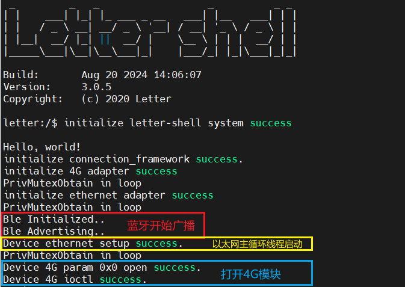


## 5.2 KConfig必需配置

根据[2. KConfig](#2. KConfig)中的配置，KConfig至少应当配置以下内容：

- [2.1.1 Using UART device](#2.1.1 Using UART device)
- [2.1.2 Using Ethernet](#2.1.2 Using Ethernet)
- [2.1.4 Using BLE](#2.1.4 Using BLE)
- [2.1.6 Using RS485](#2.1.6 Using RS485)
- [2.1.7 Using LTE](#Using LTE)
- [2.2 kernel feature](#2.2 kernel feature)
- [2.3 File System](#2.3 File System)
- [2.4.1 Framework](#2.4.1 Framework)
- [2.4.2.1 config stack size and priority of main task](#2.4.2.1 config stack size and priority of main task)

## 5.3 处理蓝牙请求包

`Ubiquitous/XiZi_IIoT/board/ch32v208rbt6/third_party_driver/ble/src/app_uart.c`中的`app_uart_process`函数被`wchbleMainTask`线程无限循环调用。

`app_uart_process`函数的大致过程如下：

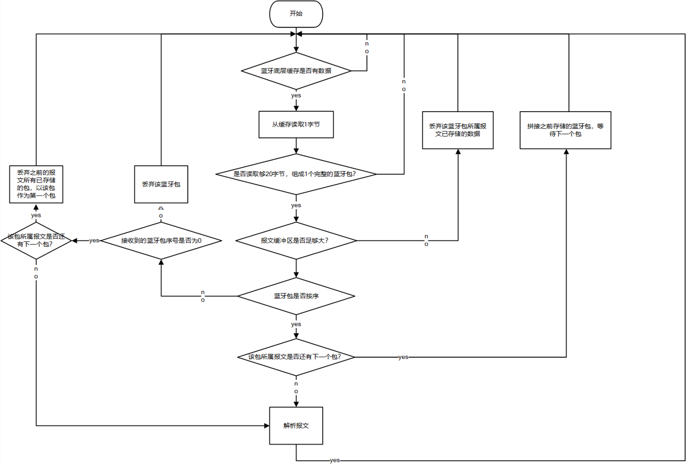

## 5.4 解析蓝牙请求报文

在[5.4 处理蓝牙请求包过程](#5.4 处理蓝牙请求包过程)的最后，是解析报文，即开启一个`parseBleRequestTask`线程。

解析蓝牙请求报文的函数为：`Ubiquitous/XiZi_IIoT/board/ch32v208rbt6/third_party_driver/ModuleConfig.c`文件中的`parseBleRequest`函数。该函数会根据请求报文的类型及字段，修改全局变量CFG的相应字段，并且将CFG写入到FLASH中。

如果请求报文的类型是网络设置报文，ch32v208还会尝试连接目的IP地址和端口号，向微信小程序响应一个网络连接状态报文。

# 6. 采集电表数据功能说明

所在文件路径：`APP_Framework/Applications/connection_app/4g_app/ch32v208_adl400.c`

所采用的测试电表，型号为Acrel ADL400。

## 6.1 main函数

文件路径：`APP_Framework/Applications/main.c`

需要至少在main.c文件中添加以下内容，用于启动相关线程：

```c
#include <adapter.h>
#include <transform.h>
#include <ModuleConfig.h>
int main() {
    FrameworkInit();
    void startUpTransformDataTask(void);
    startUpTransformDataTask(); // 开启数据传输向的相关线程
}
```

## 6.2 KConfig必需配置

- [2.1.1 Using UART device](#2.1.1 Using UART device)
- [2.1.2 Using Ethernet](#2.1.2 Using Ethernet)
- [2.1.6 Using RS485](#2.1.6 Using RS485)
- [2.1.7 Using LTE](#Using LTE)
- [2.2 kernel feature](#2.2 kernel feature)
- [2.3 File System](#2.3 File System)
- [2.4 APP_Framework](#2.4 APP_Framework)

## 6.3 从电表采集数据

ADL400的RS485通信接口支持MODBUS-RTU通信协议，通信口波特率可在1200bps、2400bps、4800 bps、9600bps 和 19200 bps 之间设置，校验位为无校验。

### 6.3.1 生成MODBUS-RTU帧

ch32v208如果想要从电表采集数据，需要函数`generateRequestFrame`生成MODBUS-RTU请求帧。以下为该函数的函数原型：

```c
/**
 * @brief  生成Modbus RTU请求帧，用于获取指定寄存器的值
 * @param  address 请求的Modbus地址
 * @param  functionCode 功能码
 * @param  startAddress 数据起始地址
 * @param  quantity 数据读取个数
 * @param  modbusRtuRequestFrame 生成的ModBus RTU请求帧数组
 * @param  requestFrameArrLength 生成的ModBus RTU请求帧数组长度，固定为8
 * @return int   0表示生成成功，其他结果表示生成失败
 * @note   Modbus
 * RTU请求帧格式：地址（1字节）+功能码（1字节）+数据起始地址（2字节）+数据读取个数（2字节）+校验码（2字节）
 */
static int generateRequestFrame(unsigned char address, unsigned char functionCode, unsigned short startAddress, unsigned short quantity,
                                unsigned char modbusRtuRequestFrame[], int requestFrameArrLength);
```

### 6.3.2 解析MODBUS-RTU响应帧

解析MODBUS-RTU响应帧，实际上是将多个MODBUS-RTU响应帧的结果，拼接成要上传给服务器的数据格式。`parseModBusRtuResponseFrame`函数负责实现该功能，该函数的函数原型如下所示：

```c
/**
 * @brief  解析ADL400响应的Modbus RTU数据帧
 * @param  modbusRtuResponseFrame0 请求数据后ADL400的响应帧
 * @param  modbusRtuResponseFrame1 请求时间戳后ADL400的响应帧
 * @param  modbusRtuResponseFrame2 请求电流电压比后ADL400的响应帧
 * @param  pDataFrame 将要上传给服务器的数据帧，包括id和数据
 */
static void parseModBusRtuResponseFrame(unsigned char *modbusRtuResponseFrame0, unsigned char *modbusRtuResponseFrame1,
                                        unsigned char *modbusRtuResponseFrame2, struct DataFrame *pDataFrame);
```

将要上传给服务器的数据帧，将会存放在互斥循环队列中，等待上传。

### 6.3.3 整体流程

1. 打开并配置RS485
2. 生成MODBUS-RTU帧，并写入到RS485设备中
3. 读取MODBUS-RTU响应帧内容，并解析
4. 将解析后的数据帧放到互斥循环队列中，等待上传
5. 返回第2步

## 6.4 向服务器上传数据

目前采用4G或以太网两种方式向服务器上传数据，分别对应`sendDataToServerTask_4G`函数和`sendDataToServerTask_Ethernet`函数。

可以在`startUpTransformDataTask`函数中，修改start_routine变量，从而修改向服务器上传数据的方式，如下所示：

```c
void *(*start_routine)(void *) = sendDataToServerTask_4G;        // 通过4G模块上传到服务器
// void *(*start_routine)(void *) = sendDataToServerTask_Ethernet;  // 通过以太网模块上传到服务器
```

# 附录1 蓝牙帧格式

ch32v208与微信小程序通过蓝牙交互。一个请求报文分成多个蓝牙包，每个蓝牙包固定20字节。

微信小程序发出请求报文，ch32v208响应确认报文并解析请求报文。如果配置的是4G模块或者以太网模块，还会响应一个网络连接状态报文。

## 请求报文

微信小程序向ch32v208发送请求报文。

### 请求蓝牙包格式

==蓝牙每个包固定20个字节，每次发送请求可能有多个包，根据报文类型决定==

| 字段           | 长度（位） | 说明                                                |
| -------------- | ---------- | --------------------------------------------------- |
| 包ID           | 8          | 每个报文固定同一个包ID                              |
| 是否有下一个包 | 1          | 有的话为1，没有的话为0                              |
| 包序号         | 7          | 包序号从0到127，意味着数据最多只能有128×20=2560字节 |
| 数据           | 18×8=148位 | 将报文拆分                                          |

### 网络设置报文

1. 4G模块：关闭MQTT开关，设置目的IP地址、目的端口号。

   | 字段       | 长度 (字节) | 说明             |
   | ---------- | ----------- | ---------------- |
   | 报文ID     | 1           | 0~255            |
   | 报文类型   | 1           | 固定为 0x01      |
   | 模块类型   | 1           | 固定为 0x01 (4G) |
   | 目的IP地址 | 4           | IPv4 地址        |
   | 目的端口号 | 2           | 端口号 (0-65535) |
   | MQTT开关   | 1           | 固定为0          |

2. 4G模块：打开MQTT开关，设置目的IP地址、目的端口号、MQTT发布主题、MQTT用户名、MQTT密码、MQTT客户端ID。

   | 字段         | 长度 (字节) | 说明               |
   | ------------ | ----------- | ------------------ |
   | 报文ID       | 1           | 0~255              |
   | 报文类型     | 1           | 固定为 0x02        |
   | 模块类型     | 1           | 固定为 0x01 (4G)   |
   | 目的IP地址   | 4           | IPv4 地址          |
   | 目的端口号   | 2           | 端口号 (0-65535)   |
   | MQTT开关     | 1           | 固定为1            |
   | MQTT发布主题 | 64          | 限制在63字节以内   |
   | MQTT用户名   | 64          | 限制在 63字节以内  |
   | MQTT密码     | 64          | 限制在 63字节以内  |
   | MQTT客户端ID | 24          | 限制在 23 字节以内 |

3. 以太网模块：打开DHCP开关，设置目的IP地址、目的端口号。

   | 字段       | 长度 (字节) | 说明                 |
   | ---------- | ----------- | -------------------- |
   | 报文ID     | 1           | 0~255                |
   | 报文类型   | 1           | 固定为 0x03          |
   | 模块类型   | 1           | 固定为 0x02 (以太网) |
   | 目的IP地址 | 4           | IPv4 地址            |
   | 目的端口号 | 2           | 端口号 (0-65535)     |
   | DHCP开关   | 1           | 固定为1              |

4. 以太网模块：关闭DHCP开关，设置目的IP地址、目的端口号、源IP地址、源端口号、子网掩码、网关地址。

   | 字段       | 长度 (字节) | 说明                 |
   | ---------- | ----------- | -------------------- |
   | 报文ID     | 1           | 0~255                |
   | 报文类型   | 1           | 固定为 0x04          |
   | 模块类型   | 1           | 固定为 0x02 (以太网) |
   | 目的IP地址 | 4           | IPv4 地址            |
   | 目的端口号 | 2           | 端口号 (0-65535)     |
   | DHCP开关   | 1           | 固定为0              |
   | 源IP地址   | 4           | IPv4 地址            |
   | 源端口号   | 2           | 端口号 (0-65535)     |
   | 子网掩码   | 4           | IPv4 地址            |
   | 网关地址   | 4           | IPv4 地址            |

### 设备接口设置报文

1. RS485模块，设置波特率、数据位、停止位、校验位。

   | 字段     | 长度 (字节) | 说明                                                         |
   | -------- | ----------- | ------------------------------------------------------------ |
   | 报文ID   | 1           | 0~255                                                        |
   | 报文类型 | 1           | 固定为 0x10                                                  |
   | 模块类型 | 1           | 固定为 0x01 (RS485)                                          |
   | 波特率   | 1           | `2400` -> `0x01` <br />`4800` -> `0x02`<br />`9600` -> `0x03`<br />`19200` -> `0x04`<br />`38400` -> `0x05`<br />`57600` -> `0x06`<br />`115200` -> `0x07`<br />`230400` -> `0x08` |
   | 数据位   | 1           | `8` -> `0x01`<br />`9` -> `0x02`                             |
   | 停止位   | 1           | `1` -> `0x01`<br />`2` -> `0x02`                             |
   | 校验位   | 1           | `None` -> `0x01`<br />` Odd` -> `0x02`<br />`Even` -> `0x03` |

## 响应报文

ch32v208向微信小程序发送响应报文。

### 设置确认报文

如果ch32v208收到设置报文，会通过类型为notification的特征值向微信小程序返回设置确认报文。

| 字段     | 长度 (字节) | 说明                                  |
| -------- | ----------- | ------------------------------------- |
| 报文ID   | 1           | 0~255，和设置报文的ID保持一致         |
| 报文类型 | 1           | 固定为 0x01                           |
| 设置状态 | 1           | 1：正在设置，2：设置成功，3：设置失败 |

### 网络连接状态报文

如果微信小程序发送网络设置报文，ch32v208会通过类型为notification的特征值向小程序返回网络连接状态报文。

| 字段     | 长度 (字节) | 说明                                      |
| -------- | ----------- | ----------------------------------------- |
| 报文ID   | 1           | 0~255，和设置报文的ID保持一致             |
| 报文类型 | 1           | 固定为 0x02                               |
| 模块类型 | 1           | 4G为0x01，以太网为0x02                    |
| 网络状态 | 1           | 1：连接成功，2：连接失败，3: 4G模块未启动 |

# 附录2 main函数

以下为启动蓝牙配置功能和采集电表数据功能的main函数写法，仅作参考：

```c
/*
 * Copyright (c) 2020 AIIT XUOS Lab
 * XiUOS is licensed under Mulan PSL v2.
 * You can use this software according to the terms and conditions of the Mulan PSL v2.
 * You may obtain a copy of Mulan PSL v2 at:
 *        http://license.coscl.org.cn/MulanPSL2
 * THIS SOFTWARE IS PROVIDED ON AN "AS IS" BASIS, WITHOUT WARRANTIES OF ANY KIND,
 * EITHER EXPRESS OR IMPLIED, INCLUDING BUT NOT LIMITED TO NON-INFRINGEMENT,
 * MERCHANTABILITY OR FIT FOR A PARTICULAR PURPOSE.
 * See the Mulan PSL v2 for more details.
 */

#include <stdio.h>
#include <string.h>
#include <adapter.h>
#include <transform.h>
#include <ModuleConfig.h>

extern int FrameworkInit();
extern void ApplicationOtaTaskInit(void);

#ifdef OTA_BY_PLATFORM
extern int OtaTask(void);
#endif

#ifdef APPLICATION_WEBSERVER
extern int webserver(void);
#endif

int main(void) {
    printf("\nHello, world!\n");
    FrameworkInit();
#ifdef APPLICATION_OTA
    ApplicationOtaTaskInit();
#endif

#ifdef OTA_BY_PLATFORM
    OtaTask();
#endif

#ifdef APPLICATION_WEBSERVER
    webserver();
#endif

    void startUpTransformDataTask(void);
    startUpTransformDataTask();
/**
 * 如果想要打开蓝牙配置功能，KConfig中必须启用BLE、ETH、4G、RS485模块
 */
#ifdef BSP_BLE_CONFIG
	/* 创建互斥信号量 */
	if (PrivMutexCreate(&romConfigurationMutex, 0) < 0) {
        printf("CFG mutex create failed.\n");
        return 0;
    }

    /* 启动蓝牙主任务线程 */
    void startUpBleTask(void);
    startUpBleTask();

    /* 启动以太网主任务线程 */
    struct Adapter *adapter = AdapterDeviceFindByName(ADAPTER_ETHERNET_NAME);  // 查找以太网模块适配器
    AdapterDeviceSetUp(adapter);

    /* 打开4G模块 */
    struct Adapter *adapter_4G = AdapterDeviceFindByName(ADAPTER_4G_NAME);  // 查找4G模块适配器
	AdapterDeviceOpen(adapter_4G);
#endif
}
// int cppmain(void);
```

# 附录3 蓝牙特征值

## 蓝牙名称

- 如果KConfig中开启了`Using BLE config`，则可以在KConfig中更改。

  路径：`ch32v208rbt6 feature`-`Using BLE`，勾选 `Using BLE config`，字段`device ble name`即蓝牙名称，如下所示：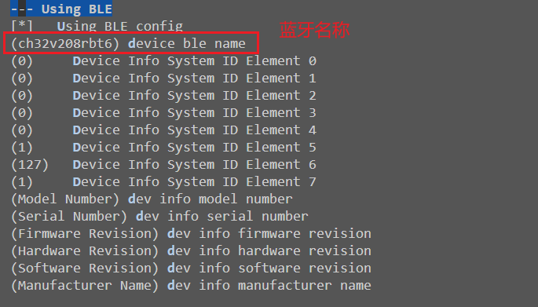

- 如果KConfig中没有开启`Using BLE config`，则需要在代码中进行修改。

  文件路径：`Ubiquitous/XiZi_IIoT/board/ch32v208rbt6/third_party_driver/ble/test/peripheral.c`，修改变量`attDeviceName`的值，如下所示，蓝牙名称为`ch32v208_ble`：

  ```c
  #ifdef BSP_BLE_CONFIG
  static uint8_t attDeviceName[GAP_DEVICE_NAME_LEN] = DEV_BLE_NAME;
  #else
  static uint8_t attDeviceName[GAP_DEVICE_NAME_LEN] = "ch32v208_ble";
  #endif
  ```

## 设备信息

- 如果KConfig中开启了`Using BLE config`，则可以在KConfig中更改。

  路径：`ch32v208rbt6 feature`-`Using BLE`，勾选 `Using BLE config`，如下所示：

  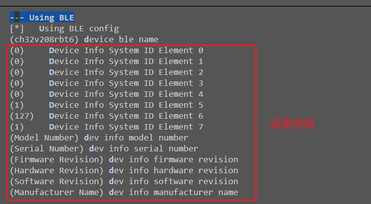

- 如果KConfig中没有开启`Using BLE config`，则需要在代码中进行修改。

  文件路径：`Ubiquitous/XiZi_IIoT/board/ch32v208rbt6/third_party_driver/ble/Profile/devinfoservice.c`，修改以下内容：

  ```c
  #ifdef BSP_BLE_CONFIG // 启用BLE配置之后，从KConfig中获取设备信息
  ...
  #else // 未启用BLE配置
  // System ID characteristic
  static uint8_t devInfoSystemIdProps = GATT_PROP_READ;
  static uint8_t devInfoSystemId[DEVINFO_SYSTEM_ID_LEN] = {0, 0, 0, 0, 0, 1, 127, 1};
  
  // Model Number String characteristic
  static uint8_t devInfoModelNumberProps = GATT_PROP_READ;
  static const uint8_t devInfoModelNumber[] = "Model Number";
  
  // Serial Number String characteristic
  static uint8_t devInfoSerialNumberProps = GATT_PROP_READ;
  static const uint8_t devInfoSerialNumber[] = "Serial Number";
  
  // Firmware Revision String characteristic
  static uint8_t devInfoFirmwareRevProps = GATT_PROP_READ;
  static const uint8_t devInfoFirmwareRev[] = "Firmware Revision";
  
  // Hardware Revision String characteristic
  static uint8_t devInfoHardwareRevProps = GATT_PROP_READ;
  static const uint8_t devInfoHardwareRev[] = "Hardware Revision";
  
  // Software Revision String characteristic
  static uint8_t devInfoSoftwareRevProps = GATT_PROP_READ;
  static const uint8_t devInfoSoftwareRev[] = "Software Revision";
  
  // Manufacturer Name String characteristic
  static uint8_t devInfoMfrNameProps = GATT_PROP_READ;
  static const uint8_t devInfoMfrName[] = "Manufacturer Name";
  #endif
  ```

| 变量                | 蓝牙服务ID                           | 蓝牙特征值ID                         | 说明       |
| ------------------- | ------------------------------------ | ------------------------------------ | ---------- |
| devInfoSystemId     | 0000180A-0000-1000-8000-00805F9B34FB | 00002A23-0000-1000-8000-00805F9B34FB | 系统ID     |
| devInfoModelNumber  | 0000180A-0000-1000-8000-00805F9B34FB | 00002A24-0000-1000-8000-00805F9B34FB | 模块编号   |
| devInfoSerialNumber | 0000180A-0000-1000-8000-00805F9B34FB | 00002A25-0000-1000-8000-00805F9B34FB | 设备序列号 |
| devInfoFirmwareRev  | 0000180A-0000-1000-8000-00805F9B34FB | 00002A26-0000-1000-8000-00805F9B34FB | 固件版本   |
| devInfoHardwareRev  | 0000180A-0000-1000-8000-00805F9B34FB | 00002A27-0000-1000-8000-00805F9B34FB | 硬件版本   |
| devInfoSoftwareRev  | 0000180A-0000-1000-8000-00805F9B34FB | 00002A28-0000-1000-8000-00805F9B34FB | 软件版本   |
| devInfoMfrName      | 0000180A-0000-1000-8000-00805F9B34FB | 00002A29-0000-1000-8000-00805F9B34FB | 设备生产商 |

## 微信小程序交互

ch32v208通过两个特征值与微信小程序进行交互：

- 属性为GATT_PROP_WRITE_NO_RSP | GATT_PROP_WRITE的特征值，负责微信小程序向ch32v208发送请求报文。该特征值暂称`ble_uart_RxChar`（在ch32v208视角中是读取该特征值）。
- 属性为GATT_PROP_NOTIFY的特征值，负责ch32v208向微信小程序发送响应报文。该特征值暂称`ble_uart_TxChar`（在ch32v208视角中是写入该特征值）。

如下图所示：

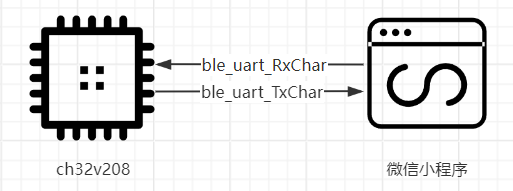

| 变量            | 蓝牙服务ID                           | 蓝牙特征值ID                         | 说明     |
| --------------- | ------------------------------------ | ------------------------------------ | -------- |
| ble_uart_RxChar | 6E400001-B5A3-F393-E0A9-E50E24DCCA9F | 6E400002-B5A3-F393-E0A9-E50E24DCCA9F | 请求报文 |
| ble_uart_TxChar | 6E400001-B5A3-F393-E0A9-E50E24DCCA9F | 6E400003-B5A3-F393-E0A9-E50E24DCCA9F | 响应报文 |