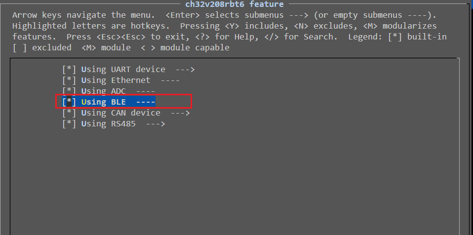
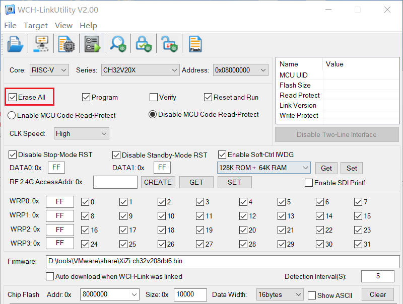
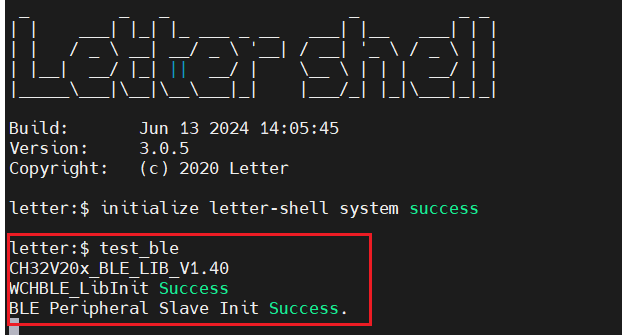
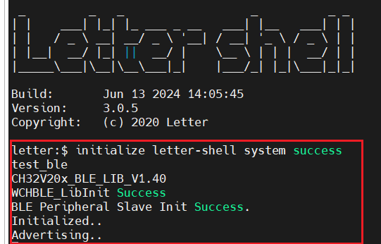
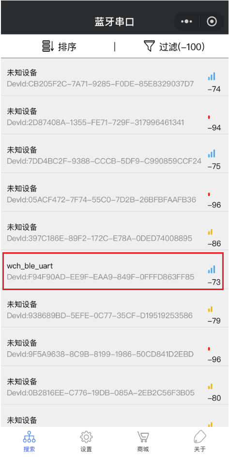
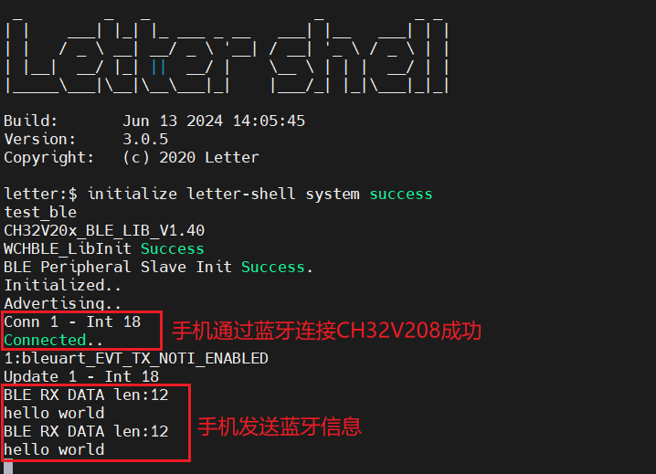
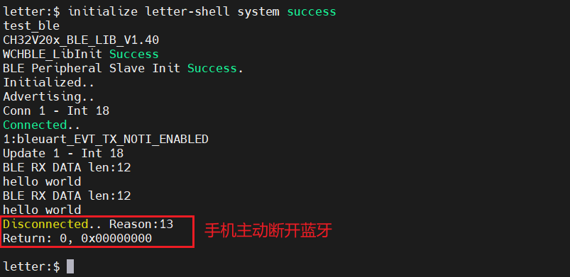

==该文件已废弃，蓝牙具体功能详见`Ubiquitous/XiZi_IIoT/board/ch32v208rbt6/third_party_driver/README.md`中的`5. 蓝牙配置功能说明`==

# 1. 特殊配置

CH32V208支持2Mbps低功耗蓝牙BLE通讯模块。

在进行正常程序编译烧录的过程中，需要进行以下特殊配置，其他步骤保持一致。

## 1.1 menuconfig

在menuconfig配置界面中，根据以下路径选择：

`ch32v208rbt6 feature`->勾选`Using BLE`，如下所示：

## 1.2 烧录

在首次将包含蓝牙的程序烧录进CH32V208时，在WCH-LinkUtility烧录工具中，需要勾选`Erase All`选项，如下所示，此后烧录则无需勾选该选项：

## 1.3 ROM和RAM大小设置

由于蓝牙源文件中有静态库，源文件的ROM大小可能会超过128K，因此最好启用慢速FLASH。详见`Ubiquitous/XiZi_IIoT/board/ch32v208rbt6/README.md`中的`7. 烧录`一节。

# 2. 连接蓝牙

启动系统完成后，使用`test_ble`命令启动蓝牙。如果在[1.2 烧录](#1.2 烧录)中是首次进行烧录，那么会看到以下内容：

此时蓝牙并没有启动成功，需要按下CH32V208上的复位按钮，待系统启动完成后再次输入`test_ble`命令，此时蓝牙才可以启动成功，如下所示：

> [!note]
>
> 此后烧录，如果在`WCH-LinkUtility`中没有勾选`Erase All`，那么可以一次启动蓝牙成功，无需复位。

此时，在手机任意蓝牙调试程序中，即可看到`wch_ble_uart`的蓝牙设备，如下：

连接之后，发送信息，即可在串口调试中，看到所发送的信息，表示CH32V208成功收到蓝牙信息，如下图所示：

# 3. 断开蓝牙

目前，测试程序无法自行断开蓝牙，需要在手机上主动断开蓝牙。断开之后，系统程序回到命令行，如下：

