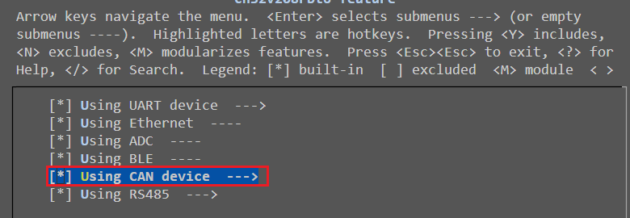
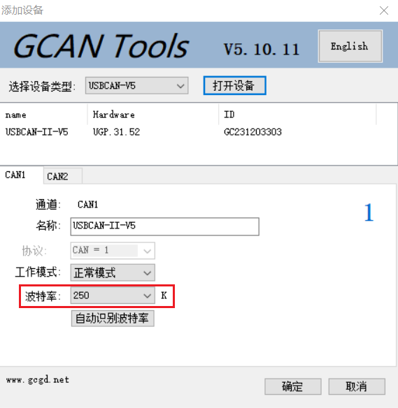
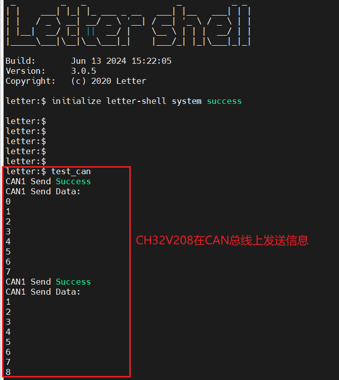
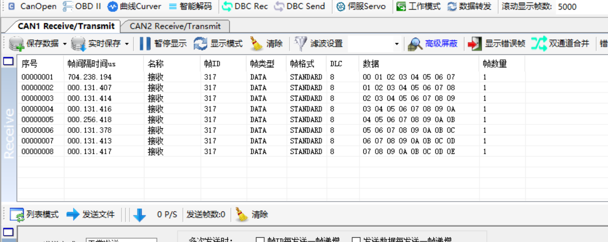

# 1. 特殊配置

## 1.1 CAN波特率配置

> 参考资料：
>
> [1]https://www.cnblogs.com/wchmcu/p/17546797.html

如果CAN波特率配置不正确，导致CAN上位机无法识别波特率，那么会导致CAN发送信息失败。

在源程序中CAN的计算公式为：$CANbps=tpclk1/((TS1[3:0]+1+TS2[2:0]+1 +1)*(BPR[9:0]+1))$

源文件配置CAN波特率的位置为`Ubiquitous/XiZi_IIoT/board/ch32v208rbt6/third_party_driver/can/test/can_test.c`的`static int init_can(u8 tsjw, u8 tbs2, u8 tbs1, u16 brp, u8 mode)`方法。

初始波特率配置为：

```c
init_can(CAN_SJW_1tq, CAN_BS2_5tq, CAN_BS1_6tq, 20, CAN_Mode_Normal);
```

即$60M/((4+1+5+1+1))*(19+1))=250Kbps$

> [!note]
>
> 主频在`Ubiquitous/XiZi_IIoT/arch/risc-v/ch32v208rbt6/User/system_ch32v20x.c`中配置，需要注意tpclk1为主频的1/2，因此主频如果设置为120MHz，那么对应的tpclk1为60MHz。

## 1.2 menuconfig

在menuconfig配置界面中，根据以下路径选择：

`ch32v208rbt6 feature`->勾选`Using CAN device`，如下所示：



# 2. 连接USBCAN分析仪

此处测试使用的是广成USBCAN-II Pro+分析仪。

将CH32V208的CAN_H端口与分析仪CAN1的H端口相连，将CH32V208的CAN_L端口与分析仪CAN1的L端口相连，如下图所示：


# 3. CAN总线发送信息

USBCAN上位机注意选择波特率为250K（默认）。注意关闭帧id过滤功能。



打开上位机之后，在XiZi命令行输入`test_can`命令，此时程序自动往CAN总线发送信息。如果发送信息成功，命令行会显示以下内容：



同时在USBCAN上位机显示接受CAN帧成功，如下所示：

