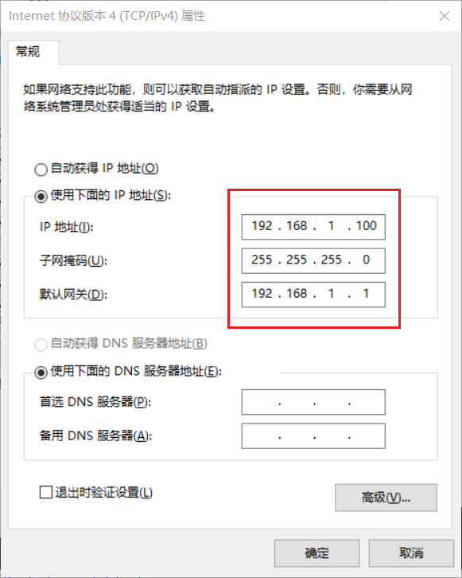
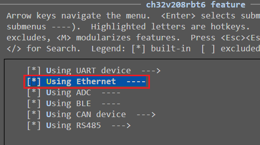
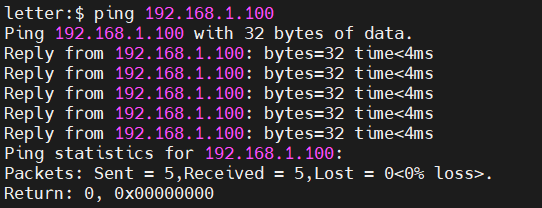
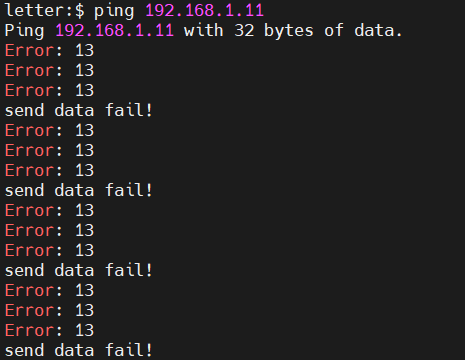
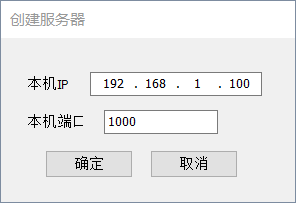
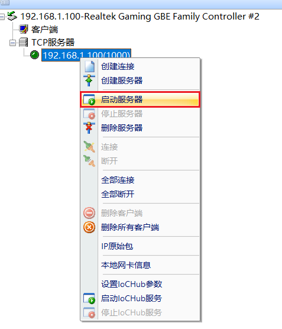
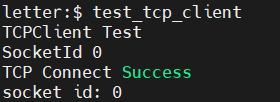
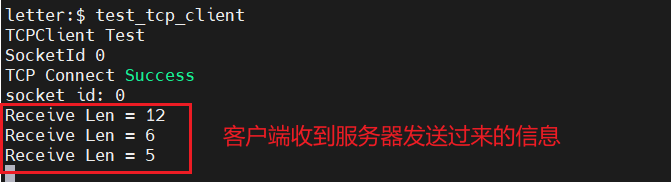
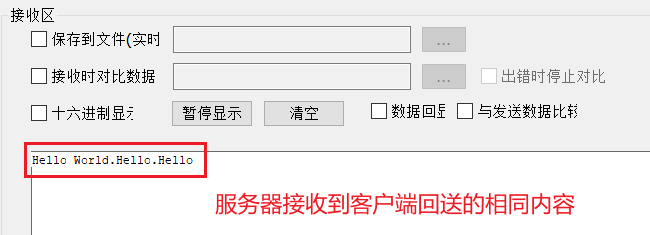

==该文件已废弃，以太网具体功能详见`Ubiquitous/XiZi_IIoT/board/ch32v208rbt6/third_party_driver/README.md`==中的`6.4 向服务器上传数据`。

# 1. 特殊配置

## 1.1 IP地址配置

目前IP地址配置内容在代码中写死，所在的源文件为`Ubiquitous/XiZi_IIoT/board/ch32v208rbt6/third_party_driver/ethernet/connect_ether.c`。

其内容可以自行修改：

```c
uint8_t IPAddr[4] = { 192, 168, 1, 10 }; // IP address
uint8_t GWIPAddr[4] = { 192, 168, 1, 1 }; // Gateway IP address
uint8_t IPMask[4] = { 255, 255, 255, 0 }; // subnet mask
uint8_t DESIP[4] = { 192, 168, 1, 100 }; // destination IP address
```

以上默认配置表示：

- CH32V208的IP地址为192.168.1.10
- 网关地址为192.168.1.1
- 子网掩码为255.255.255.0
- 目的地址为192.168.1.100（`test_tcp_client`命令连接的服务器地址）

将CH32V208与电脑连接好网线，并启动XiZi之后，电脑的IP地址配置如下所示：



## 1.2 ROM和RAM大小设置

由于以太网源文件中有静态库，源文件的ROM大小可能会超过128K，因此最好启用慢速FLASH。详见`Ubiquitous/XiZi_IIoT/board/ch32v208rbt6/README.md`中的`7. 烧录`一节。

## 1.3 Menuconfig

在menuconfig配置界面中，根据以下路径选择：

`ch32v208rbt6 feature`->勾选`Using Ethernet`，如下所示：



# 2. ping

使用网线连接CH32V208和电脑，并且启动XiZi操作系统后，在命令行输入`ping <ip地址>`。如果CH32V208与电脑网络畅通，会显示以下内容：



如果CH32V208与电脑网络不畅通，会显示以下内容（使用错误IP地址测试）：



# 3. test_tcp_client

`test_tcp_client`命令测试CH32V208作为客户端连接服务器。

使用`TcpIpDebug`调试工具模拟服务器，下载地址：https://www.wch.cn/downloads/TcpIpDebug_exe.html

## 3.1 创建服务器

在电脑中打开TcpIpDebug工具后，创建服务器，IP地址和端口配置如下：



## 3.2 启动服务器

右键点击刚刚创建的服务器，点击启动服务器，如下所示：



## 3.3 连接服务器

在XiZi命令行中键入命令`test_tcp_client`，显示以下内容表示连接服务器成功：



在TcpIpDebug中可以模拟服务器向客户端发送信息，发送之后在XiZi命令行会显示接收信息的长度，并且向服务器会送同样的内容，如下：





测试源程序中没有主动断开连接的代码，因此需要服务器主动断开，之后源程序回到XiZi命令行输入。