> [!caution]
>
> 4G模块的引脚（MAIN_TX）和ADC模块的引脚有冲突，因此不能同时启用4G模块和ADC模块。

开发板使用的4G模块为WH-GM800TF-CT-4-N41串口转LTE芯片，对LTE 4G模块的测试分为两个部分：

1. 通过`USR-CAT1 V1.2.5`串口配置软件进行配置以及通信。
2. 通过XIZI操作系统命令行进行输入配置以及通信。

# 1. 4G模块模型

该模块的模型如下：

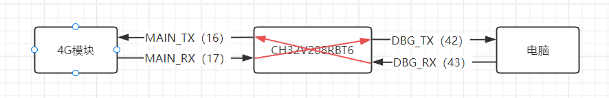

括号中的数据代表CH32V208芯片引脚。CH32V208RBT6通过DBG_TX和DBG_RX串口与电脑相连，通过MAIN_TX和MAIN_RX串口与4G模块相连，如果要从个人电脑输入信息给4G模块，需要在这两个串口之间进行软件层面的转发数据：

- 将从电脑（终端）接受到的信息（DBG_RX）转发到MAIN_TX串口引脚上。
- 将从4G模块接受到的信息（MAIN_RX）转发到DBG_TX串口引脚上。

# 2. 远程服务器开启TCP服务器端口

Linux可以使用nc命令开启端口，以下命令打开本机的10001端口：

```bash
nc -l -vv -n -p 10001
```

> [!caution]
>
> 需要先在路由器或者防火墙上打开10001端口。

输入以上命令后，服务器开始监听10001端口上的连接，其中：

- `-l`：监听端口
- `-vv`：连接时显示详细信息
- `-n`：禁止将本主机IP解析成名字
- `-p 10001`：监听的端口为10001

# 3. 通过串口配置软件进行配置以及通信

串口配置软件下载地址：https://www.usr.cn/Download/1289.html

## 3.1 特殊配置

在`Ubiquitous/XiZi_IIoT/board/ch32v208rbt6/third_party_driver/lte/test/lte_test.c`中修改以下内容：

```c
int lteMode = TRANSPARENT_TRANSMISSION_MODE;  // 传输模式
```

该语句的作用是：将会在4G模块配置初始化之后，4G模块和电脑实现透明传输数据，CH32V208RBT6芯片不对数据进行任何处理。

## 3.2 执行lte_test命令

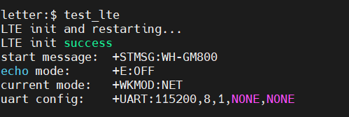

执行`lte_test`命令，会对4G模块进行一系列初始化配置并重启，显示以上信息代表重启成功。

## 3.3 USR-CAT1串口配置软件操作

### 3.3.1 产品型号选择

软件左上角点击`产品型号选择`，选择`WH-GM800TF-X-N41`，如下：

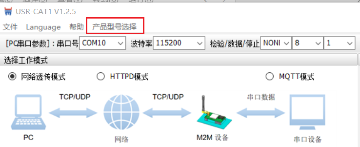

### 3.3.2 串口配置

关闭其他软件上的串口，打开USR-CAT1串口配置软件，配置并打开串口。

- 串口号选择电脑对应串口。
- 波特率选择选择115200。
- 检验/数据/停止选择：NONE/8/1。
- 点击【打开串口】。

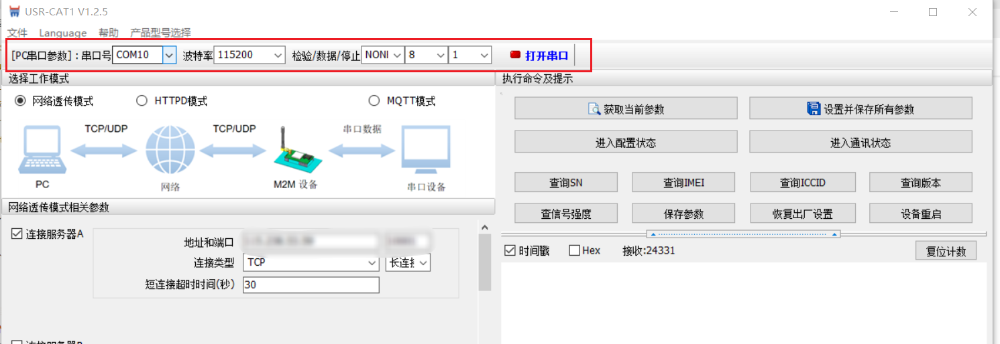

### 3.3.3 相关参数配置

1. 工作模式选择`网络透传模式`。
2. 勾选`连接服务器A`，地址和端口选择[2. 远程服务器开启TCP服务器端口](#2. 远程服务器开启TCP服务器端口)中服务器的公网地址以及开放的端口。
3. 点击`设置并保存所有参数`。

配置过程如下图所示：

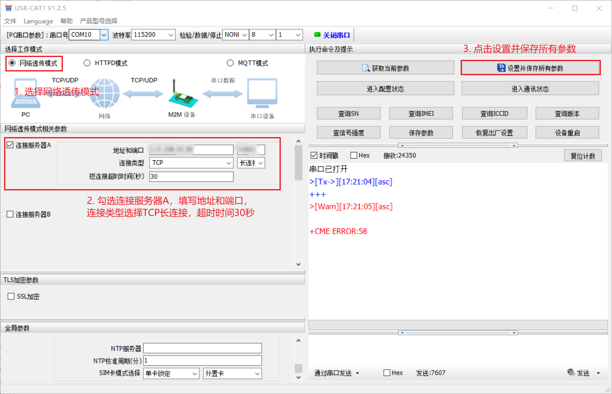

> [!note]
>
> 可能串口配置软件版本V1.2.5有BUG，我点击设置并保存所有参数之后，正常应该一次执行所有配置指令，但是实际只执行了` AT+WKMOD=NET` 一条配置指令。需要不断在命令行输入错误指令才可以自动执行所有的AT配置指令，直至执行到`AT+S`指令为止。如下图所示：
>
> 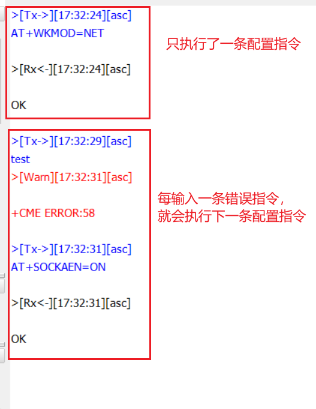

进行完以上步骤，4G模块会保存参数并且重新启动，重新启动完成后，即可与远程服务器通信。

## 3.4 与远程服务器通信

如下图所示，远程服务器能够接收4G模块发送的信息，4G模块也能够接收到远程服务器发送的信息：

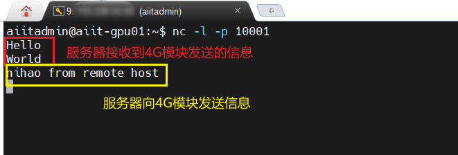

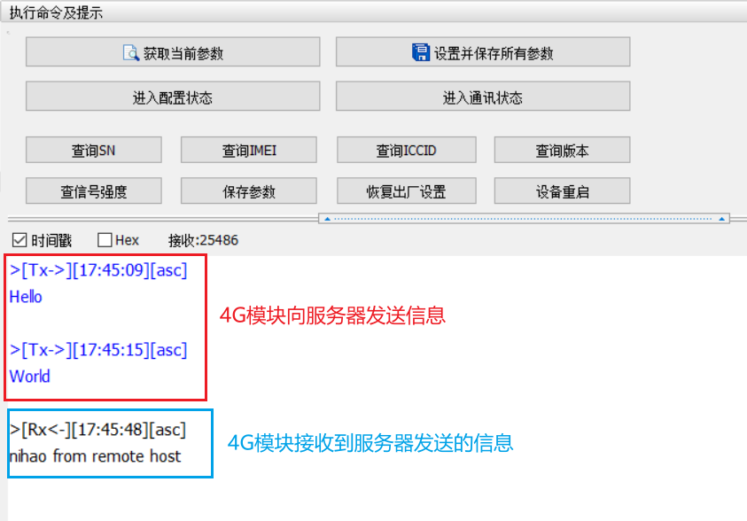

如果服务器和4G模块无法进行通信，请进行以下检查：

- 默认是优先外置SIM卡。请注意外置SIM卡是否缺口向外（正常缺口向外）。
- 内置SIM卡默认每月100M流量，请核实是否超额。
- 服务器开启端口是否在路由器或防火墙也开启。

# 4. 通过命令行进行配置以及通信

## 4.1 特殊配置

在`Ubiquitous/XiZi_IIoT/board/ch32v208rbt6/third_party_driver/lte/test/lte_test.c`中修改以下内容：

```c
int lteMode = COMMAND_LINE_MODE;            // 传输模式
```

该语句的作用是：将会在4G模块配置初始化之后，4G模块和电脑进行命令行交互，CH32V208RBT6芯片需对数据进行额外处理。

## 4.2 执行lte_test命令

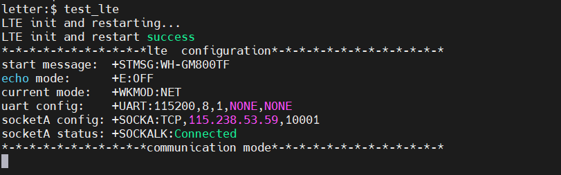

执行`lte_test`命令，会对4G模块进行一系列初始化配置并重启，显示以上信息代表重启成功。

默认情况下，4G模块会尝试每隔10秒连接服务器，总共尝试60次，如果还未连接上则表示无法与服务器进行通信。

如果连接服务器成功，则会默认进入通信模式，如上图所示，此时在命令行输入的内容键入回车后会发送给服务器。

如果连接服务器失败（默认查询10次，查询间隔为1秒、2秒……10秒，如果都是查询无连接，则认为连接失败），则会默认进入配置模式，如下图所示，此时在命令行键入的内容键入回车后，相当于给4G模块发送AT指令。

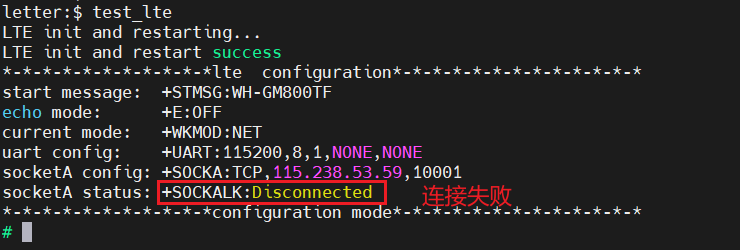

## 4.3 与远程服务器进行通信

如果当前处于配置模式，则会显示：`*-*-*-*-*-*-*-*-*-*-*communication mode*-*-*-*-*-*-*-*-*-*-*-*-*`。如果当前处于通信模式，则会显示：`*-*-*-*-*-*-*-*-*-*-*communication mode*-*-*-*-*-*-*-*-*-*-*-*-*`。

- 通信模式转为配置模式：键入`+++`回车，如下图所示：

  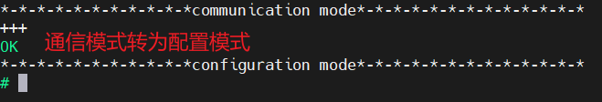

- 配置模式转为通信模式：键入`AT+ENTM`回车，如下图所示：

  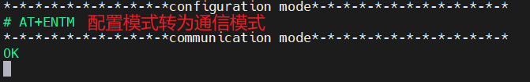

在通信模式下，输入内容可以直接发送到远程服务器，也可以接收到来自远程服务器发来的信息，如下图所示：

4G模块：

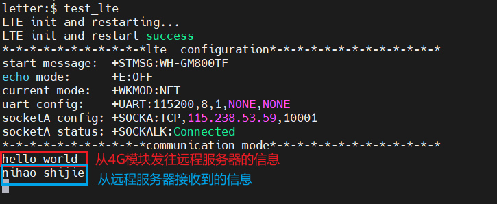

远程服务器：

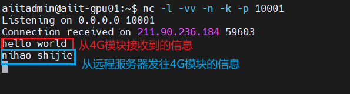

## 4.4 退出LTE测试

无论在配置模式还是在通信模式，键入`quit`回车，即可退出LTE测试，回到shell命令行，如下图所示：

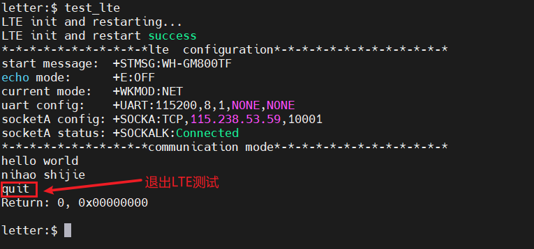

