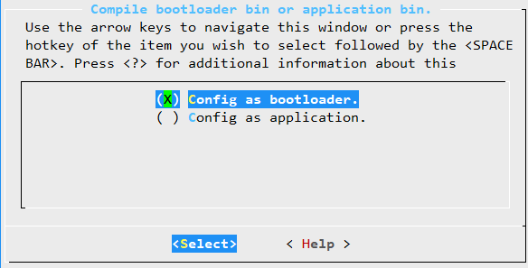
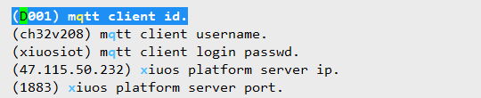
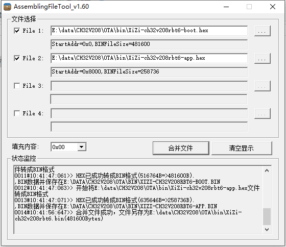
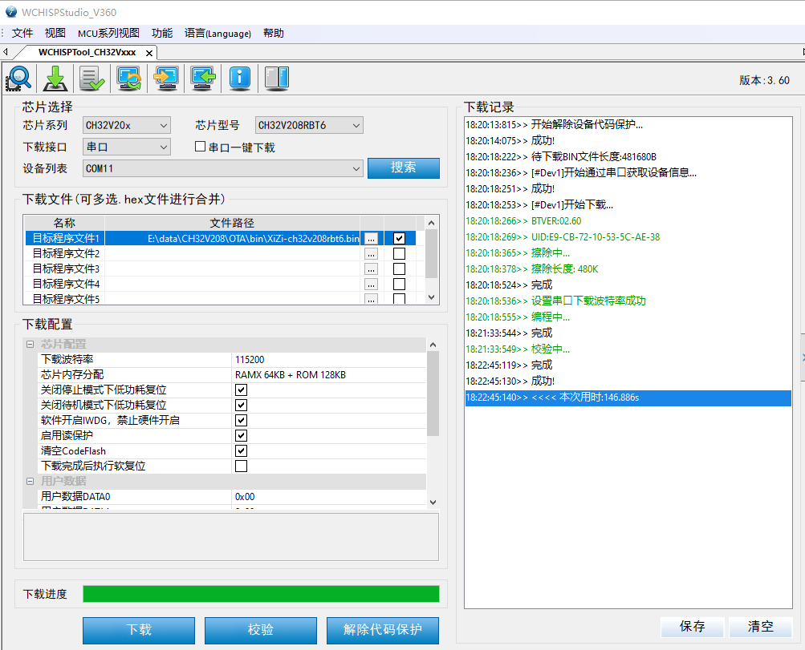
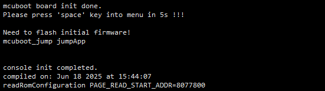
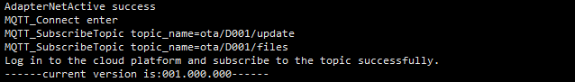
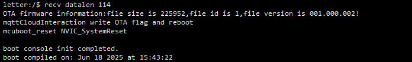
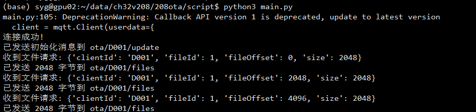
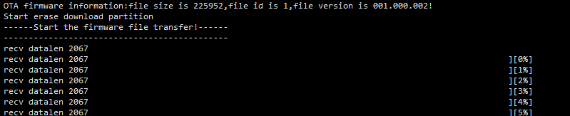
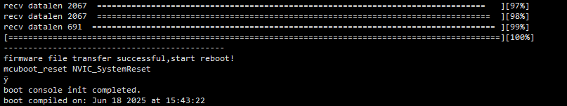

# 编译
生成支持OTA升级的固件，需要分别编译boot和app。其中，boot是升级需要的固件，app是正常系统固件。

编译boot之前，需要在路径 Ubiquitous/XiZi_IIoT 下，执行：

    cp board/ch32v208rbt6/.defconfig_boot board/ch32v208rbt6/.defconfig

编译app之前，需要在路径 Ubiquitous/XiZi_IIoT 下，执行：

    cp board/ch32v208rbt6/.defconfig_app board/ch32v208rbt6/.defconfig

可以执行 make BOARD=ch32v208rbt6 menuconfig，查看config 选项。

     .config - XiZi_IIoT Project Configuration
     > Tool feature > OTA function > Enable support OTA function > Compile bootloader bin or application bin.

     .config - XiZi_IIoT Project Configuration
     > APP_Framework > app lib > lib using MQTT > Enable support MQTT function > xiuos platform mqtt connection parameter configuration.

执行 make BOARD=ch32v208rbt6，进行编译。

编译后，分别生成 XiZi-ch32v208rbt6-boot.bin 和 XiZi-ch32v208rbt6-app.bin，以及 XiZi-ch32v208rbt6-boot.hex 和 XiZi-ch32v208rbt6-app.hex。

从沁恒官网（[产品手册 - 南京沁恒微电子股份有限公司](https://www.wch.cn/downloads/category/27.html)）下载工具软件 WCH_AssemblingFileTool.exe，将 XiZi-ch32v208rbt6-boot.hex 和 XiZi-ch32v208rbt6-app.hex 合并成 XiZi-ch32v208rbt6.bin。

# 烧录
从沁恒官网下载工具软件 WchIspStudio.exe，选择芯片和串口，选择固件。

设备端，按boot和reset按键，让设备进入烧录模式。点击“解除代码保护”和“下载”，进行烧录。

# OTA升级

烧录成功后，先启动 boot 程序，然后跳转到 app 程序 。

进入系统后初始化4G模块并开启线程进行mqtt通信，可以看到此时的版本是 001.000.000。

然后，需要进入publisher，将要更新的app程序XiZi-ch32v208rbt6-app.bin放到publisher下，修改main.py中的version和文件名。

然后，电脑上运行 python3 main_early.py (需pip install paho-mqtt安装依赖库)。

设备检测到版本信息后，写入OTA状态，然后重启，重启后boot进入下载状态。

然后，电脑上运行 python3 main.py。

设备检测到版本信息后，开始传输文件。

当传输进度为100%后，更新app的bin将烧录至APP区，之后板子会自动重启。

重启后依然先进入boot，然后启动app。查看APP日志，以及version打印信息确认升级成功。

# 注意事项

CH32V208的FLASH大小是480KB，其中零等待运行区域大小是128KB。FLASH快速写函数以及系统中断等关键函数需要运行在零等待运行区域。

程序分布如下：

|address|Area|Size|
|-|-|-|
|0x08000000 ~ 0x08008000 | Boot_FAST | 32KB |
|0x08008000 ~ 0x08050000 | Application | 288KB |
|0x08050000 ~ 0x08077000 | Boot_SLOW | 156KB |
|0x08077000 ~ 0x08078000 | OTA_FLAG | 4KB |

