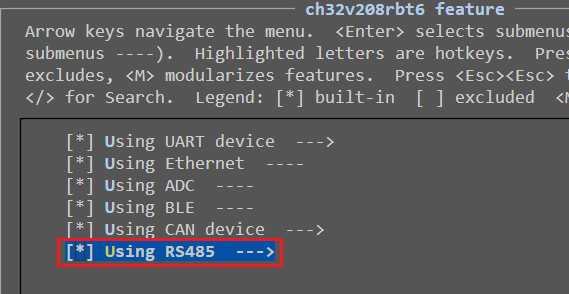
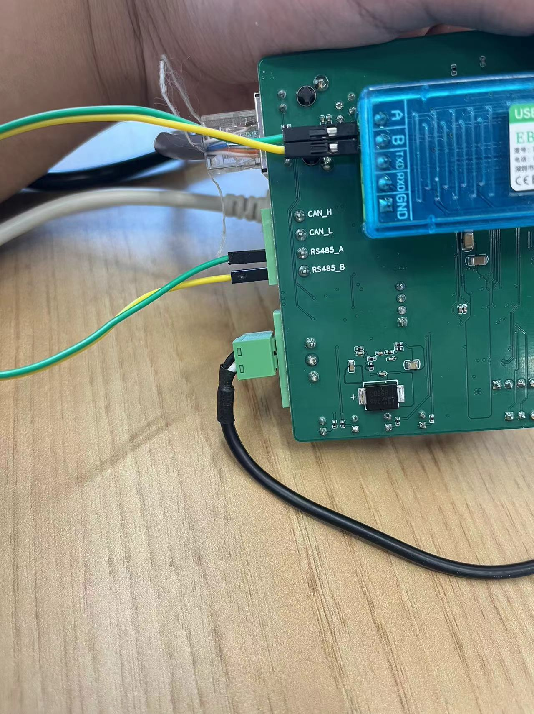
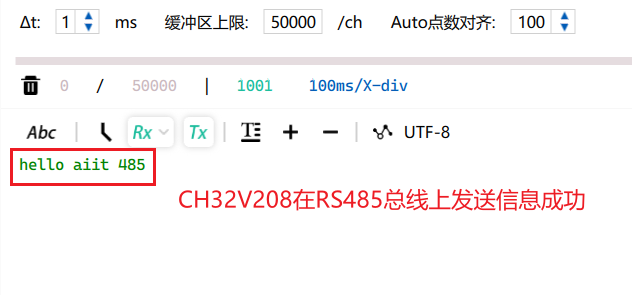
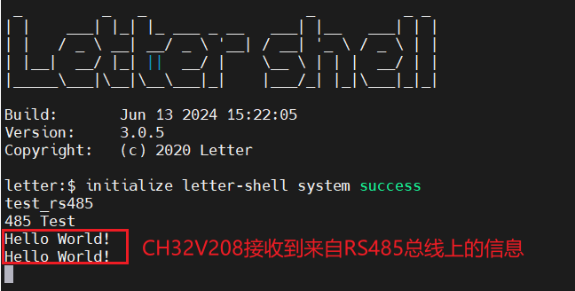
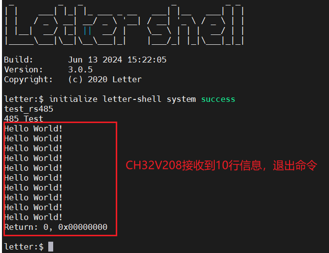
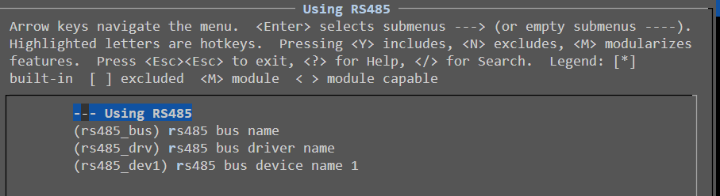
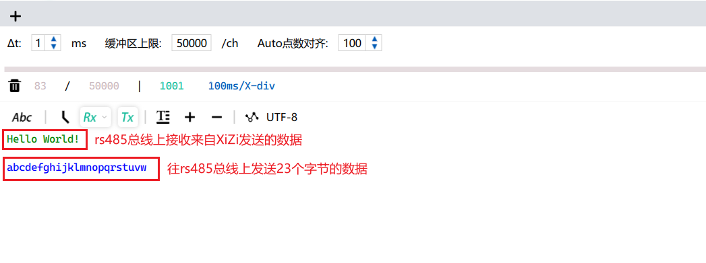
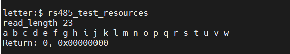

RS-485只是电气信号接口，有许多通信协议使用RS-485准位的电气信号，但RS-485规格书本身没有提到通信速度、格式以及资料传输的通信协议。因此使用UART在RS485总线上传输数据。

# 1. 特殊配置

## 1.1 Menuconfig

在menuconfig配置界面中，根据以下路径选择：

`ch32v208rbt6 feature`->勾选`Using RS485`，如下所示：



# 2. 连接USB转RS485转换器

连接CH32V208上的`RS485_A`端口到USB转RS485转换器上的`A`端口，连接CH32V208上的`RS485_B`端口到USB转RS485转换器上的`B`端口，如下图所示：



# 3. test_rs485

打开串口调试上位机，并且启动XiZi操作系统后，键入命令`test_rs485`，此时在上位机会看到以下信息，代表CH32V208在RS485总线上发送信息成功：



同时，在上位机中向RS485总线发送数据，CH32V208也可以收到，如下所示：



接收达到10行信息后，源程序会退出该命令，回到命令行正常输入模式，如下图所示：



# 4. test_rs485_resources

该文件用于测试`Ubiquitous/XiZi_IIoT/resources`下的驱动模型是否可以正常读写。驱动模型如下所示：


## 4.1 相关配置说明

### 4.1.1 Menuconfig

`ch32v208rbt6 feature`->`Using RS485`选中之后回车，设置rs485总线、驱动、设备的名称，如下图所示：



## 4.2 驱动程序说明

详见《矽璓操作系统实验-RISCV篇-20230904.pdf》3.6和4.5节。

由于RS485为电气协议，不涉及通信协议，可以使用串口直接发送。故RS485的驱动程序与串口的驱动程序在同一个文件`Ubiquitous/XiZi_IIoT/board/ch32v208rbt6/third_party_driver/uart/connect_uart.c`。

特别说明中断设置，`void SerialSetIsr(struct SerialHardwareDevice *serial_dev, int event)`函数用于在resources层设置中断，该函数会转到对应的中断处理函数处理。可以在接收硬件中断之后调用该函数，提升到resources层处理。

## 4.3 驱动使用

1. 根据[4.1.1 Menuconfig](#4.1.1 Menuconfig)中的rs485总线、驱动、设备的名称，找到指向rs485总线、驱动、设备的指针，如下所示。

   ```c
   /* find the rs485 bus pointer */
   bus = BusFind(RS485_BUS_NAME);
   if (NONE == bus) {
       KPrintf("BusFind %s failed\n", RS485_BUS_NAME);
       return 1;
   }
   /* find the rs485 driver pointer */
   drv = BusFindDriver(bus, RS485_DRV_NAME);
   if (NONE == drv) {
       KPrintf("BusFindDriver %s failed\n", RS485_DRV_NAME);
       return 1;
   }
   /* find the rs485 device pointer */
   dev = BusFindDevice(bus, RS485_DEVICE_NAME_1);
   if (NONE == dev) {
       KPrintf("BusFindDevice %s failed\n", RS485_DEVICE_NAME_1);
       return 1;
   }
   ```

2. 初始化驱动，此过程最终会调用 `drv->configure(drv, configure_info)`，即`Ubiquitous/XiZi_IIoT/board/ch32v208rbt6/third_party_driver/uart/connect_uart.c`中的`SerialInit`函数，如下所示：

   ```c
   struct BusConfigureInfo configure_info;
   struct SerialCfgParam serialCfgParam;
   memset(&serialCfgParam, 0, sizeof(struct SerialCfgParam));
   configure_info.configure_cmd = OPE_INT;
   configure_info.private_data = &serialCfgParam;
   ret = BusDrvConfigure(drv, &configure_info);
   
   if (EOK != ret) {
       KPrintf("BusDrvConfigure OPE_INT failed error code %d\n", ret);
       return ret;
   }
   ```

3. 对驱动和设备进行匹配，即检查驱动对应的总线和设备对应的总线是否名称相同（同一总线上），如下所示：

   ```c
   ret = bus->match(drv, dev);
   if (EOK != ret) {
       KPrintf("BusMatch failed error code %d\n", ret);
       return ret;
   }
   ```

4. 打开设备，最终调用`Ubiquitous/XiZi_IIoT/resources/serial/dev_serial.c`的`SerialDevOpen`函数，如下所示：

   ```c
   ret = BusDevOpen(dev);
   if (EOK != ret) {
       KPrintf("BusDevOpen failed error code %d\n", ret);
       return ret;
   }
   ```

   > [!note]
   >
   > `SerialDevOpen`函数主要分配缓冲区以及使能串口中断。

5. 对设备进行读写操作，如下所示：

   ```c
   /*step 4: write serial data, configure struct BusBlockWriteParam*/
   struct BusBlockWriteParam writeParam;
   writeParam.buffer = (void *)sendString;
   writeParam.size = sizeof(sendString) - 1;
   BusDevWriteData(dev, &writeParam);
   
   Delay_Ms(10000);
   
   /*step 5: read serial data, configure struct BusBlockWriteParam*/
   struct BusBlockReadParam readParam;
   char buffer[100];
   readParam.buffer = (void *)buffer;
   readParam.size = 100;
   readParam.read_length = 0;
   int res = BusDevReadData(dev, &readParam);
   if (EOK == res) {
       KPrintf("read_length %d\n", readParam.read_length);
       for (int i = 0; i < readParam.read_length; i++) {
           KPrintf("%c ", buffer[i]);
       }
       KPrintf("\n");
   } else {
       KPrintf("read data failed\n");
   }
   ```

   > [!note]
   >
   > 如果在打开设备（中断开启前）发送串口数据，串口虽然不会触发中断，但是会暂存一个字节的数据。一旦打开设备，中断会立即触发，`BusDevReadData`会将这一字节读入内存。

6. 关闭设备，最终调用`Ubiquitous/XiZi_IIoT/resources/serial/dev_serial.c`的`SerialDevClose`函数，如下所示：

   ```c
   /*step 6: close bus_device*/
   BusDevClose(dev);
   ```

   > [!note]
   >
   > `SerialDevClose`函数主要分配缓冲区以及禁用串口中断。

## 4.4 测试

打开串口调试上位机，并且启动XiZi操作系统后，键入命令`test_rs485_resources`，此时在上位机会看到以下信息，代表CH32V208在RS485总线上发送信息成功：



同时，键入命令后10秒内在上位机中向RS485总线发送数据，CH32V208也可以收到，如下所示：


