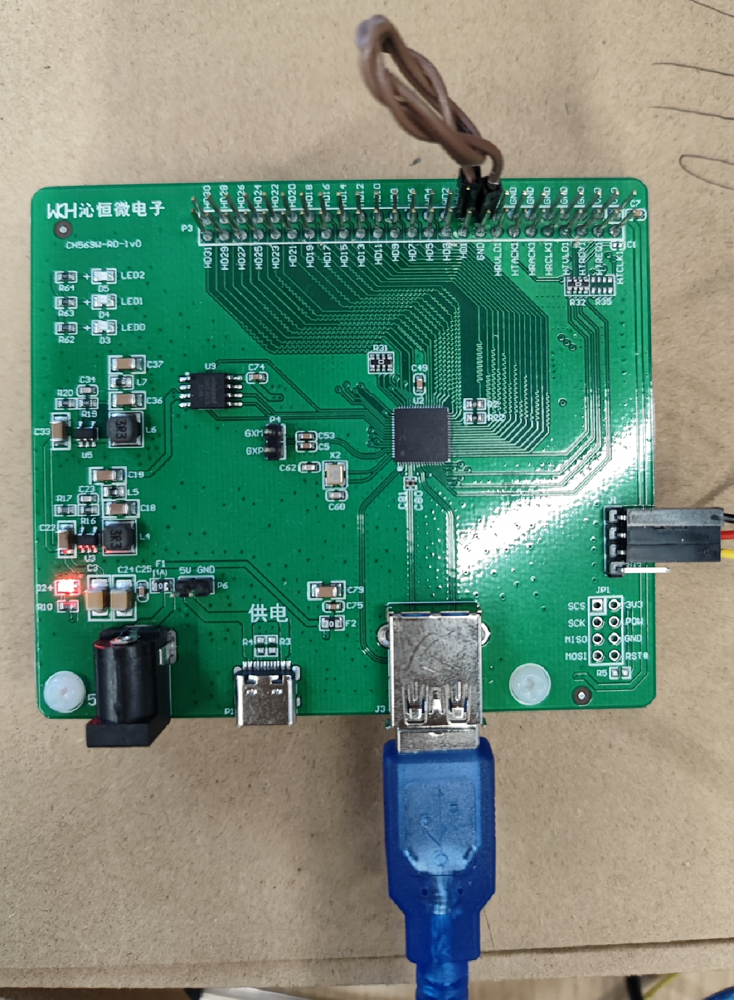
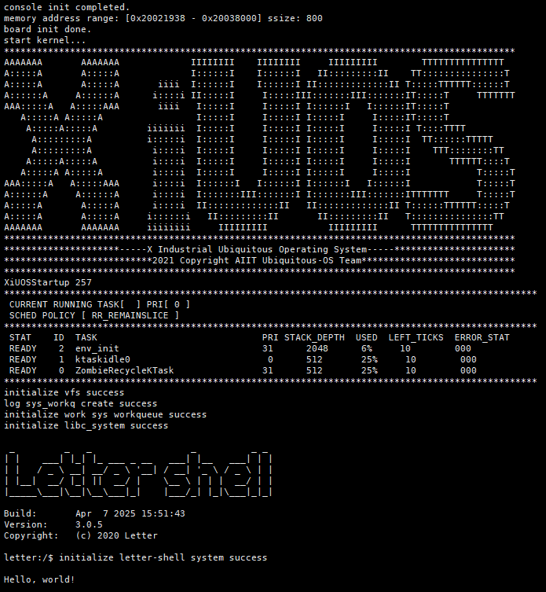

# 1. 简介

| 硬件      | 描述                                              |
| --------- | ------------------------------------------------- |
| 芯片型号  | CH569W                                            |
| CPU       | 单核RISC-V3A                                      |
| 主频      | 120MHz                                            |
| 片内SRAM  | 32/64/96KB 可配置的 128 位宽 SRAM（RAMX）         |
| 片内FLASH | 448KB 用户应用程序存储区 CodeFlash                |
| 外设      | 串口、SPI FLASH、SerDes网络、USBD CDC、Watchdog等 |

# 2. 克隆代码

将XiUOS的源代码克隆下来：

```bash
git clone https://gitlink.org.cn/xuos/xiuos.git
```

# 3. 下载编译工具链

编译环境：Ubuntu 20.04.6 LTS

编译工具链：riscv-none-embed-gcc（xpack-riscv-none-embed-gcc-8.2.0-3.1）

编译工具链可到Github进行下载：https://github.com/xpack-dev-tools/riscv-none-embed-gcc-xpack/releases/download/v8.2.0-3.1/xpack-riscv-none-embed-gcc-8.2.0-3.1-linux-x64.tgz

下载完成后将其移动到`/opt`目录下，并进行解压：

```bash
sudo tar -xvzf xpack-riscv-none-embed-gcc-8.2.0-3.1-linux-x64.tgz
```

# 4. 编译

## 方式1（推荐）

可以在`Ubiquitous/XiZi_IIoT`目录下创建文件`script.sh`，内容如下：

```sh
#! /bin/env sh
export CROSS_COMPILE=/opt/xPacks/riscv-none-embed-gcc/8.2.0-3.1/bin/riscv-none-embed-
make BOARD=ch569w distclean # 将之前的编译生成文件清空
make BOARD=ch569w menuconfig
make BOARD=ch569w
```

创建之后，在命令行移动到`XiZi-IIOT`目录下，键入`./script.sh`运行该脚本。

经过Kconfig配置、编译后，即可在`Ubiquitous/XiZi_IIoT/build`目录中生成`XiZi-ch569w.bin`文件，将该文件拷贝至Windows本地电脑，用于下一步烧录。

如果`make BOARD=ch569w menuconfig`显示【无法找到`kconfig-mconf`】，需要先安装`ncurses-devel`和`kconfig-mconf`，如下：

```bash
sudo apt install libncurses5-dev kconfig-frontends
```

# 5. 烧录

1. 沁恒微电子官网下载 WCHISPTool.exe 工具进行 bin 文件下载到芯片 flash 的操作。CH569W 芯片需要进入下载模式才能使用 ISP 工具下载代码，一般使用 USB 方式下载代码最为方便。
2. 将 CH569W 评估板使用 USB 插头对插头线和计算机连接起来。如图，打开 ISP 下载工具，芯片信号选择 CH569，下载方式选择 USB，将 CH569W 评估板断电，然后将下载配置脚（出厂默认为 PA5，原理图上的HD0）接地后对评估板上电，此时 ISP 工具的 USB 设备列表中将显示新连上来的 CH569W 芯片。最后点击“下载”，即可使程序下载到评估版上的主芯片。




# 6. 启动

烧录完成后，并且将串口连接至电脑。

将评估板上电重新，即可看到操作系统启动的信息，如下：

