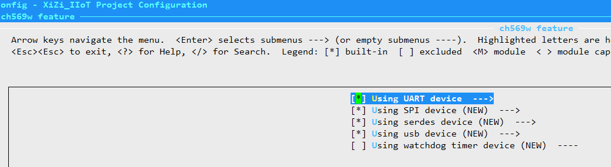
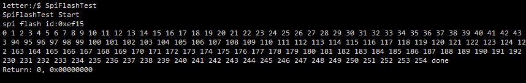
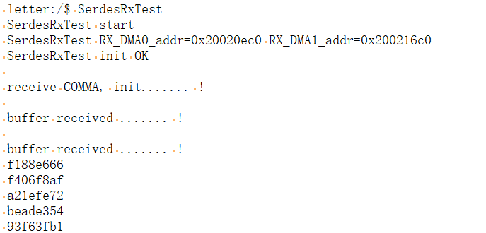
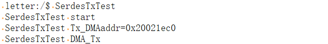
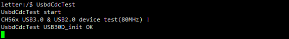
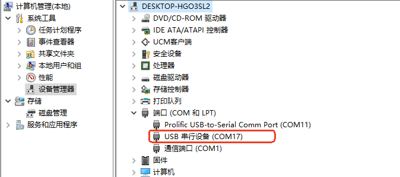
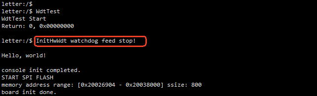

# 1. 模块编译配置

开发板支持外设驱动：UART、SPI FLASH、SerDes网络、USBD CDC、Watchdog。

默认配置文件路径：`xiuos/Ubiquitous/XiZi_IIoT$ ll board/ch569w/.defconfig`   

可以通过命令`make BOARD=ch569w menuconfig` ，查看`ch569w feature`的默认配置。

# 2. 模块测试用例

下面介绍各模块的测试方法。

## 2.1 UART

UART用于串口打印，和shell命令输入。

测试方法，查看设备启动日志，以及输入命令。

## 2.2 SPI FLASH

开发板的spi没有外部接口，是连接的flash芯片。测试通过spi对flash的读写。

串口执行：`SpiFlashTest`

## 2.3 SerDes

串并互转控制器及收发器（SerDes）。系统内置了支持信号隔离和远距离传输的 SerDes 模块，支持 1.2Gbps 高速差分信号（GXM/GXP
引脚），可以通过光纤模块或网线中的一个差分对等传输媒体，进行远距离数据传输。

开发板上SERDES为半双工接口，仅单向传输使用。需要两个CH569设备通过SerDes进行通信。

SerDes测试需要先执行`SerdesRxTest`，等到SerdesRx打印初始化成功后，在另有一个设备上执行`SerdesTxTest`。

## 2.4 USBD CDC

USBD CDC（USB Device Communication Device Class）是一种将 USB 设备模拟为串口（虚拟串口）的功能实现，允许设备通过 USB 与主机进行串行数据通信。

串口输入命令：`UsbdCdcTest`，在电脑的设备管理器查看，出现新增COM口。

## 2.5 Watchdog

看门狗测试，需要编译时选择打开watchdog功能。

系统在后台运行wdt，通过命令`WdtTest`，停止喂狗，触发系统重启。

