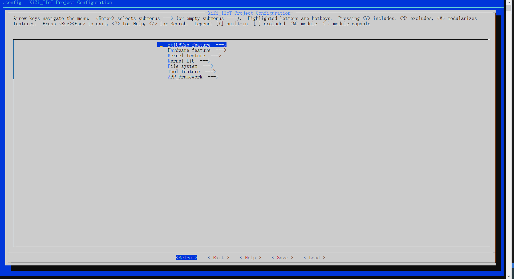
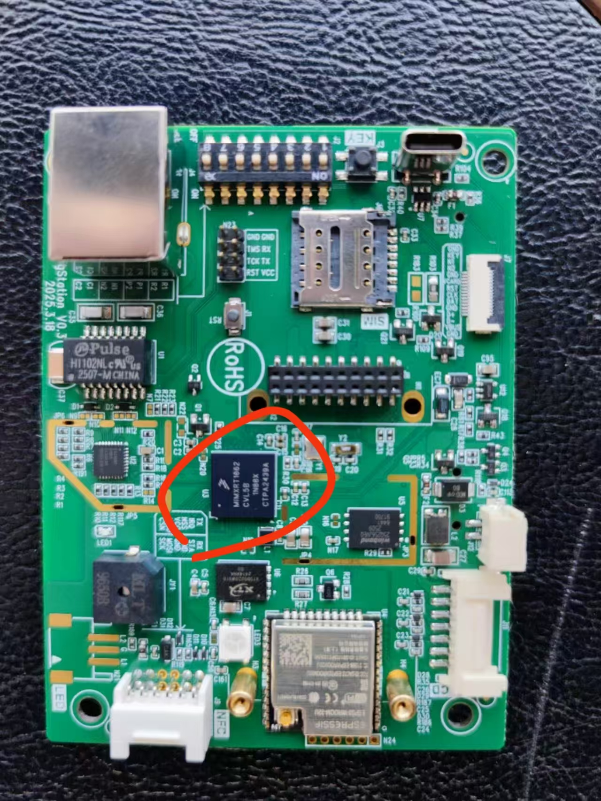
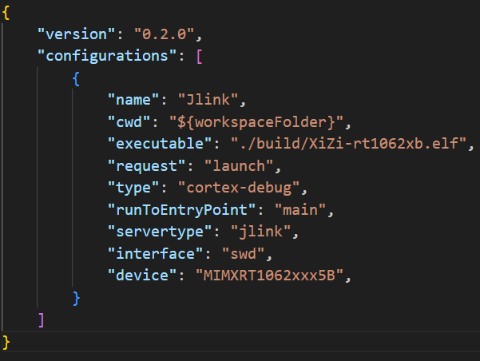
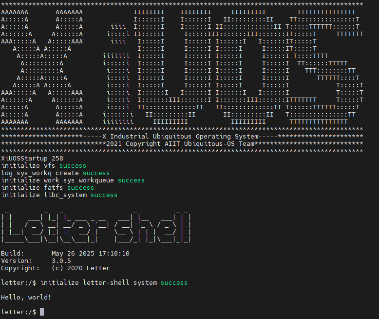

# 构建矽璓工业物联操作系统：使用ARM架构的rt1062xb系列处理器

# NXP i\.MX RT1060系列
MCU:MIMXRT106ACVL5B


## 1. 简介

| 硬件 | 描述 |
| -- | -- |
|芯片型号| MIMXRT106ACVL5B |
|架构| cortex-m7 |
|主频| 528MHz |
|片内SRAM| 1MB shared with TCM |

## 2. 开发环境搭建

### 推荐使用：

**操作系统：** ubuntu18.04 [https://ubuntu.com/download/desktop](https://ubuntu.com/download/desktop)

更新`ubuntu 18.04`源的方法:（根据自身情况而定，可以不更改）

第一步:打开sources.list文件

```c
sudo vim /etc/apt/sources.list
```

第二步:将以下内容复制到sources.list文件

```c
deb http://mirrors.aliyun.com/ubuntu/ bionic main restricted universe multiverse
deb http://mirrors.aliyun.com/ubuntu/ bionic-security main restricted universe multiverse
deb http://mirrors.aliyun.com/ubuntu/ bionic-updates main restricted universe multiverse
deb http://mirrors.aliyun.com/ubuntu/ bionic-proposed main restricted universe multiverse
deb http://mirrors.aliyun.com/ubuntu/ bionic-backports main restricted universe multiverse
deb-src http://mirrors.aliyun.com/ubuntu/ bionic main restricted universe multiverse
deb-src http://mirrors.aliyun.com/ubuntu/ bionic-security main restricted universe multiverse
deb-src http://mirrors.aliyun.com/ubuntu/ bionic-updates main restricted universe multiverse
deb-src http://mirrors.aliyun.com/ubuntu/ bionic-proposed main restricted universe multiverse
deb-src http://mirrors.aliyun.com/ubuntu/ bionic-backports main restricted universe multiverse
```

第三步:更新源和系统软件

```c
sudo apt-get update
sudo apt-get upgrade
```

**开发工具推荐使用 VSCode   ，VScode下载地址为：** VSCode  [https://code.visualstudio.com/](https://code.visualstudio.com/)，推荐下载地址为 [http://vscode.cdn.azure.cn/stable/3c4e3df9e89829dce27b7b5c24508306b151f30d/code_1.55.2-1618307277_amd64.deb](http://vscode.cdn.azure.cn/stable/3c4e3df9e89829dce27b7b5c24508306b151f30d/code_1.55.2-1618307277_amd64.deb)

### 依赖包安装：

```
$ sudo apt install build-essential pkg-config  git
$ sudo apt install gcc make libncurses5-dev openssl libssl-dev bison flex libelf-dev autoconf libtool gperf libc6-dev
```

**XiUOS操作系统源码下载：** XiUOS [https://www.gitlink.org.cn/xuos/xiuos](https://www.gitlink.org.cn/xuos/xiuos)

新建一个空文件夹并进入文件夹中，并下载源码，具体命令如下：

```c
mkdir test  &&  cd test
git clone https://gitlink.org.cn/xuos/xiuos.git
```

使用VScode打开代码，具体操作步骤为：在源码文件夹下打开系统终端，输入`code .`即可打开VScode开发环境。

### 裁减配置工具的下载

裁减配置工具：

**工具地址：** kconfig-frontends [https://www.gitlink.org.cn/xuos/kconfig-frontends](https://www.gitlink.org.cn/xuos/kconfig-frontends)，下载与安装的具体命令如下：

```c
mkdir kfrontends  && cd kfrontends
git clone https://gitlink.org.cn/xuos/kconfig-frontends.git
```

下载源码后按以下步骤执行软件安装：

```c
cd kconfig-frontends
./xs_build.sh
```

### 编译工具链：

ARM： arm-none-eabi(`gcc version 6.3.1`)，默认安装到Ubuntu的/usr/bin/arm-none-eabi-，使用如下命令行下载和安装。

```shell
$ sudo apt install gcc-arm-none-eabi
```

## 编译说明

### 编辑环境：`Ubuntu18.04`

### 编译工具链：`arm-none-eabi-gcc`
使用`VScode`打开工程的方法有多种，本文介绍一种快捷键，在项目目录下将`code .`输入linux系统命令终端即可打开目标项目


编译步骤：

1.在VScode命令终端中执行以下命令，生成配置文件

```c
cd ./Ubiquitous/XiZi
make BOARD=rt1062xb distclean
make BOARD=rt1062xb menuconfig
```

2.在menuconfig界面配置需要关闭和开启的功能，按回车键进入下级菜单，按Y键选中需要开启的功能，按N键选中需要关闭的功能，配置结束后保存并退出（本例旨在演示简单的输出例程，所以没有需要配置的选项，双击快捷键ESC退出配置）



退出时选择`yes`保存上面所配置的内容。

3.继续执行以下命令，进行编译

```
make BOARD=rt1062xb
```

4.如果编译正确无误，会产生XiZi-rt1062xb.elf、XiZi-rt1062xb.bin文件。

## 3. 烧写及运行

### 3.1 烧写
1、烧写工具：VSCODE cortext-debug

2、ok1052-c开发板需要通过JLINK连接板子的SWD接口进行烧录，连线根据板子水印依次连接即可。


3、同时需要配置vscode的cortext-debug参数


4、按下F5则开始进行烧录

### 3.2 运行结果

1、开发板支持TTL串口连接，接线座与SWD在同一个排针N23上。

2、烧录完成后，通过USB转UART可看到运行结果：

