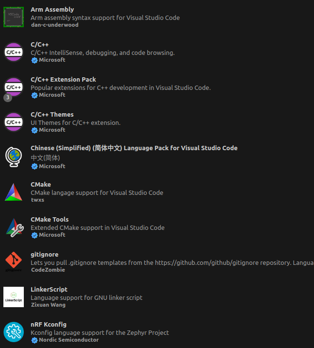
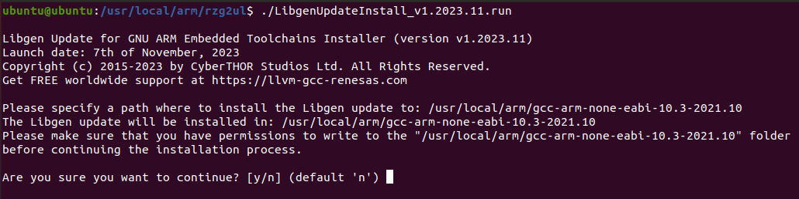
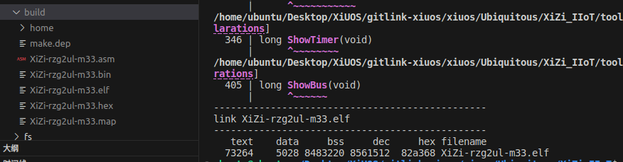
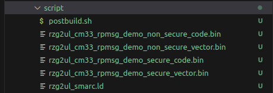
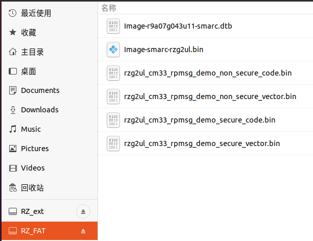
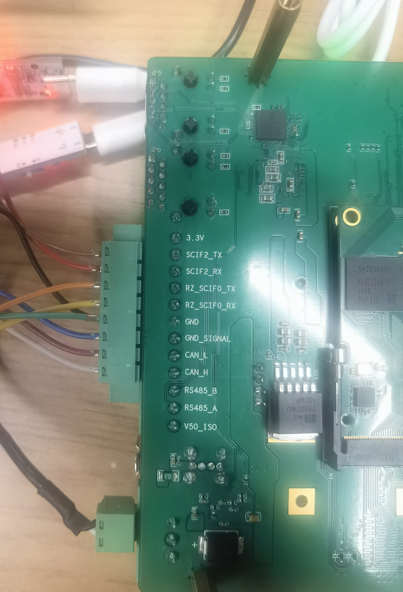
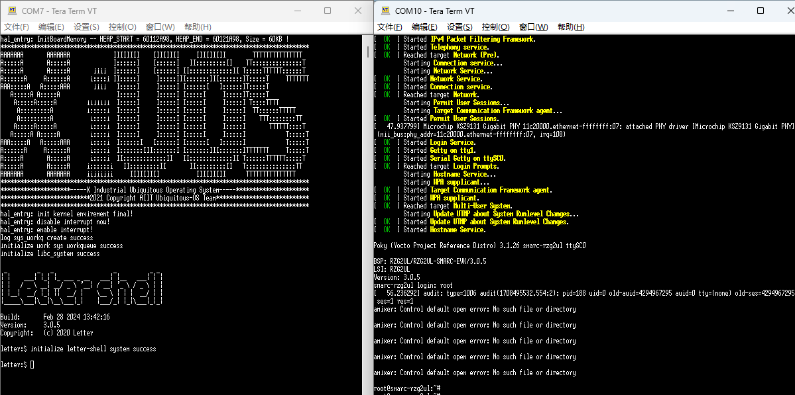
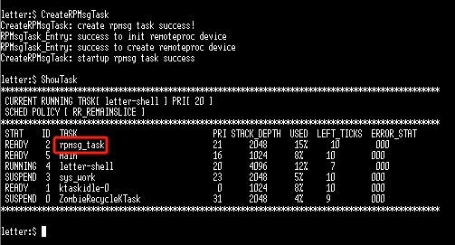
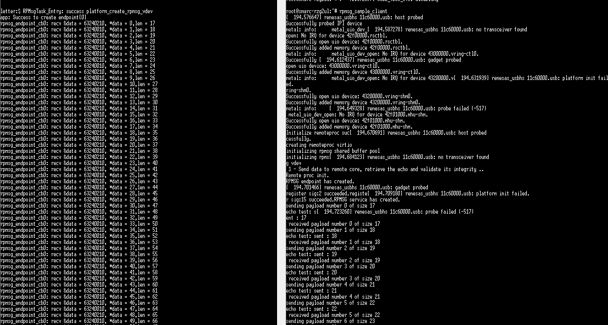
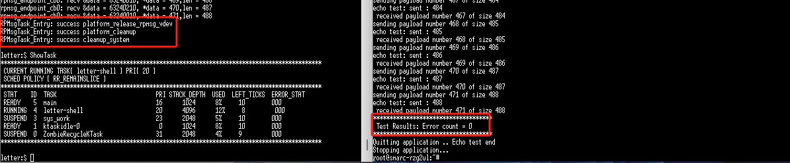

# 从零开始构建矽璓工业物联操作系统：使用 RZ/G2UL 开发板的Cortex-M33核心

[XiUOS](http://xuos.io/) (X Industrial Ubiquitous Operating System) 矽璓工业物联操作系统是一款面向工业物联场景的泛在操作系统，来自泛在操作系统研究计划。所谓泛在操作系统(UOS: Ubiquitous Operating Systems)，是支持互联网时代人机物融合泛在计算应用模式的新型操作系统，是传统操作系统概念的泛化与延伸。在泛在操作系统技术体系中，不同的泛在计算设备和泛在应用场景需要符合各自特性的不同UOS，XiUOS即是面向工业物联场景的一种UOS，主要由一个极简的微型实时操作系统(RTOS)内核和其上的智能工业物联框架构成，支持工业物联网(IIoT: Industrial Internet of Things)应用。

## 一、开发环境搭建

### 操作系统：Ubuntu 20.04 （Ubuntu 18.04也可以）

### 1、Ubuntu 20.04 换源 （Ubuntu 18.04可自行百度）

### （1）、打开sources.list文件

```c
sudo vim /etc/apt/sources.list
```
### （2）、将以下内容复制到sources.list文件

```c
deb http://mirrors.aliyun.com/ubuntu/ focal main restricted universe multiverse
deb-src http://mirrors.aliyun.com/ubuntu/ focal main restricted universe multiverse
deb http://mirrors.aliyun.com/ubuntu/ focal-security main restricted universe multiverse
deb-src http://mirrors.aliyun.com/ubuntu/ focal-security main restricted universe multiverse
deb http://mirrors.aliyun.com/ubuntu/ focal-updates main restricted universe multiverse
deb-src http://mirrors.aliyun.com/ubuntu/ focal-updates main restricted universe multiverse
deb http://mirrors.aliyun.com/ubuntu/ focal-proposed main restricted universe multiverse
deb-src http://mirrors.aliyun.com/ubuntu/ focal-proposed main restricted universe multiverse
deb http://mirrors.aliyun.com/ubuntu/ focal-backports main restricted universe multiverse
deb-src http://mirrors.aliyun.com/ubuntu/ focal-backports main restricted universe multiverse
```
### （3）、更新源和系统软件

```c
sudo apt-get update
sudo apt-get upgrade
```
### 2、项目依赖包安装
```c
$ sudo apt install build-essential pkg-config  git
$ sudo apt install gcc make libncurses5-dev openssl libssl-dev bison flex libelf-dev autoconf libtool gperf libc6-dev
```
### 3、开发工具安装
**开发工具推荐使用 VSCode   ，VScode下载地址为：** VSCode  [https://code.visualstudio.com/](https://code.visualstudio.com/)

### 4、VSCode 插件安装
**推荐安装下图所示插件：**



### 5、XiUOS操作系统源码下载
XiUOS [https://www.gitlink.org.cn/xuos/xiuos](https://www.gitlink.org.cn/xuos/xiuos)

新建一个空文件夹并进入文件夹中，并下载源码，具体命令如下：

```c
mkdir test  &&  cd test
git clone https://gitlink.org.cn/xuos/xiuos.git
```

1、打开XiUOS源码文件包可以看到以下目录：
| 名称 | 说明 |
| -- | -- |
| APP_Framework | 应用代码 |
| Ubiquitous | 板级支持包,支持NuttX、RT-Thread和XiZi内核 |

2、打开XiZi内核源码文件包可以看到以下目录：
| 名称 | 说明 |
| -- | -- |
| arch | 架构代码 |
| board | 板级支持包 |
| fs | 文件系统 |
| kernel | 内核源码 |
| lib | 第三方库源码 |
| resources | 驱动文件 |
| tool | 系统工具 |

使用VScode打开代码，具体操作步骤为：在源码文件夹下打开系统终端，输入`code .`即可打开VScode开发环境，如下图所示：


### 6、裁减配置工具的下载

**工具地址：** kconfig-frontends [https://www.gitlink.org.cn/xuos/kconfig-frontends](https://www.gitlink.org.cn/xuos/kconfig-frontends)，下载与安装的具体命令如下：

```c
mkdir kfrontends  && cd kfrontends
git clone https://gitlink.org.cn/xuos/kconfig-frontends.git
```

下载源码后按以下步骤执行软件安装：

```c
cd kconfig-frontends
./xs_build.sh
```

### 7、编译工具链安装

**下载：GNU ARM Embedded Toolchain：** gcc-arm-none-eabi-10.3-2021.10-x86_64-linux.tar.bz2 [https://developer.arm.com/open-source/gnu-toolchain/gnu-rm/downloads](https://developer.arm.com/open-source/gnu-toolchain/gnu-rm/downloads)

**下载：Libgen Update for GNU ARM Embedded Toolchains：** Libgen Update (Linux) for GCC ARM Embedded Toolchains v1.2023.11 or later [https://gcc-renesas.com/rz/rz-download-toolchains/](https://gcc-renesas.com/rz/rz-download-toolchains/)

**GNU ARM Embedded Toolchain 安装位置推荐：/usr/local/arm** 

**找到下载的工具链更新包 Libgen ，并运行以下命令：**
```c
sudo chmod 755 LibgenUpdateInstall_v1.2023.11.run
sudo ./LibgenUpdateInstall_v1.2023.11.run
```
**运行后输入ARM工具链根目录、回车，再输入 y 以确认**



**至此，编译环境已经安装完毕**

## 二、系统源代码编译步骤

### 1、编译前准备：修改编译链位置
### （1）修改文件 xiuos/Ubiquitous/XiZi_IIoT/board/rzg2ul-m33/config.mk
``` c
// 参照原本的数据将其修改为自己的编译链位置
export CROSS_COMPILE ?=/usr/local/arm/gcc-arm-none-eabi-10.3-2021.10/bin/arm-none-eabi-
```
### （2）修改文件 xiuos/Ubiquitous/XiZi_IIoT/board/rzg2ul-m33/script/postbuild.sh
``` c
// 参照原本的数据将其修改为自己的目标文件位置
inputfilename={path to}/xiuos/Ubiquitous/XiZi_IIoT/build/XiZi-rzg2ul-m33.elf
// 将 objcopy 工具路径改为自己的路径
{path to}/gcc-arm-none-eabi-10.3-2021.10/bin/arm-none-eabi-objcopy
```
### 2、编译配置
在VScode命令终端中执行以下命令，生成配置文件
```c
cd ./Ubiquitous/XiZi
make BOARD=rzg2ul-m33 distclean
make BOARD=rzg2ul-m33 menuconfig
```
### 3、编译
在VScode命令终端中执行以下命令以开始编译
```c
make BOARD=rzg2ul-m33
```
等待编译完成：生成`XiZi-rzg2ul-m33.elf`等文件



### 4、编译输出处理
`RZ/G2UL`的`M33`端没有`FLASH`，需要借助 `boot-loader` 加载到内存中直接运行。
同时因为内存映射跨度大，不能作为一个`bin`文件进行烧录，需要将其拆分为多个`bin`文件由`loader`逐一加载。
```c
// 打开VSCode终端，进入目录： Ubiquitous/XiZi_IIoT/board/rzg2ul-m33/script 执行脚本 postbuild.sh
./postbuild.sh
```
生成的文件：安全/非安全的中断向量表和代码数据段共四个文件



## 三、运行执行

### 1、BootLoader烧录
BootLoader的烧录、Linux端的编译参照官方，注意M33的串口2输出引脚与USB0冲突，不能同时使用，同时需要修改Linux配置文件：
```c
// 文件 /kernel-source/drivers/clk/renesas/r9a07g043-cpg.c 修改如下以防止串口2在Linux启动过程中被重置
static const unsigned int r9a07g043_crit_mod_clks[] __initconst = {
	MOD_CLK_BASE + R9A07G043_GIC600_GICCLK,
	MOD_CLK_BASE + R9A07G043_IA55_PCLK,
	MOD_CLK_BASE + R9A07G043_IA55_CLK,
	MOD_CLK_BASE + R9A07G043_DMAC_ACLK,
        MOD_CLK_BASE + R9A07G043_OSTM2_PCLK, // 用于M33时钟心跳
        MOD_CLK_BASE + R9A07G043_SCIF2_CLK_PCK, // 用于M33串口输出
};
```

### 2、将生成的文件拷贝到上一步生成的SD卡里



> 在上一步中，SD被划分为两个逻辑分区，一个作为根文件系统（RZ_ext），一个用于存放系统镜像（RZ_FAT包含Linux镜像、设备数已经刚放进去的M33端程序）

### 3、物理连接

`SCIF2_TX/RX`作为M33核心的输出串口；`RZ_SCIF0_TX/RX`作为Linux的输出串口，`GND`共地；



### 4、修改 boot 参数以自动加载
```c
// 1. 加载安全区代码的环境变量
setenv bootcmd_m3_sec_load "fatload mmc 1:1 0x0001FF80 rzg2ul_cm33_rpmsg_demo_secure_vector.bin; fatload mmc 1:1 0x42EFF440 rzg2ul_cm33_rpmsg_demo_secure_code.bin"
// 2. 加载非安全区代码的环境变量
setenv bootcmd_m3_nosec_load "fatload mmc 1:1 0x00010000 rzg2ul_cm33_rpmsg_demo_non_secure_vector.bin; fatload mmc 1:1 0x40010000 rzg2ul_cm33_rpmsg_demo_non_secure_code.bin"
// 3. 防止环境变量过长，合并文件加载
setenv bootcmd_m3_load "run bootcmd_m3_nosec_load; run bootcmd_m3_sec_load"
// 4. M33 启动环境变量
setenv bootcmd_m3_start "cm33 start_debug 0x1001FF80 0x00010000"
// 5. 合并M33启动加载环境变量
setenv bootcmd_m3_boot "dcache off; mmc dev 1; run bootcmd_m3_load; run bootcmd_m3_start; dcache on"
// 6. Boot会在超时后自动执行 bootcmd ，将M33的启动命令加入该环境变量
setenv bootcmd "run bootcmd_m3_boot"  // 注意：若是需要启动Linux，需要把Linux内核的启动命令也放入该环境变量
// 7. 保存环境变量
saveenv
```

### 5、运行M33
**将SD插入卡槽，按下开发板 reset 按键**



## 四、核间通信测试
> XiUOS 将收到的数据打印后返回到Linux

### 1、在M33端创建监听任务

```c
CreateRPMsgTask // 该命令会创建一个通信节点，在探测到Linux的第一条信息时该通信节点被激活
```


### 2、在Linux端启动核间通信测试例程

```c
rpmsg_sample_client
```



### 3、测试结果

