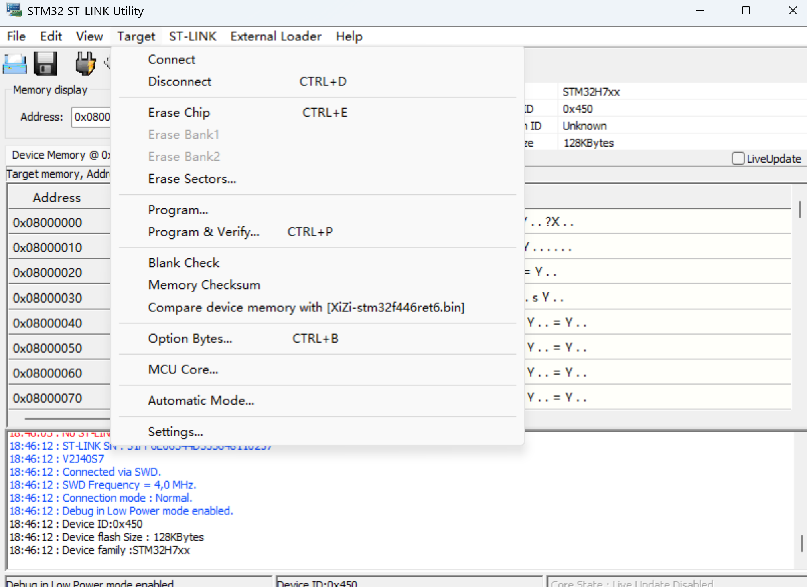
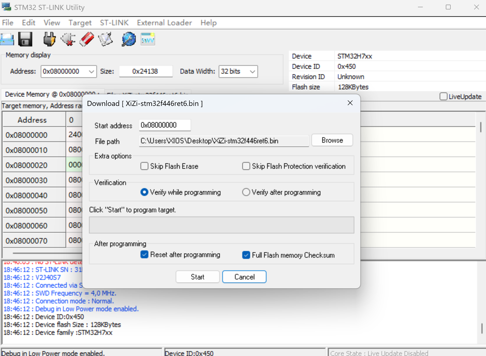
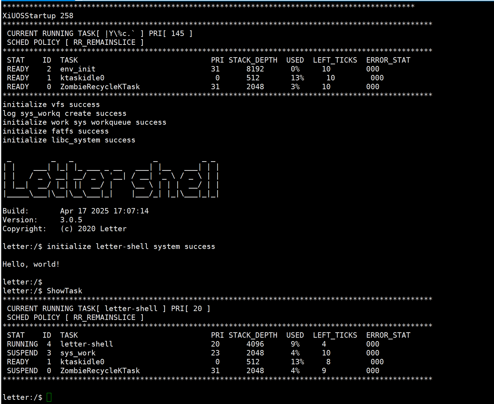

# 1. 简介

| 硬件      | 描述                                              |
| --------- | ------------------------------------------------- |
| 芯片型号  | STM32H750XBH6                                           |
| CPU       | 双核ARM CORTEX-M7                                      |
| 主频      | 480MHz                                            |
| 片内SRAM  | 1MB         |
| 片内FLASH | 128KB                 |
| 外设      | 目前仅实现UART串口 |


# 2. 下载编译工具链

编译环境：Ubuntu 22.04.6 LTS

编译工具链：arm-none-eabi-gcc

**1.​更新软件源​：**
```bash
sudo apt update
```

**2.​安装工具链​：**
```bash
sudo apt install gcc-arm-none-eabi binutils-arm-none-eabi gdb-multiarch
```
此命令会安装编译器、链接器、汇编器等核心工具。


**3.​验证安装​：**
```bash
arm-none-eabi-gcc --version
```
若显示版本信息（如 10.3.1），则安装成功。

⚠️ ​注意​：

通过 apt 安装的版本可能不是最新版（如 Ubuntu 22.04 默认安装 10.3.1）。
若需调试工具 arm-none-eabi-gdb，需额外安装 gdb-multiarch：
bashbash复制bash复制sudo apt install gdb-multiarch

## 3. 编译说明

### 编辑环境：`Ubuntu22.04`


编译步骤：

**1.在终端中执行以下命令，生成配置文件**

```c
cd ./Ubiquitous/XiZi
make BOARD=stm32h750 distclean
make BOARD=stm32h750 menuconfig
```


**2.继续执行以下命令，进行编译**

```c
make BOARD=stm32h750
```


## 4. 烧录

**​1.硬件准备与连接**​


​所需设备​：
```
ST-Link调试器（V2或更新版本）。
STM32H750开发板。
4针杜邦线（连接ST-Link调试器与开发板）：
```
​引脚对应关系​：
```
调试器SWDIO → 开发板SWDIO
调试器SWCLK → 开发板SWCLK
调试器GND → 目标板GND
调试器VCC → 开发板3.3V
```


 ​**2.软件安装与环境配置​**


**​安装驱动与工具​**：
到ST官网https://www.st.com/content/st_com/en.html ​下载ST-Link驱动​和ST-LINK Utility​。

​**ST-LINK Utility烧录​**

将ST-Link调试器与电脑连接，打开ST-LINK Utility，点击connect连接stlink。连接成功如下图所示

 

然后点击Program & Verify选择要烧录的bin固件即可完成烧录。

 


# 5. 启动

烧录完成后，并且将串口连接至电脑。

将评估板上电重新，即可看到操作系统启动的信息，如下：

