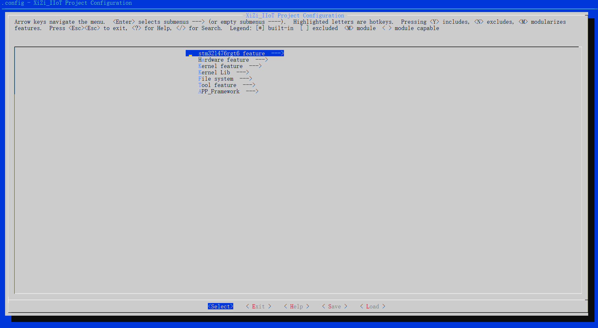
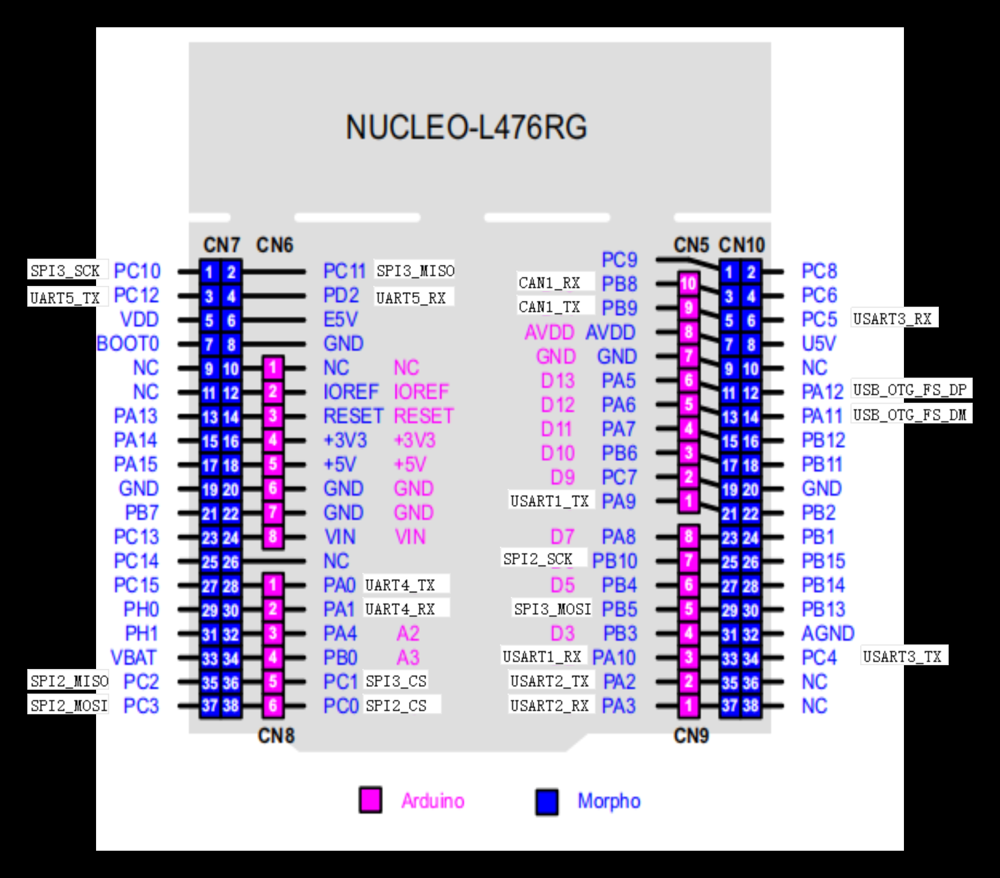
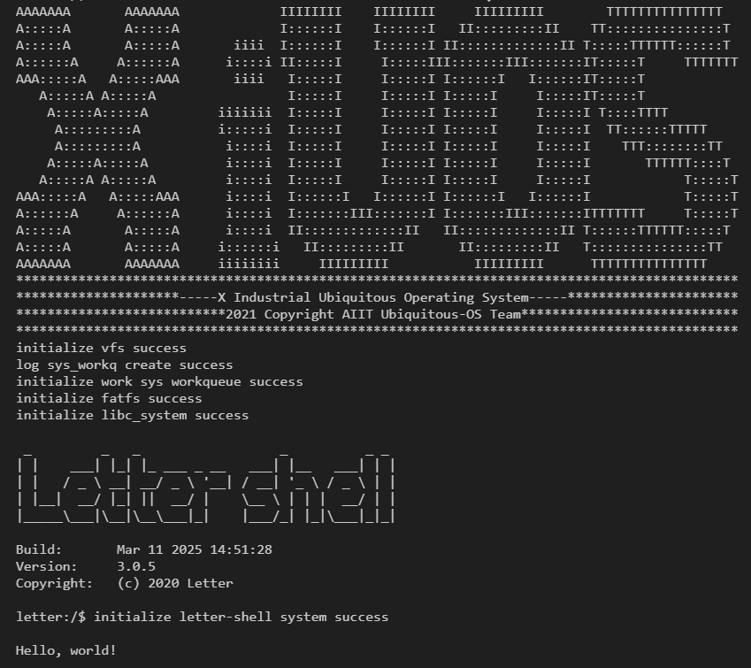
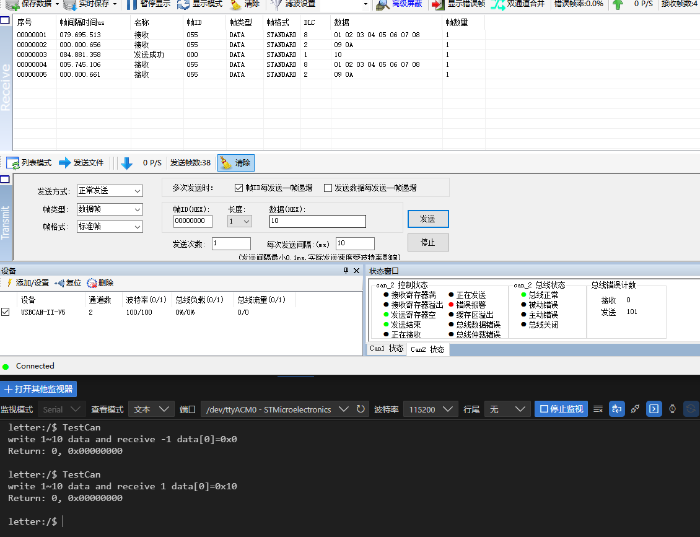
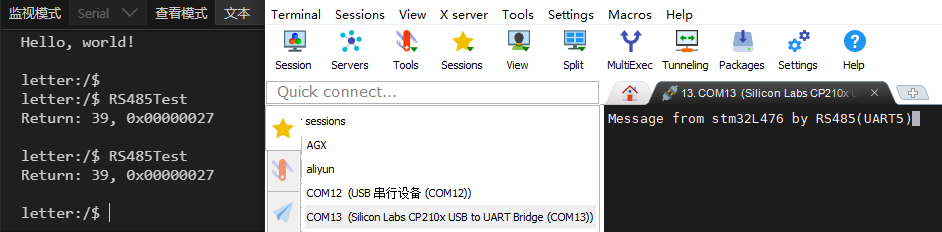
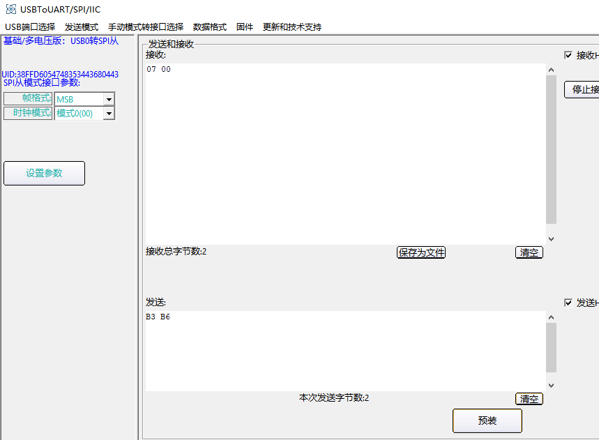
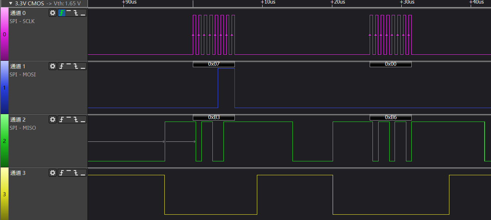
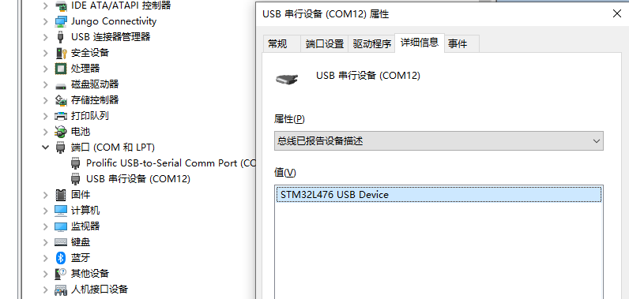
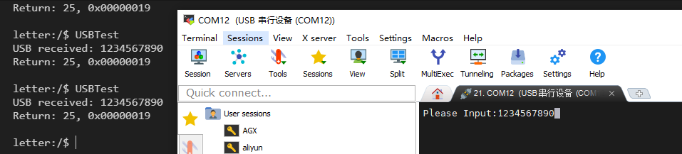
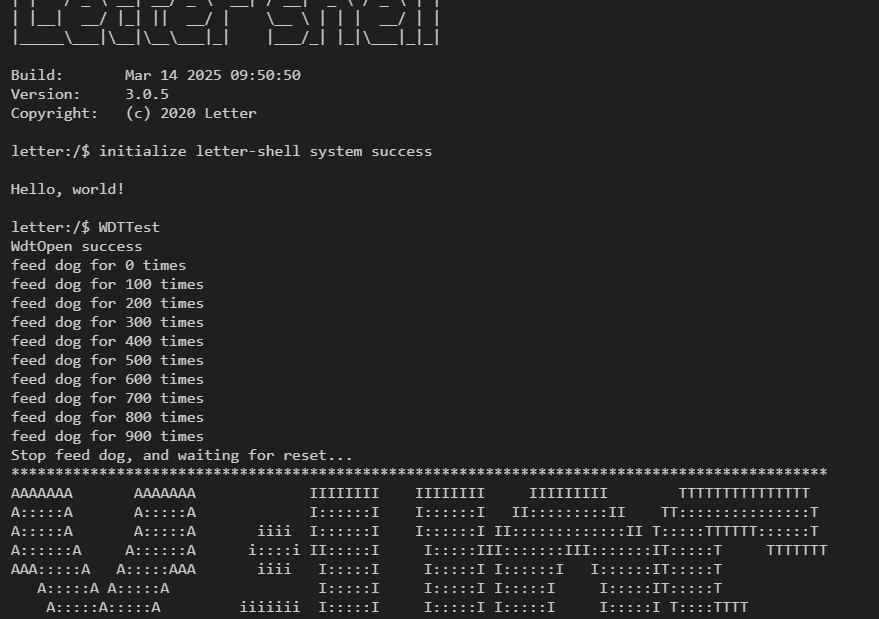

# 1. 简介

| 硬件      | 描述                                                         |
| --------- | ------------------------------------------------------------ |
| 芯片型号  | STM32L476                                                 |
| CPU       | 单核Cortex-M4                                                 |
| 主频      | 80MHz                                                       |
| 片内SRAM  | 可配：512KB、1MB                                       |
| 片内FLASH | 可配：128KB                                   |
| 外设      | SPI、USB2.0全速设备、CAN控制器等 |

# 2. 克隆代码

将XiUOS的源代码克隆下来：

```bash
git clone https://gitlink.org.cn/xuos/xiuos.git
```

# 3. 下载编译工具链

### 编译环境：Ubuntu18.04

### 编译工具链：arm-none-eabi-gcc

编译步骤：
>	1.ARM下编译需要安装arm-none-eabi编译工具, 安装到Ubuntu的默认路径/usr/bin/arm-none-eabi-，使用如下命令行下载
```bash
sudo apt-get install gcc-arm-none-eabi
```
>2.在代码根目录下执行以下命令，生成配置文件

```bash
cd ./Ubiquitous/XiZi
make BOARD=stm32l476rgt6 distclean
make BOARD=stm32l476rgt6 menuconfig
```
>3.在menuconfig界面配置需要关闭和开启的功能，按回车键进入下级菜单，按Y键选中需要开启的功能，按N键选中需要关闭的功能，配置结束后保存并退出



# 4. 编译

```bash
make BOARD=stm32l476rgt6
```
>5.如果编译正确无误，会产生XiZi-stm32l476rgt6.elf、XiZi-stm32l476rgt6.bin文件。其中XiZi-stm32l476rgt6.bin需要烧写到设备中进行运行。
```bash
可以使用STM32 ST-LINK Utility工具进行烧录
```
>6.最后可以执行以下命令，清除配置文件和编译生成的文件
```bash
make BOARD=stm32l476rgt6 distclean
```

# 5. 端口连接


`stm32l476rgt6`需要使用`ST-LINK`模块进行连接，直接插入板载usb即可，板载usb默认接入了UART2，可通过UART2直接打印shell
如需连接其他外设，按照pinmap接线即可

pinmap：


UART2 shell：



# 6. 外设支持情况

CAN：


RS485(默认接入UART4)：


SPI:



USB:



看门狗:
